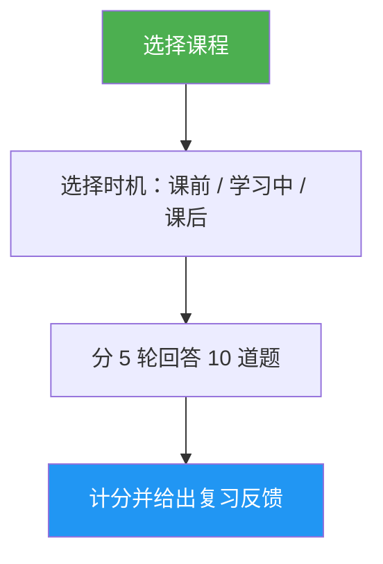

# Lesson Quiz

> 一个交互式测验，用 10 道题测试你对某个 Claude Code 课程的理解，并提供逐题反馈和有针对性的复习建议。

## 亮点

- 每个课程 10 道题，混合考察概念理解与实操能力
- 覆盖全部 10 节课程（从 01-Slash Commands 到 10-CLI）
- 三种时机模式：课前预检、学习中进度检查、课后掌握度验证
- 每题都提供正确答案和解释
- 给出定向复习建议，指向具体课程章节
- `references/question-bank.md` 中包含覆盖所有课程的 100 道题库

## 适用场景

| Say this... | Skill will... |
|---|---|
| "quiz me on hooks" | 对第 06 课 Hooks 发起 10 道题测验 |
| "lesson quiz 03" | 测试你对第 03 课 Skills 的理解 |
| "do I understand MCP" | 评估你对第 05 课 MCP 的掌握情况 |
| "practice quiz" | 先让你选择课程，再开始测验 |

## 工作方式



## 用法

```
/lesson-quiz [lesson-name-or-number]
```

示例：
```
/lesson-quiz hooks
/lesson-quiz 03
/lesson-quiz advanced-features
/lesson-quiz           # （会提示你选择课程）
```

## 输出内容

### 成绩报告
- 总分（满分 10 分）和等级（Mastered / Proficient / Developing / Beginning）
- 按题目类型拆分结果（概念题 vs 实操题）

### 逐题反馈
对每道答错的题目，会显示：
- 你的答案 vs 正确答案
- 为什么正确答案是对的
- 建议回看的课程具体章节

### 按时机给出的引导
- **Pre-test**：建立基线，指出学习时应重点关注的内容
- **During**：帮助识别你已经掌握了什么、还需要回看什么
- **After**：确认是否真正掌握，或指出剩余薄弱点

## 资源

| Path | Description |
|---|---|
| `references/question-bank.md` | 100 道预写题目（每课 10 题），包含答案、解释和复习指引 |
