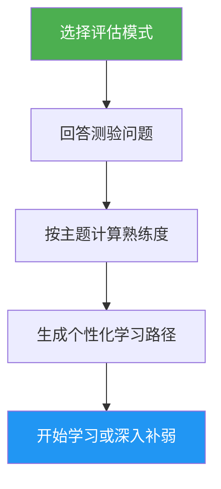

# Self-Assessment & Learning Path Advisor

> 一个全面的 Claude Code 能力评估工具，会评估 10 个特性领域、识别你的技能缺口，并生成个性化学习路径，帮助你继续升级。

## 亮点

- 两种评估模式：Quick（8 题，约 2 分钟）和 Deep（5 轮，约 5 分钟）
- 评估 10 个能力领域：Slash Commands、Memory、Skills、Hooks、MCP、Subagents、Checkpoints、Advanced Features、Plugins、CLI
- 按主题分别打分，并给出掌握等级（None / Basic / Proficient）
- 做缺口分析，并按依赖关系排序优先级
- 生成带具体练习与完成标准的个性化学习路径
- 提供后续动作：开始学习、深入补弱、实践项目，或重新评估

## 适用场景

| Say this... | Skill will... |
|---|---|
| "assess my level" | 运行评估测验并判断你当前水平 |
| "where should I start" | 评估你的经验并建议起点 |
| "check my skills" | 输出你在 10 个领域里的详细能力画像 |
| "what should I learn next" | 找出技能缺口并生成优先级学习路径 |

## 工作方式



## 评估模式

### Quick Assessment（约 2 分钟）
- 2 轮，共 8 道是 / 否经验题
- 判断整体等级：Beginner / Intermediate / Advanced
- 列出具体缺口并附教程链接
- 最适合：第一次使用、快速自查

### Deep Assessment（约 5 分钟）
- 5 轮问题，覆盖 10 个特性领域（每轮 2 个主题）
- 按主题计分（每项 0-2 分，总分 20 分）
- 输出 mastery 表，标出优势项、优先缺口和复习项
- 生成考虑依赖顺序的学习路径，带阶段划分和时间估算
- 推荐把多个薄弱项串起来练的实践项目
- 最适合：已有经验、想继续升级，或做周期性技能回顾的人

## 用法

```
/self-assessment
```

## 输出内容

### 技能画像表
显示每个主题的分数、掌握等级和状态（Learn / Review / Mastered）。

### 个性化学习路径
- 按依赖顺序组织成多个阶段
- 每个主题都包含：教程链接、关注重点、关键练习、完成标准
- 已掌握主题不会重复计入时间估算
- 会推荐结合多个薄弱项的实践项目

### 后续动作
评估完成后，你可以选择：
- 从第一个缺口教程开始，并获得引导式练习
- 深入补某一个薄弱主题
- 创建一个覆盖你缺口的实践项目
- 换一种模式重新评估
