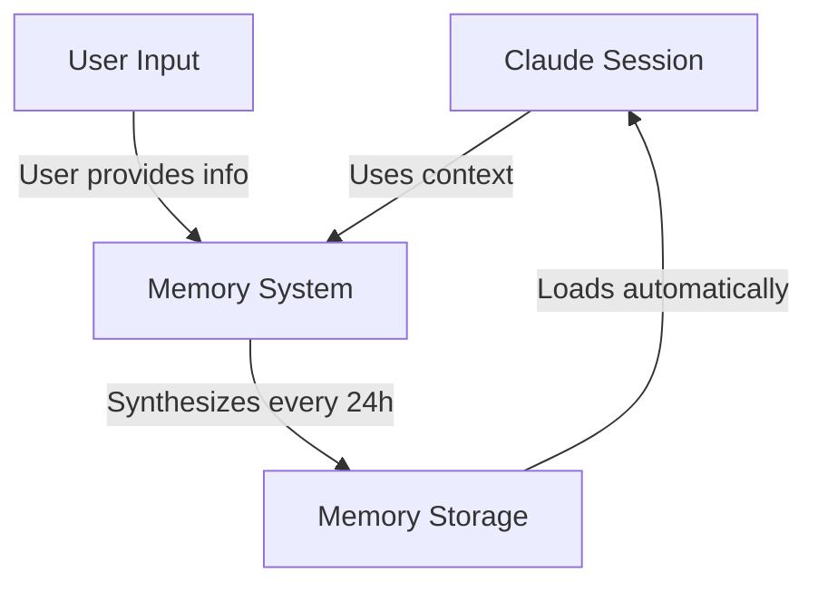
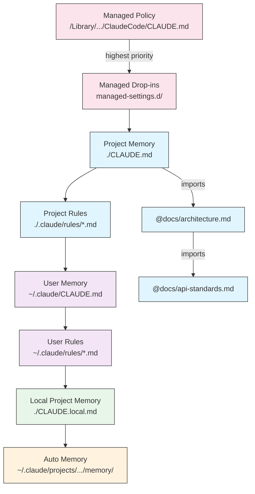
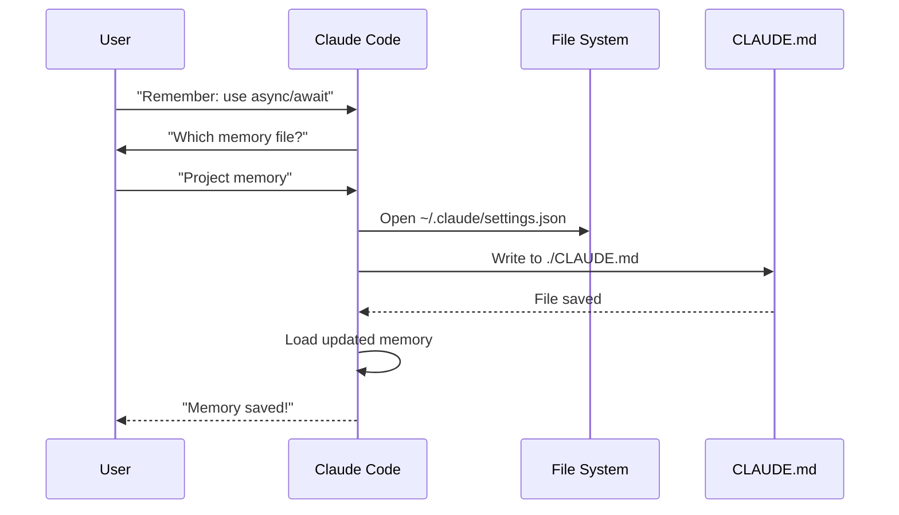
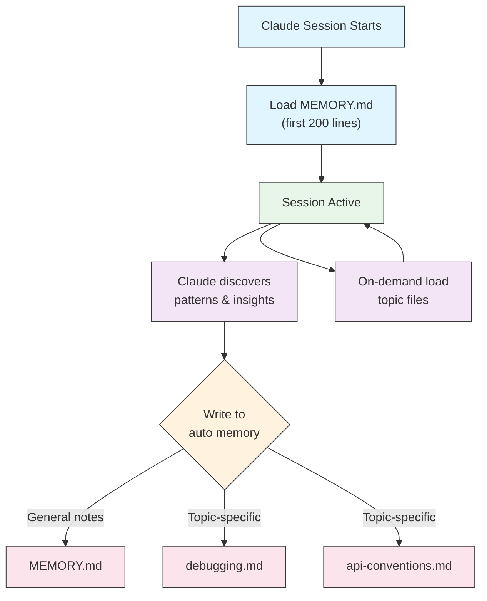

<picture>
  <source media="(prefers-color-scheme: dark)" srcset="../resources/logos/claude-howto-logo-dark.svg">
  
</picture>

# Memory Guide

Memory 让 Claude 可以在多个会话和对话之间保留上下文。它有两种形式：一种是 claude.ai 中的自动综合记忆，另一种是 Claude Code 中基于文件系统的 `CLAUDE.md`。

## Overview

Claude Code 中的 Memory 提供了可跨多个 session 和 conversation 持续生效的上下文。与临时上下文窗口不同，memory 文件允许你：

- 在团队内共享项目规范
- 保存个人开发偏好
- 维护目录级别的规则和配置
- 引入外部文档
- 将 memory 作为项目的一部分纳入版本控制

Memory 系统按多个层级工作，从全局个人偏好到特定子目录规则都可以覆盖，因此你可以精细控制 Claude 记住什么，以及这些信息如何生效。

## Memory Commands Quick Reference

| Command | Purpose | Usage | When to Use |
|---------|---------|-------|-------------|
| `/init` | 初始化项目 memory | `/init` | 新项目启动，首次搭建 CLAUDE.md |
| `/memory` | 在编辑器中编辑 memory 文件 | `/memory` | 大幅更新、重组结构、审查内容 |
| `#` prefix | 快速添加单行 memory | `# Your rule here` | 在对话中临时补充快速规则 |
| `# new rule into memory` | 显式写入 memory | `# new rule into memory<br/>Your detailed rule` | 添加多行、较复杂的规则 |
| `# remember this` | 自然语言式 memory 更新 | `# remember this<br/>Your instruction` | 以对话方式更新 memory |
| `@path/to/file` | 引入外部内容 | `@README.md` or `@docs/api.md` | 在 CLAUDE.md 中引用现有文档 |

## Quick Start: Initializing Memory

### The `/init` Command

`/init` 是在 Claude Code 中初始化项目 memory 的最快方式。它会创建一个带有基础项目文档结构的 `CLAUDE.md` 文件。

**Usage:**

```bash
/init
```

**What it does:**

- 在项目中创建新的 `CLAUDE.md` 文件（通常位于 `./CLAUDE.md` 或 `./.claude/CLAUDE.md`）
- 建立项目约定和使用规范
- 为跨 session 持久化上下文打下基础
- 提供一个记录项目标准的模板结构

**增强交互模式：** 设置 `CLAUDE_CODE_NEW_INIT=true` 可启用多阶段交互流程，逐步引导你完成项目初始化：

```bash
CLAUDE_CODE_NEW_INIT=true claude
/init
```

**When to use `/init`:**

- 用 Claude Code 启动一个新项目
- 建立团队编码规范和协作约定
- 给代码库结构补充说明文档
- 为协作开发搭建 memory 层级

**Example workflow:**

```markdown
# In your project directory
/init

# Claude creates CLAUDE.md with structure like:
# Project Configuration
## Project Overview
- Name: Your Project
- Tech Stack: [Your technologies]
- Team Size: [Number of developers]

## Development Standards
- Code style preferences
- Testing requirements
- Git workflow conventions
```

### Quick Memory Updates with `#`

在任何对话中，只要消息以 `#` 开头，你就可以快速把内容加入 memory：

**Syntax:**

```markdown
# Your memory rule or instruction here
```

**Examples:**

```markdown
# Always use TypeScript strict mode in this project

# Prefer async/await over promise chains

# Run npm test before every commit

# Use kebab-case for file names
```

**How it works:**

1. 发送一条以 `#` 开头的消息，并跟上你的规则
2. Claude 会将其识别为更新 memory 的请求
3. Claude 会询问要写入哪个 memory 文件（project 或 personal）
4. 规则会被写入对应的 `CLAUDE.md` 文件
5. 未来的 session 会自动加载这部分上下文

**Alternative patterns:**

```markdown
# new rule into memory
Always validate user input with Zod schemas

# remember this
Use semantic versioning for all releases

# add to memory
Database migrations must be reversible
```

### The `/memory` Command

`/memory` 命令可以让你在 Claude Code 会话中直接编辑 `CLAUDE.md` memory 文件。它会在系统默认编辑器里打开这些文件，便于进行完整编辑。

**Usage:**

```bash
/memory
```

**What it does:**

- 在系统默认编辑器中打开 memory 文件
- 允许你进行大幅新增、修改和重组
- 提供对整个 memory 层级中所有文件的直接访问
- 帮你管理跨 session 持续生效的上下文

**When to use `/memory`:**

- 审查已有的 memory 内容
- 大幅更新项目规范
- 重组 memory 结构
- 添加详细说明文档或规则
- 随项目演进持续维护 memory

**Comparison: `/memory` vs `/init`**

| Aspect | `/memory` | `/init` |
|--------|-----------|---------|
| **Purpose** | 编辑已有的 memory 文件 | 初始化新的 `CLAUDE.md` |
| **When to use** | 更新或修改项目上下文 | 开始新项目时 |
| **Action** | 打开编辑器进行修改 | 生成起始模板 |
| **Workflow** | 持续维护 | 一次性初始化 |

**Example workflow:**

```markdown
# Open memory for editing
/memory

# Claude presents options:
# 1. Managed Policy Memory
# 2. Project Memory (./CLAUDE.md)
# 3. User Memory (~/.claude/CLAUDE.md)
# 4. Local Project Memory

# Choose option 2 (Project Memory)
# Your default editor opens with ./CLAUDE.md content

# Make changes, save, and close editor
# Claude automatically reloads the updated memory
```

**Using Memory Imports:**

`CLAUDE.md` 支持 `@path/to/file` 语法，用来引入外部内容：

```markdown
# Project Documentation
See @README.md for project overview
See @package.json for available npm commands
See @docs/architecture.md for system design

# Import from home directory using absolute path
@~/.claude/my-project-instructions.md
```

**Import features:**

- 支持相对路径和绝对路径（例如 `@docs/api.md` 或 `@~/.claude/my-project-instructions.md`）
- 支持递归引入，最大深度为 5
- 第一次从外部位置引入内容时，会触发审批对话框，避免安全风险
- 在 Markdown 的行内代码或代码块里不会解析 import 指令，所以你可以安全地把它们写进示例文档
- 可以通过引用已有文档来避免重复
- 被引用的内容会自动进入 Claude 的上下文

## Memory Architecture

Claude Code 中的 Memory 采用层级化结构，不同作用域承担不同职责：



## Memory Hierarchy in Claude Code

Claude Code 使用多层级 memory 体系。启动时会自动加载 memory 文件，优先级更高的文件会先生效。

**Complete Memory Hierarchy (in order of precedence):**

1. **Managed Policy** - 组织级统一指令
   - macOS: `/Library/Application Support/ClaudeCode/CLAUDE.md`
   - Linux/WSL: `/etc/claude-code/CLAUDE.md`
   - Windows: `C:\Program Files\ClaudeCode\CLAUDE.md`

2. **Managed Drop-ins** - 按字母顺序合并的策略文件（v2.1.83+）
   - 位于 managed policy `CLAUDE.md` 同级目录下的 `managed-settings.d/`
   - 文件会按字母顺序合并，适合模块化管理策略

3. **Project Memory** - 团队共享上下文（可做版本控制）
   - `./.claude/CLAUDE.md` 或 `./CLAUDE.md`（仓库根目录）

4. **Project Rules** - 模块化、按主题拆分的项目规则
   - `./.claude/rules/*.md`

5. **User Memory** - 个人偏好（作用于所有项目）
   - `~/.claude/CLAUDE.md`

6. **User-Level Rules** - 个人规则（作用于所有项目）
   - `~/.claude/rules/*.md`

7. **Local Project Memory** - 个人项目级偏好
   - `./CLAUDE.local.md`

> **Note**：截至 2026 年 3 月，[官方文档](https://code.claude.com/docs/en/memory) 中还没有提到 `CLAUDE.local.md`。它可能仍然作为 legacy feature 可用。对于新项目，更建议使用 `~/.claude/CLAUDE.md`（用户级）或 `.claude/rules/`（项目级、可按路径生效）。

8. **Auto Memory** - Claude 自动记录的笔记和经验
   - `~/.claude/projects/<project>/memory/`

**Memory Discovery Behavior:**

Claude 会按以下顺序查找 memory 文件，排在前面的优先级更高：



## Excluding CLAUDE.md Files with `claudeMdExcludes`

在大型 monorepo 中，有些 `CLAUDE.md` 文件可能和你当前工作无关。`claudeMdExcludes` 设置可以让你显式跳过这些文件，不把它们加载进上下文：

```jsonc
// In ~/.claude/settings.json or .claude/settings.json
{
  "claudeMdExcludes": [
    "packages/legacy-app/CLAUDE.md",
    "vendors/**/CLAUDE.md"
  ]
}
```

这些 pattern 都是相对于项目根目录来匹配路径的。这个设置尤其适合：

- 拥有大量子项目、但你只关心其中一部分的 monorepo
- 仓库里包含第三方或 vendored `CLAUDE.md` 文件的场景
- 通过排除过时或无关指令，减少 Claude 上下文窗口中的噪声

## Settings File Hierarchy

Claude Code 的 settings（包括 `autoMemoryDirectory`、`claudeMdExcludes` 等配置）来自五级层级结构，优先级高的会覆盖优先级低的：

| Level | Location | Scope |
|-------|----------|-------|
| 1 (Highest) | Managed policy (system-level) | 组织级强制策略 |
| 2 | `managed-settings.d/` (v2.1.83+) | 模块化策略 drop-ins，按字母顺序合并 |
| 3 | `~/.claude/settings.json` | 用户偏好 |
| 4 | `.claude/settings.json` | 项目级配置（提交到 git） |
| 5 (Lowest) | `.claude/settings.local.json` | 本地覆盖（git ignore） |

**Platform-specific configuration (v2.1.51+):**

设置也可以通过以下平台原生机制配置：
- **macOS**: Property list（plist）文件
- **Windows**: Windows Registry

这些平台原生配置会和 JSON settings 一起读取，并遵循同样的优先级规则。

## Modular Rules System

你可以通过 `.claude/rules/` 目录来组织模块化、按路径生效的规则。规则既可以定义在项目级，也可以定义在用户级：

```
your-project/
├── .claude/
│   ├── CLAUDE.md
│   └── rules/
│       ├── code-style.md
│       ├── testing.md
│       ├── security.md
│       └── api/                  # 支持子目录
│           ├── conventions.md
│           └── validation.md

~/.claude/
├── CLAUDE.md
└── rules/                        # 用户级规则（作用于所有项目）
    ├── personal-style.md
    └── preferred-patterns.md
```

`rules/` 目录中的规则会被递归发现，包括所有子目录。位于 `~/.claude/rules/` 的用户级规则会先于项目级规则加载，因此你可以先设定个人默认值，再让项目规则在需要时覆盖它们。

### Path-Specific Rules with YAML Frontmatter

你可以通过 YAML frontmatter 定义只作用于特定路径的规则：

```markdown
---
paths: src/api/**/*.ts
---

# API Development Rules

- All API endpoints must include input validation
- Use Zod for schema validation
- Document all parameters and response types
- Include error handling for all operations
```

**Glob Pattern Examples:**

- `**/*.ts` - 所有 TypeScript 文件
- `src/**/*` - `src/` 下的所有文件
- `src/**/*.{ts,tsx}` - 多种扩展名
- `{src,lib}/**/*.ts, tests/**/*.test.ts` - 多个 pattern 组合

### Subdirectories and Symlinks

`.claude/rules/` 中的规则支持两种组织方式：

- **Subdirectories**：规则会递归发现，所以你可以按主题拆到不同文件夹里（例如 `rules/api/`、`rules/testing/`、`rules/security/`）
- **Symlinks**：支持通过软链接在多个项目之间共享规则。例如，你可以把统一规则文件放在中心位置，再把它 symlink 到各个项目的 `.claude/rules/` 中

## Memory Locations Table

| Location | Scope | Priority | Shared | Access | Best For |
|----------|-------|----------|--------|--------|----------|
| `/Library/Application Support/ClaudeCode/CLAUDE.md` (macOS) | Managed Policy | 1 (Highest) | Organization | System | 公司级统一策略 |
| `/etc/claude-code/CLAUDE.md` (Linux/WSL) | Managed Policy | 1 (Highest) | Organization | System | 组织标准 |
| `C:\Program Files\ClaudeCode\CLAUDE.md` (Windows) | Managed Policy | 1 (Highest) | Organization | System | 企业级规范 |
| `managed-settings.d/*.md` (alongside policy) | Managed Drop-ins | 1.5 | Organization | System | 模块化策略文件（v2.1.83+） |
| `./CLAUDE.md` or `./.claude/CLAUDE.md` | Project Memory | 2 | Team | Git | 团队规范、共享架构说明 |
| `./.claude/rules/*.md` | Project Rules | 3 | Team | Git | 按路径生效的模块化规则 |
| `~/.claude/CLAUDE.md` | User Memory | 4 | Individual | Filesystem | 个人偏好（所有项目） |
| `~/.claude/rules/*.md` | User Rules | 5 | Individual | Filesystem | 个人规则（所有项目） |
| `./CLAUDE.local.md` | Project Local | 6 | Individual | Git (ignored) | 个人项目级偏好 |
| `~/.claude/projects/<project>/memory/` | Auto Memory | 7 (Lowest) | Individual | Filesystem | Claude 自动沉淀的经验和笔记 |

## Memory Update Lifecycle

下面是 memory 更新在 Claude Code 会话中的流转过程：



## Auto Memory

Auto memory 是一个持久目录，Claude 会在与你的项目协作时自动写入 learnings、patterns 和 insights。和由你手动维护的 `CLAUDE.md` 不同，auto memory 是 Claude 在 session 过程中自己写的。

### How Auto Memory Works

- **Location**: `~/.claude/projects/<project>/memory/`
- **Entrypoint**: `MEMORY.md` 是 auto memory 目录的主入口文件
- **Topic files**: 可以按主题拆分额外文件（例如 `debugging.md`、`api-conventions.md`）
- **Loading behavior**: session 启动时会加载 `MEMORY.md` 的前 200 行。主题文件不会在启动时加载，而是按需加载。
- **Read/write**: Claude 会在 session 中随着发现项目模式和特定知识而读写这些 memory 文件

### Auto Memory Architecture



### Auto Memory Directory Structure

```
~/.claude/projects/<project>/memory/
├── MEMORY.md              # Entrypoint (first 200 lines loaded at startup)
├── debugging.md           # Topic file (loaded on demand)
├── api-conventions.md     # Topic file (loaded on demand)
└── testing-patterns.md    # Topic file (loaded on demand)
```

### Version Requirement

Auto memory 需要 **Claude Code v2.1.59 或更高版本**。如果版本较旧，请先升级：

```bash
npm install -g @anthropic-ai/claude-code@latest
```

### Custom Auto Memory Directory

默认情况下，auto memory 存在 `~/.claude/projects/<project>/memory/`。你也可以通过 `autoMemoryDirectory` 设置改用其他路径（自 **v2.1.74** 起可用）：

```jsonc
// In ~/.claude/settings.json or .claude/settings.local.json (user/local settings only)
{
  "autoMemoryDirectory": "/path/to/custom/memory/directory"
}
```

> **Note**：`autoMemoryDirectory` 只能配置在用户级（`~/.claude/settings.json`）或本地设置（`.claude/settings.local.json`）中，不能放在项目级或 managed policy 设置中。

这个能力适合以下场景：

- 想把 auto memory 存在共享或同步目录
- 想把 auto memory 从默认 Claude 配置目录中拆出去
- 想让项目使用默认层级之外的专属路径

### Worktree and Repository Sharing

同一个 git 仓库下的所有 worktree 和子目录会共享同一个 auto memory 目录。这意味着你在同一仓库的不同 worktree 间切换，或在不同子目录中工作时，都会读写同一组 memory 文件。

### Subagent Memory

Subagent（通过 Task 或并行执行等工具生成）也可以拥有自己的 memory 上下文。你可以在 subagent 定义中使用 `memory` frontmatter 字段，指定要加载哪些 memory 范围：

```yaml
memory: user      # 只加载用户级 memory
memory: project   # 只加载项目级 memory
memory: local     # 只加载本地 memory
```

这样可以让 subagent 使用更聚焦的上下文，而不是继承完整的 memory 层级。

### Controlling Auto Memory

你可以通过 `CLAUDE_CODE_DISABLE_AUTO_MEMORY` 环境变量控制 auto memory：

| Value | Behavior |
|-------|----------|
| `0` | 强制开启 auto memory |
| `1` | 强制关闭 auto memory |
| *(unset)* | 默认行为（启用 auto memory） |

```bash
# Disable auto memory for a session
CLAUDE_CODE_DISABLE_AUTO_MEMORY=1 claude

# Force auto memory on explicitly
CLAUDE_CODE_DISABLE_AUTO_MEMORY=0 claude
```

## Additional Directories with `--add-dir`

`--add-dir` 参数允许 Claude Code 除了当前工作目录外，还去额外目录中加载 `CLAUDE.md` 文件。这对 monorepo 或多项目协作场景很有用，因为你可能需要同时引入其他目录的上下文。

要启用这个能力，需要先设置环境变量：

```bash
CLAUDE_CODE_ADDITIONAL_DIRECTORIES_CLAUDE_MD=1
```

然后使用该参数启动 Claude Code：

```bash
claude --add-dir /path/to/other/project
```

Claude 会同时加载你当前工作目录里的 memory 文件，以及指定额外目录中的 `CLAUDE.md`。

## Practical Examples

### Example 1: Project Memory Structure

**File:** `./CLAUDE.md`

```markdown
# Project Configuration

## Project Overview
- **Name**: E-commerce Platform
- **Tech Stack**: Node.js, PostgreSQL, React 18, Docker
- **Team Size**: 5 developers
- **Deadline**: Q4 2025

## Architecture
@docs/architecture.md
@docs/api-standards.md
@docs/database-schema.md

## Development Standards

### Code Style
- Use Prettier for formatting
- Use ESLint with airbnb config
- Maximum line length: 100 characters
- Use 2-space indentation

### Naming Conventions
- **Files**: kebab-case (user-controller.js)
- **Classes**: PascalCase (UserService)
- **Functions/Variables**: camelCase (getUserById)
- **Constants**: UPPER_SNAKE_CASE (API_BASE_URL)
- **Database Tables**: snake_case (user_accounts)

### Git Workflow
- Branch names: `feature/description` or `fix/description`
- Commit messages: Follow conventional commits
- PR required before merge
- All CI/CD checks must pass
- Minimum 1 approval required

### Testing Requirements
- Minimum 80% code coverage
- All critical paths must have tests
- Use Jest for unit tests
- Use Cypress for E2E tests
- Test filenames: `*.test.ts` or `*.spec.ts`

### API Standards
- RESTful endpoints only
- JSON request/response
- Use HTTP status codes correctly
- Version API endpoints: `/api/v1/`
- Document all endpoints with examples

### Database
- Use migrations for schema changes
- Never hardcode credentials
- Use connection pooling
- Enable query logging in development
- Regular backups required

### Deployment
- Docker-based deployment
- Kubernetes orchestration
- Blue-green deployment strategy
- Automatic rollback on failure
- Database migrations run before deploy

## Common Commands

| Command | Purpose |
|---------|---------|
| `npm run dev` | Start development server |
| `npm test` | Run test suite |
| `npm run lint` | Check code style |
| `npm run build` | Build for production |
| `npm run migrate` | Run database migrations |

## Team Contacts
- Tech Lead: Sarah Chen (@sarah.chen)
- Product Manager: Mike Johnson (@mike.j)
- DevOps: Alex Kim (@alex.k)

## Known Issues & Workarounds
- PostgreSQL connection pooling limited to 20 during peak hours
- Workaround: Implement query queuing
- Safari 14 compatibility issues with async generators
- Workaround: Use Babel transpiler

## Related Projects
- Analytics Dashboard: `/projects/analytics`
- Mobile App: `/projects/mobile`
- Admin Panel: `/projects/admin`
```

### Example 2: Directory-Specific Memory

**File:** `./src/api/CLAUDE.md`

````markdown
# API Module Standards

This file overrides root CLAUDE.md for everything in /src/api/

## API-Specific Standards

### Request Validation
- Use Zod for schema validation
- Always validate input
- Return 400 with validation errors
- Include field-level error details

### Authentication
- All endpoints require JWT token
- Token in Authorization header
- Token expires after 24 hours
- Implement refresh token mechanism

### Response Format

All responses must follow this structure:

```json
{
  "success": true,
  "data": { /* actual data */ },
  "timestamp": "2025-11-06T10:30:00Z",
  "version": "1.0"
}
```

Error responses:
```json
{
  "success": false,
  "error": {
    "code": "VALIDATION_ERROR",
    "message": "User message",
    "details": { /* field errors */ }
  },
  "timestamp": "2025-11-06T10:30:00Z"
}
```

### Pagination
- Use cursor-based pagination (not offset)
- Include `hasMore` boolean
- Limit max page size to 100
- Default page size: 20

### Rate Limiting
- 1000 requests per hour for authenticated users
- 100 requests per hour for public endpoints
- Return 429 when exceeded
- Include retry-after header

### Caching
- Use Redis for session caching
- Cache duration: 5 minutes default
- Invalidate on write operations
- Tag cache keys with resource type
````

### Example 3: Personal Memory

**File:** `~/.claude/CLAUDE.md`

```markdown
# My Development Preferences

## About Me
- **Experience Level**: 8 years full-stack development
- **Preferred Languages**: TypeScript, Python
- **Communication Style**: Direct, with examples
- **Learning Style**: Visual diagrams with code

## Code Preferences

### Error Handling
I prefer explicit error handling with try-catch blocks and meaningful error messages.
Avoid generic errors. Always log errors for debugging.

### Comments
Use comments for WHY, not WHAT. Code should be self-documenting.
Comments should explain business logic or non-obvious decisions.

### Testing
I prefer TDD (test-driven development).
Write tests first, then implementation.
Focus on behavior, not implementation details.

### Architecture
I prefer modular, loosely-coupled design.
Use dependency injection for testability.
Separate concerns (Controllers, Services, Repositories).

## Debugging Preferences
- Use console.log with prefix: `[DEBUG]`
- Include context: function name, relevant variables
- Use stack traces when available
- Always include timestamps in logs

## Communication
- Explain complex concepts with diagrams
- Show concrete examples before explaining theory
- Include before/after code snippets
- Summarize key points at the end

## Project Organization
I organize my projects as:

   project/
   ├── src/
   │   ├── api/
   │   ├── services/
   │   ├── models/
   │   └── utils/
   ├── tests/
   ├── docs/
   └── docker/

## Tooling
- **IDE**: VS Code with vim keybindings
- **Terminal**: Zsh with Oh-My-Zsh
- **Format**: Prettier (100 char line length)
- **Linter**: ESLint with airbnb config
- **Test Framework**: Jest with React Testing Library
```

_My Test_
让 Claude 保存一条新规则


Claude 没有保存这条规则，因为当时我本地任何位置都没有 `CLAUDE.md` 文件。随后它让我确认保存位置。


### Example 4: Memory Update During Session

你可以在 Claude Code 的活跃 session 中把新规则写入 memory。常见有两种方式：

#### Method 1: Direct Request

```markdown
User: Remember that I prefer using React hooks instead of class components
     for all new components.

Claude: I'm adding that to your memory. Which memory file should this go in?
        1. Project memory (./CLAUDE.md)
        2. Personal memory (~/.claude/CLAUDE.md)

User: Project memory

Claude: ✅ Memory saved!

Added to ./CLAUDE.md:
---

### Component Development
- Use functional components with React Hooks
- Prefer hooks over class components
- Custom hooks for reusable logic
- Use useCallback for event handlers
- Use useMemo for expensive computations
```

#### Method 2: Using "# new rule into memory" Pattern

你也可以使用显式模式 `# new rule into memory` 来触发 memory 更新：

```markdown
User: # new rule into memory
      Always validate user input with Zod schemas before processing.

Claude: I'm saving this rule to memory. Which memory file should I use?
        1. Project memory (./CLAUDE.md)
        2. Personal memory (~/.claude/CLAUDE.md)

User: Project memory

Claude: ✅ Memory saved!

Added to ./CLAUDE.md:
---

### Input Validation
- Always validate user input with Zod schemas before processing
- Define schemas at the top of each API handler file
- Return 400 status with validation errors
```

#### Tips for Adding Memory

- 规则要写得具体，并且可执行
- 相关规则尽量归到同一个标题分组下
- 优先更新已有章节，而不是重复新增相同内容
- 选择合适的 memory 作用域（project 或 personal）

## Memory Features Comparison

| Feature | Claude Web/Desktop | Claude Code (CLAUDE.md) |
|---------|-------------------|------------------------|
| Auto-synthesis | ✅ 每 24 小时自动综合 | ❌ 手动维护 |
| Cross-project | ✅ 可共享 | ❌ 项目级为主 |
| Team access | ✅ 共享项目 | ✅ Git 跟踪 |
| Searchable | ✅ 内置可搜索 | ✅ 通过 `/memory` |
| Editable | ✅ 在对话中编辑 | ✅ 直接编辑文件 |
| Import/Export | ✅ 支持 | ✅ 复制粘贴即可 |
| Persistent | ✅ 24h+ | ✅ 持久保存 |

### Memory in Claude Web/Desktop

#### Memory Synthesis Timeline


**Example Memory Summary:**

```markdown
## Claude's Memory of User

### Professional Background
- Senior full-stack developer with 8 years experience
- Focus on TypeScript/Node.js backends and React frontends
- Active open source contributor
- Interested in AI and machine learning

### Project Context
- Currently building e-commerce platform
- Tech stack: Node.js, PostgreSQL, React 18, Docker
- Working with team of 5 developers
- Using CI/CD and blue-green deployments

### Communication Preferences
- Prefers direct, concise explanations
- Likes visual diagrams and examples
- Appreciates code snippets
- Explains business logic in comments

### Current Goals
- Improve API performance
- Increase test coverage to 90%
- Implement caching strategy
- Document architecture
```

## Best Practices

### Do's - What To Include

- **尽量具体、可执行**：使用清晰具体的指令，而不是模糊建议
  - ✅ Good: "Use 2-space indentation for all JavaScript files"
  - ❌ Avoid: "Follow best practices"

- **保持有组织**：用清晰的 Markdown 结构和标题组织 memory 文件

- **使用合适的层级**：
  - **Managed policy**：公司级策略、安全规范、合规要求
  - **Project memory**：团队规范、架构说明、编码约定（提交到 git）
  - **User memory**：个人偏好、沟通风格、工具选择
  - **Directory memory**：模块专属规则和覆盖项

- **善用 imports**：使用 `@path/to/file` 引用已有文档
  - 最多支持 5 层递归嵌套
  - 避免在多个 memory 文件里重复粘贴相同内容
  - 示例：`See @README.md for project overview`

- **记录高频命令**：把经常使用的命令写进去，节省重复说明时间

- **将项目 memory 纳入版本控制**：把项目级 `CLAUDE.md` 提交到 git，方便团队共享

- **定期回顾**：随着项目演进及时更新 memory，避免信息过时

- **给出具体示例**：尽量包含代码片段和具体场景

### Don'ts - What To Avoid

- **不要存 secrets**：绝不能写入 API key、密码、token 或凭据

- **不要包含敏感数据**：不要写 PII、私密信息或专有机密

- **不要重复内容**：优先用 imports（`@path`）引用已有文档

- **不要写得太空泛**：避免诸如 “follow best practices” 或 “write good code” 这类空洞描述

- **不要过长**：单个 memory 文件尽量聚焦，控制在 500 行以内

- **不要过度分层**：分层要有策略，不要为了组织而创建过多子目录覆盖

- **不要忘记更新**：过时的 memory 会带来混乱，并让 Claude 继续沿用旧习惯

- **不要超过嵌套限制**：memory imports 最多支持 5 层嵌套

### Memory Management Tips

**选择合适的 memory 层级：**

| Use Case | Memory Level | Rationale |
|----------|-------------|-----------|
| 公司安全策略 | Managed Policy | 对组织内所有项目统一生效 |
| 团队代码风格指南 | Project | 通过 git 与团队共享 |
| 你偏好的编辑器快捷键 | User | 个人偏好，不需要共享 |
| API 模块规范 | Directory | 只对该模块生效 |

**快速更新工作流：**

1. 单条规则：在对话中用 `#` 前缀
2. 多项修改：用 `/memory` 打开编辑器
3. 初始搭建：用 `/init` 生成模板

**Import best practices:**

```markdown
# Good: Reference existing docs
@README.md
@docs/architecture.md
@package.json

# Avoid: Copying content that exists elsewhere
# Instead of copying README content into CLAUDE.md, just import it
```

## Installation Instructions

### Setup Project Memory

#### Method 1: Using `/init` Command (Recommended)

最快的项目 memory 搭建方式：

1. **进入你的项目目录：**
   ```bash
   cd /path/to/your/project
   ```

2. **在 Claude Code 中执行 init 命令：**
   ```bash
   /init
   ```

3. **Claude 会创建并填充 CLAUDE.md**，带上模板结构

4. **按项目实际需要修改生成的文件**

5. **提交到 git：**
   ```bash
   git add CLAUDE.md
   git commit -m "Initialize project memory with /init"
   ```

#### Method 2: Manual Creation

如果你更喜欢手动搭建：

1. **在项目根目录创建 CLAUDE.md：**
   ```bash
   cd /path/to/your/project
   touch CLAUDE.md
   ```

2. **写入项目规范：**
   ```bash
   cat > CLAUDE.md << 'EOF'
   # Project Configuration

   ## Project Overview
   - **Name**: Your Project Name
   - **Tech Stack**: List your technologies
   - **Team Size**: Number of developers

   ## Development Standards
   - Your coding standards
   - Naming conventions
   - Testing requirements
   EOF
   ```

3. **提交到 git：**
   ```bash
   git add CLAUDE.md
   git commit -m "Add project memory configuration"
   ```

#### Method 3: Quick Updates with `#`

当 `CLAUDE.md` 已存在后，你可以在对话中快速补充规则：

```markdown
# Use semantic versioning for all releases

# Always run tests before committing

# Prefer composition over inheritance
```

Claude 会提示你选择要更新哪个 memory 文件。

### Setup Personal Memory

1. **创建 ~/.claude 目录：**
   ```bash
   mkdir -p ~/.claude
   ```

2. **创建 personal CLAUDE.md：**
   ```bash
   touch ~/.claude/CLAUDE.md
   ```

3. **写入你的偏好：**
   ```bash
   cat > ~/.claude/CLAUDE.md << 'EOF'
   # My Development Preferences

   ## About Me
   - Experience Level: [Your level]
   - Preferred Languages: [Your languages]
   - Communication Style: [Your style]

   ## Code Preferences
   - [Your preferences]
   EOF
   ```

### Setup Directory-Specific Memory

1. **为特定目录创建 memory：**
   ```bash
   mkdir -p /path/to/directory/.claude
   touch /path/to/directory/CLAUDE.md
   ```

2. **写入目录级规则：**
   ```bash
   cat > /path/to/directory/CLAUDE.md << 'EOF'
   # [Directory Name] Standards

   This file overrides root CLAUDE.md for this directory.

   ## [Specific Standards]
   EOF
   ```

3. **提交到版本控制：**
   ```bash
   git add /path/to/directory/CLAUDE.md
   git commit -m "Add [directory] memory configuration"
   ```

### Verify Setup

1. **检查 memory 文件位置：**
   ```bash
   # Project root memory
   ls -la ./CLAUDE.md

   # Personal memory
   ls -la ~/.claude/CLAUDE.md
   ```

2. **Claude Code 会在启动 session 时自动加载** 这些文件

3. **用 Claude Code 实测**：在你的项目中开启一个新 session

## Official Documentation

如需最新信息，请以 Claude Code 官方文档为准：

- **[Memory Documentation](https://code.claude.com/docs/en/memory)** - 完整的 memory 系统参考
- **[Slash Commands Reference](https://code.claude.com/docs/en/interactive-mode)** - 所有内置命令，包括 `/init` 和 `/memory`
- **[CLI Reference](https://code.claude.com/docs/en/cli-reference)** - 命令行接口文档

### Key Technical Details from Official Docs

**Memory Loading:**

- Claude Code 启动时会自动加载所有 memory 文件
- Claude 会从当前工作目录开始向上遍历，查找 `CLAUDE.md` 文件
- 当访问到子树目录时，会按上下文发现并加载该处的文件

**Import Syntax:**

- 使用 `@path/to/file` 引入外部内容（例如 `@~/.claude/my-project-instructions.md`）
- 支持相对路径和绝对路径
- 支持最多 5 层递归引入
- 第一次从外部位置引入会触发审批对话框
- 在 Markdown 行内代码或代码块中不会被解析
- 被引用内容会自动进入 Claude 的上下文

**Memory Hierarchy Precedence:**

1. Managed Policy（最高优先级）
2. Managed Drop-ins（`managed-settings.d/`，v2.1.83+）
3. Project Memory
4. Project Rules（`.claude/rules/`）
5. User Memory
6. User-Level Rules（`~/.claude/rules/`）
7. Local Project Memory
8. Auto Memory（最低优先级）

## Related Concepts Links

### Integration Points
- [MCP Protocol](../05-mcp/) - 与 memory 配合使用的实时数据访问
- [Slash Commands](../01-slash-commands/) - 会话级快捷命令
- [Skills](../03-skills/) - 带有 memory 上下文的自动化工作流

### Related Claude Features
- [Claude Web Memory](https://claude.ai) - 自动综合记忆
- [Official Memory Docs](https://code.claude.com/docs/en/memory) - Anthropic 官方文档
