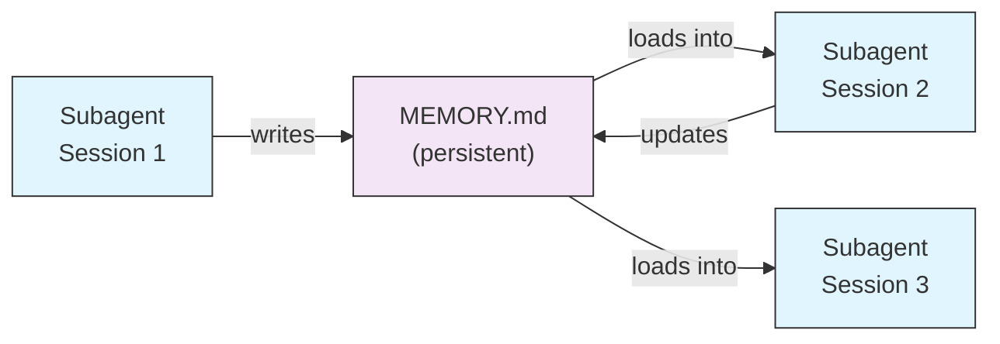
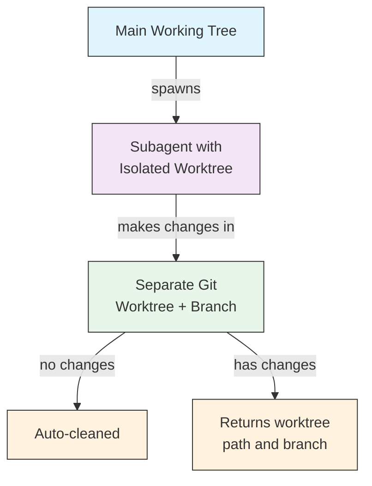
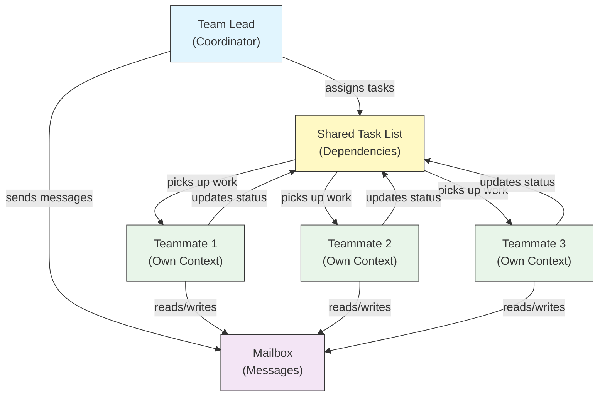
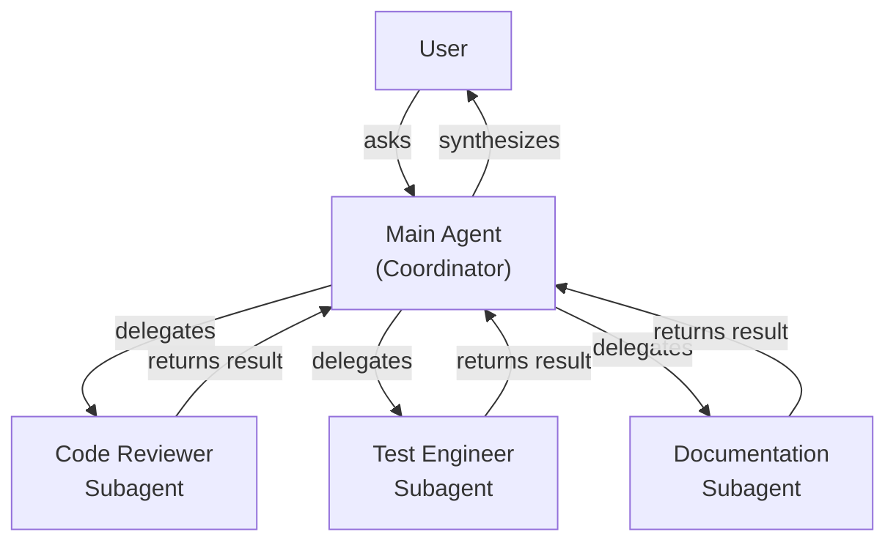
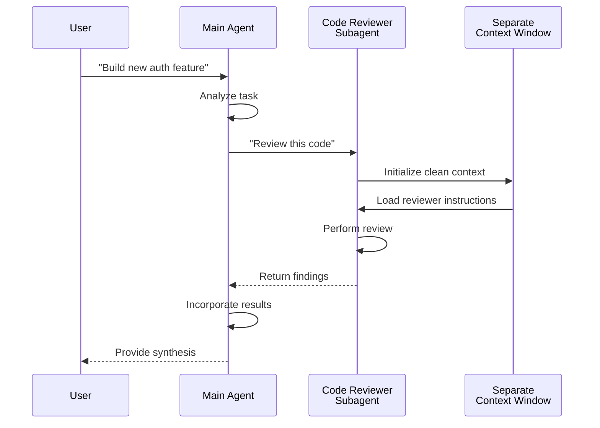
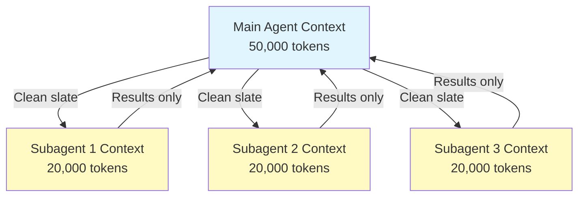
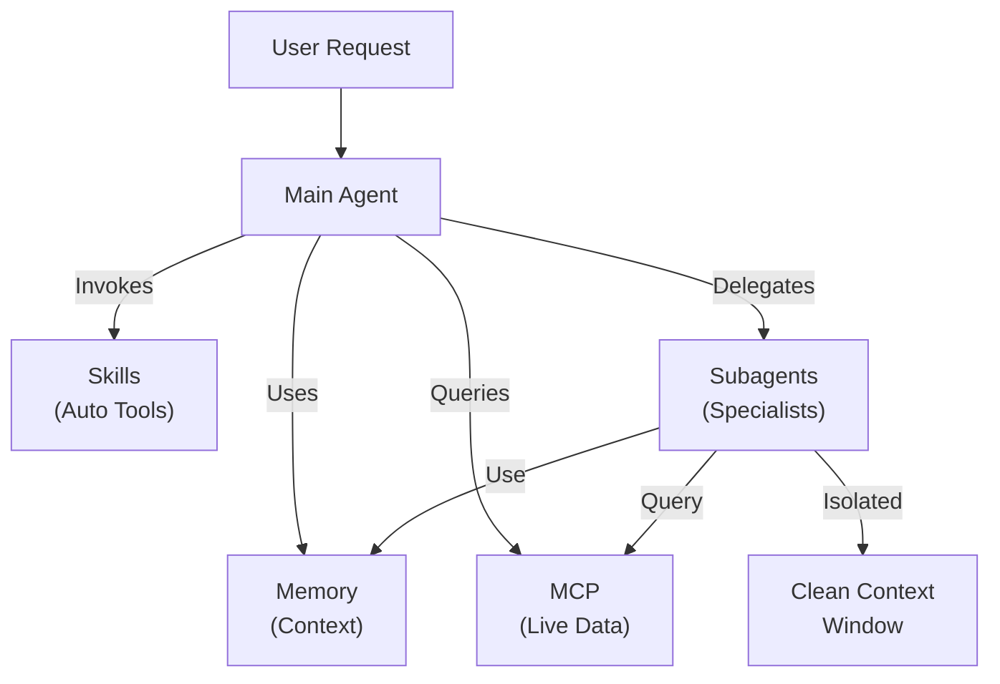

<picture>
  <source media="(prefers-color-scheme: dark)" srcset="../resources/logos/claude-howto-logo-dark.svg">
  
</picture>

# Subagents - Complete Reference Guide

Subagents 是 Claude Code 可以委派任务给它们的专用 AI 助手。每个 subagent 都有明确职责，使用独立于主对话的 context window，并且可以配置专属工具权限和自定义 system prompt。

## Table of Contents

1. [Overview](#overview)
2. [Key Benefits](#key-benefits)
3. [File Locations](#file-locations)
4. [Configuration](#configuration)
5. [Built-in Subagents](#built-in-subagents)
6. [Managing Subagents](#managing-subagents)
7. [Using Subagents](#using-subagents)
8. [Resumable Agents](#resumable-agents)
9. [Chaining Subagents](#chaining-subagents)
10. [Persistent Memory for Subagents](#persistent-memory-for-subagents)
11. [Background Subagents](#background-subagents)
12. [Worktree Isolation](#worktree-isolation)
13. [Restrict Spawnable Subagents](#restrict-spawnable-subagents)
14. [`claude agents` CLI Command](#claude-agents-cli-command)
15. [Agent Teams (Experimental)](#agent-teams-experimental)
16. [Plugin Subagent Security](#plugin-subagent-security)
17. [Architecture](#architecture)
18. [Context Management](#context-management)
19. [When to Use Subagents](#when-to-use-subagents)
20. [Best Practices](#best-practices)
21. [Example Subagents in This Folder](#example-subagents-in-this-folder)
22. [Installation Instructions](#installation-instructions)
23. [Related Concepts](#related-concepts)

---

## Overview

Subagents 在 Claude Code 中通过以下方式实现委派式任务执行：

- 创建**隔离的 AI 助手**，使用独立 context window
- 提供**定制化 system prompt**，注入特定领域专长
- 通过**工具访问控制**限制能力范围
- 防止复杂任务**污染主上下文**
- 支持多个专用任务的**并行执行**

每个 subagent 都在干净、独立的上下文里运行，只接收完成当前任务所需的最小上下文，完成后再把结果返回给主 agent 进行汇总。

**Quick Start**：使用 `/agents` 命令可以交互式创建、查看、编辑和管理 subagents。

---

## Key Benefits

| Benefit | Description |
|---------|-------------|
| **Context preservation** | 在独立上下文中工作，避免污染主对话 |
| **Specialized expertise** | 针对特定领域优化，任务成功率更高 |
| **Reusability** | 可跨项目使用，也可与团队共享 |
| **Flexible permissions** | 不同 subagent 可配置不同工具权限 |
| **Scalability** | 多个 agent 可同时处理不同方面的任务 |

---

## File Locations

Subagent 文件可以放在多个位置，不同位置决定不同作用域：

| Priority | Type | Location | Scope |
|----------|------|----------|-------|
| 1 (highest) | **CLI-defined** | 通过 `--agents` flag（JSON） | 仅当前 session |
| 2 | **Project subagents** | `.claude/agents/` | 当前项目 |
| 3 | **User subagents** | `~/.claude/agents/` | 所有项目 |
| 4 (lowest) | **Plugin agents** | 插件的 `agents/` 目录 | 通过插件启用 |

当存在同名定义时，优先级更高的来源会覆盖更低的来源。

---

## Configuration

### File Format

Subagents 通过 YAML frontmatter 加 Markdown system prompt 定义：

```yaml
---
name: your-sub-agent-name
description: Description of when this subagent should be invoked
tools: tool1, tool2, tool3  # Optional - inherits all tools if omitted
disallowedTools: tool4  # Optional - explicitly disallowed tools
model: sonnet  # Optional - sonnet, opus, haiku, or inherit
permissionMode: default  # Optional - permission mode
maxTurns: 20  # Optional - limit agentic turns
skills: skill1, skill2  # Optional - skills to preload into context
mcpServers: server1  # Optional - MCP servers to make available
memory: user  # Optional - persistent memory scope (user, project, local)
background: false  # Optional - run as background task
effort: high  # Optional - reasoning effort (low, medium, high, max)
isolation: worktree  # Optional - git worktree isolation
initialPrompt: "Start by analyzing the codebase"  # Optional - auto-submitted first turn
hooks:  # Optional - component-scoped hooks
  PreToolUse:
    - matcher: "Bash"
      hooks:
        - type: command
          command: "./scripts/security-check.sh"
---

Your subagent's system prompt goes here. This can be multiple paragraphs
and should clearly define the subagent's role, capabilities, and approach
to solving problems.
```

### Configuration Fields

| Field | Required | Description |
|-------|----------|-------------|
| `name` | Yes | 唯一标识符（小写字母和连字符） |
| `description` | Yes | 用自然语言描述用途。写入 "use PROACTIVELY" 可鼓励自动调用 |
| `tools` | No | 逗号分隔的工具列表。不写则继承全部工具。支持 `Agent(agent_name)` 语法来限制可派生的 subagent |
| `disallowedTools` | No | 该 subagent 明确禁止使用的工具列表 |
| `model` | No | 使用的模型：`sonnet`、`opus`、`haiku`、完整模型 ID 或 `inherit`。默认使用配置中的 subagent model |
| `permissionMode` | No | `default`、`acceptEdits`、`dontAsk`、`bypassPermissions`、`plan` |
| `maxTurns` | No | subagent 允许执行的最大 agentic turn 数 |
| `skills` | No | 预加载 skills，逗号分隔。会在启动时把完整 skill 内容注入 subagent 上下文 |
| `mcpServers` | No | 让该 subagent 可用的 MCP servers |
| `hooks` | No | 组件级 hooks（PreToolUse、PostToolUse、Stop） |
| `memory` | No | 持久 memory 目录作用域：`user`、`project` 或 `local` |
| `background` | No | 设为 `true` 时，该 subagent 总在后台运行 |
| `effort` | No | 推理强度：`low`、`medium`、`high` 或 `max` |
| `isolation` | No | 设为 `worktree` 时，给 subagent 独立 git worktree |
| `initialPrompt` | No | 当 subagent 作为主 agent 运行时自动提交的首轮 prompt |

### Tool Configuration Options

**Option 1: Inherit All Tools（省略该字段）**
```yaml
---
name: full-access-agent
description: Agent with all available tools
---
```

**Option 2: Specify Individual Tools**
```yaml
---
name: limited-agent
description: Agent with specific tools only
tools: Read, Grep, Glob, Bash
---
```

**Option 3: Conditional Tool Access**
```yaml
---
name: conditional-agent
description: Agent with filtered tool access
tools: Read, Bash(npm:*), Bash(test:*)
---
```

### CLI-Based Configuration

你也可以通过 `--agents` flag 以 JSON 格式为单个 session 定义 subagents：

```bash
claude --agents '{
  "code-reviewer": {
    "description": "Expert code reviewer. Use proactively after code changes.",
    "prompt": "You are a senior code reviewer. Focus on code quality, security, and best practices.",
    "tools": ["Read", "Grep", "Glob", "Bash"],
    "model": "sonnet"
  }
}'
```

**`--agents` 的 JSON 格式：**

```json
{
  "agent-name": {
    "description": "Required: when to invoke this agent",
    "prompt": "Required: system prompt for the agent",
    "tools": ["Optional", "array", "of", "tools"],
    "model": "optional: sonnet|opus|haiku"
  }
}
```

**Priority of Agent Definitions:**

Agent 定义按以下优先级加载（先匹配先赢）：
1. **CLI-defined** - `--agents` flag（仅当前 session，JSON）
2. **Project-level** - `.claude/agents/`（当前项目）
3. **User-level** - `~/.claude/agents/`（所有项目）
4. **Plugin-level** - 插件的 `agents/` 目录

这意味着 CLI 定义可以在单次 session 中覆盖所有其他来源。

---

## Built-in Subagents

Claude Code 自带若干始终可用的 built-in subagents：

| Agent | Model | Purpose |
|-------|-------|---------|
| **general-purpose** | Inherits | 复杂、多步骤任务 |
| **Plan** | Inherits | 为 plan mode 做调研 |
| **Explore** | Haiku | 只读代码库探索（quick/medium/very thorough） |
| **Bash** | Inherits | 在独立上下文中执行终端命令 |
| **statusline-setup** | Sonnet | 配置状态栏 |
| **Claude Code Guide** | Haiku | 回答 Claude Code 功能问题 |

### General-Purpose Subagent

| Property | Value |
|----------|-------|
| **Model** | 继承父级 |
| **Tools** | 全部工具 |
| **Purpose** | 复杂调研任务、多步骤操作、代码修改 |

**When used**：需要同时探索和修改，并伴随复杂推理的任务。

### Plan Subagent

| Property | Value |
|----------|-------|
| **Model** | 继承父级 |
| **Tools** | Read, Glob, Grep, Bash |
| **Purpose** | 在 plan mode 中自动用于调研代码库 |

**When used**：当 Claude 需要先理解代码库，再向用户展示计划时。

### Explore Subagent

| Property | Value |
|----------|-------|
| **Model** | Haiku（快、低延迟） |
| **Mode** | 严格只读 |
| **Tools** | Glob, Grep, Read, Bash（仅允许只读命令） |
| **Purpose** | 快速搜索和分析代码库 |

**When used**：只需要搜索或理解代码，不需要做修改时。

**Thoroughness Levels**：
- **"quick"** - 快速搜索，探索最少，适合找特定模式
- **"medium"** - 中等深度，平衡速度和完整性，默认策略
- **"very thorough"** - 跨多处位置和命名方式做全面分析，耗时更长

### Bash Subagent

| Property | Value |
|----------|-------|
| **Model** | 继承父级 |
| **Tools** | Bash |
| **Purpose** | 在独立上下文窗口中执行终端命令 |

**When used**：运行 shell 命令，且希望命令上下文与主对话隔离时。

### Statusline Setup Subagent

| Property | Value |
|----------|-------|
| **Model** | Sonnet |
| **Tools** | Read, Write, Bash |
| **Purpose** | 配置 Claude Code 状态栏显示 |

**When used**：设置或自定义状态栏时。

### Claude Code Guide Subagent

| Property | Value |
|----------|-------|
| **Model** | Haiku（快、低延迟） |
| **Tools** | 只读 |
| **Purpose** | 回答 Claude Code 功能和使用方式相关问题 |

**When used**：用户提问 Claude Code 的工作方式或具体功能如何使用时。

---

## Managing Subagents

### Using the `/agents` Command (Recommended)

```bash
/agents
```

它会提供一个交互式菜单，用于：
- 查看所有可用 subagents（built-in、user、project）
- 通过引导流程创建新 subagent
- 编辑现有自定义 subagent 及其工具权限
- 删除自定义 subagent
- 查看同名冲突时哪个 subagent 实际生效

### Direct File Management

```bash
# Create a project subagent
mkdir -p .claude/agents
cat > .claude/agents/test-runner.md << 'EOF'
---
name: test-runner
description: Use proactively to run tests and fix failures
---

You are a test automation expert. When you see code changes, proactively
run the appropriate tests. If tests fail, analyze the failures and fix
them while preserving the original test intent.
EOF

# Create a user subagent (available in all projects)
mkdir -p ~/.claude/agents
```

---

## Using Subagents

### Automatic Delegation

Claude 会根据以下信息主动委派任务：
- 你请求中的任务描述
- subagent 配置中的 `description` 字段
- 当前上下文和可用工具

如果你希望 Claude 更积极地使用某个 subagent，可以在 `description` 中写入 "use PROACTIVELY" 或 "MUST BE USED"：

```yaml
---
name: code-reviewer
description: Expert code review specialist. Use PROACTIVELY after writing or modifying code.
---
```

### Explicit Invocation

你也可以显式要求使用某个 subagent：

```
> Use the test-runner subagent to fix failing tests
> Have the code-reviewer subagent look at my recent changes
> Ask the debugger subagent to investigate this error
```

### @-Mention Invocation

使用 `@` 前缀可以强制调用指定 subagent（绕过自动委派启发式）：

```
> @"code-reviewer (agent)" review the auth module
```

### Session-Wide Agent

你还可以让整个 session 都以某个 agent 作为主 agent 运行：

```bash
# Via CLI flag
claude --agent code-reviewer

# Via settings.json
{
  "agent": "code-reviewer"
}
```

### Listing Available Agents

使用 `claude agents` 命令列出所有来源中已配置的 agents：

```bash
claude agents
```

---

## Resumable Agents

Subagents 可以在保留完整上下文的前提下继续之前的对话：

```bash
# Initial invocation
> Use the code-analyzer agent to start reviewing the authentication module
# Returns agentId: "abc123"

# Resume the agent later
> Resume agent abc123 and now analyze the authorization logic as well
```

**Use cases**：
- 跨多个 session 的长时间研究
- 不丢失上下文的迭代式优化
- 保持上下文的多步骤工作流

---

## Chaining Subagents

你可以按顺序串联多个 subagent：

```bash
> First use the code-analyzer subagent to find performance issues,
  then use the optimizer subagent to fix them
```

这样就能构造复杂工作流，让一个 subagent 的输出成为下一个 subagent 的输入。

---

## Persistent Memory for Subagents

`memory` 字段可以为 subagent 提供一个跨对话持久存在的目录。这样 subagent 就能随着时间积累知识，保存笔记、发现和上下文信息。

### Memory Scopes

| Scope | Directory | Use Case |
|-------|-----------|----------|
| `user` | `~/.claude/agent-memory/<name>/` | 跨所有项目的个人笔记和偏好 |
| `project` | `.claude/agent-memory/<name>/` | 团队共享的项目知识 |
| `local` | `.claude/agent-memory-local/<name>/` | 不提交到版本控制的本地项目知识 |

### How It Works

- memory 目录中的 `MEMORY.md` 前 200 行会自动加载进 subagent 的 system prompt
- `Read`、`Write`、`Edit` 工具会自动为该 subagent 启用，以便它管理自己的 memory 文件
- subagent 可以按需要在 memory 目录中创建更多文件

### Example Configuration

```yaml
---
name: researcher
memory: user
---

You are a research assistant. Use your memory directory to store findings,
track progress across sessions, and build up knowledge over time.

Check your MEMORY.md file at the start of each session to recall previous context.
```



---

## Background Subagents

Subagents 可以在后台运行，从而把主对话留给其他任务。

### Configuration

在 frontmatter 中设置 `background: true`，即可让该 subagent 始终作为后台任务运行：

```yaml
---
name: long-runner
background: true
description: Performs long-running analysis tasks in the background
---
```

### Keyboard Shortcuts

| Shortcut | Action |
|----------|--------|
| `Ctrl+B` | 将当前运行中的 subagent 任务切到后台 |
| `Ctrl+F` | 杀掉所有后台 agent（连按两次确认） |

### Disabling Background Tasks

可通过环境变量完全禁用后台任务支持：

```bash
export CLAUDE_CODE_DISABLE_BACKGROUND_TASKS=1
```

---

## Worktree Isolation

`isolation: worktree` 会为 subagent 分配一个独立 git worktree，使其可以独立修改代码，而不影响主工作树。

### Configuration

```yaml
---
name: feature-builder
isolation: worktree
description: Implements features in an isolated git worktree
tools: Read, Write, Edit, Bash, Grep, Glob
---
```

### How It Works



- subagent 在独立 branch 的独立 git worktree 中工作
- 如果 subagent 没有产生改动，worktree 会自动清理
- 如果有改动，主 agent 会收到 worktree 路径和 branch 名，便于后续审查或合并

---

## Restrict Spawnable Subagents

你可以在 `tools` 字段中使用 `Agent(agent_type)` 语法，限制某个 subagent 只能派生特定 subagents。这相当于一个 allowlist。

> **Note**：从 v2.1.63 开始，`Task` 工具已更名为 `Agent`。旧的 `Task(...)` 写法仍然作为别名可用。

### Example

```yaml
---
name: coordinator
description: Coordinates work between specialized agents
tools: Agent(worker, researcher), Read, Bash
---

You are a coordinator agent. You can delegate work to the "worker" and
"researcher" subagents only. Use Read and Bash for your own exploration.
```

在这个例子中，`coordinator` 只能派生 `worker` 和 `researcher` 两个 subagent，即使系统里定义了其他 subagents，也无法调用。

---

## `claude agents` CLI Command

`claude agents` 命令会按来源分组列出所有已配置 agents（built-in、user-level、project-level）：

```bash
claude agents
```

该命令会：
- 显示所有来源中的可用 agents
- 按来源位置分组展示
- 标记 **overrides**，说明高优先级定义如何覆盖低优先级定义（例如 project-level agent 覆盖同名 user-level agent）

---

## Agent Teams (Experimental)

Agent Teams 让多个 Claude Code 实例在复杂任务上协同工作。和 subagents 不同，subagents 更像“被委派的子任务执行者，执行完回传结果”；而 teammates 是独立运行的 Claude Code 实例，拥有自己的上下文，并通过共享 mailbox 直接协作。

> **Note**：Agent Teams 属于实验特性，需要 Claude Code v2.1.32+。使用前需手动开启。

### Subagents vs Agent Teams

| Aspect | Subagents | Agent Teams |
|--------|-----------|-------------|
| **Delegation model** | 父 agent 委派子任务并等待结果 | team lead 分派任务，teammates 独立执行 |
| **Context** | 每个子任务都是新上下文，结果会被提炼回主 agent | 每个 teammate 都维护自己的持久上下文 |
| **Coordination** | 顺序或并行执行，由父 agent 协调 | 通过共享任务列表和自动依赖管理协作 |
| **Communication** | 只能返回结果 | 通过 mailbox 进行 agent 间消息通信 |
| **Session resumption** | 支持 | in-process teammates 不支持恢复 |
| **Best for** | 聚焦、边界清晰的子任务 | 需要并行处理的大型多文件项目 |

### Enabling Agent Teams

可以通过环境变量或 `settings.json` 开启：

```bash
export CLAUDE_CODE_EXPERIMENTAL_AGENT_TEAMS=1
```

或者在 `settings.json` 中：

```json
{
  "env": {
    "CLAUDE_CODE_EXPERIMENTAL_AGENT_TEAMS": "1"
  }
}
```

### Starting a team

启用后，直接在 prompt 中要求 Claude 使用 teammates：

```
User: Build the authentication module. Use a team — one teammate for the API endpoints,
      one for the database schema, and one for the test suite.
```

Claude 会自动创建 team、分派任务并协调执行。

### Display modes

控制 teammate 活动的显示方式：

| Mode | Flag | Description |
|------|------|-------------|
| **Auto** | `--teammate-mode auto` | 自动根据终端环境选择最佳显示方式 |
| **In-process** | `--teammate-mode in-process` | 在当前终端内联显示 teammate 输出（默认） |
| **Split-panes** | `--teammate-mode tmux` | 将每个 teammate 放进独立 tmux 或 iTerm2 pane |

```bash
claude --teammate-mode tmux
```

也可以在 `settings.json` 中设置：

```json
{
  "teammateMode": "tmux"
}
```

> **Note**：分屏模式需要 tmux 或 iTerm2。不支持 VS Code terminal、Windows Terminal 或 Ghostty。

### Navigation

在分屏模式下，用 `Shift+Down` 在 teammates 之间切换。

### Team Configuration

Team 配置保存在 `~/.claude/teams/{team-name}/config.json`。

### Architecture



**Key components**：

- **Team Lead**：负责创建 team、分配任务和整体协调的主 Claude Code session
- **Shared Task List**：带自动依赖跟踪的同步任务列表
- **Mailbox**：供 teammates 沟通状态和协调工作的消息系统
- **Teammates**：相互独立的 Claude Code 实例，每个都有自己的 context window

### Task assignment and messaging

Team lead 会把工作拆成任务并分配给 teammates。共享任务列表负责：

- **Automatic dependency management** — 任务会自动等待依赖完成
- **Status tracking** — teammates 在执行中持续更新任务状态
- **Inter-agent messaging** — teammates 通过 mailbox 发送消息进行协调（例如："Database schema is ready, you can start writing queries"）

### Plan approval workflow

对于复杂任务，team lead 会在 teammates 开始工作前先生成执行计划。用户需要先审阅并批准这个计划，从而确保团队行动方向符合预期，再开始任何代码变更。

### Hook events for teams

Agent Teams 新增了两个 [hook events](../06-hooks/)：

| Event | Fires When | Use Case |
|-------|-----------|----------|
| `TeammateIdle` | 某个 teammate 完成当前任务且没有待处理工作时 | 触发通知、分配后续任务 |
| `TaskCompleted` | 共享任务列表中的某个任务被标记完成时 | 跑验证、更新仪表盘、触发依赖任务 |

### Best practices

- **Team size**：建议 3-5 个 teammates，协调成本和效率最平衡
- **Task sizing**：每项任务控制在 5-15 分钟，足够小以便并行，也足够大以保持意义
- **Avoid file conflicts**：不同 teammate 最好分配不同文件或目录，避免 merge conflict
- **Start simple**：第一次先用 in-process 模式，熟悉后再切换 split-panes
- **Clear task descriptions**：任务描述要具体、可执行，让 teammates 能独立推进

### Limitations

- **Experimental**：未来版本中行为可能变化
- **No session resumption**：in-process teammates 在 session 结束后无法恢复
- **One team per session**：一个 session 中不能嵌套 team，也不能同时存在多个 team
- **Fixed leadership**：team lead 角色不能移交给 teammate
- **Split-pane restrictions**：需要 tmux / iTerm2；不支持 VS Code terminal、Windows Terminal、Ghostty
- **No cross-session teams**：teammates 仅存在于当前 session

> **Warning**：Agent Teams 仍是实验功能。请先在非关键任务上试用，并关注协调过程是否有异常。

---

## Plugin Subagent Security

出于安全考虑，插件提供的 subagents 在 frontmatter 上有额外限制。以下字段**不能**出现在 plugin subagent 定义中：

- `hooks` - 不能定义生命周期 hooks
- `mcpServers` - 不能配置 MCP servers
- `permissionMode` - 不能覆盖权限设置

这样可以防止插件通过 subagent hooks 提权，或执行任意命令。

---

## Architecture

### High-Level Architecture



### Subagent Lifecycle



---

## Context Management



### Key Points

- 每个 subagent 都会获得一个**新的 context window**，不带主对话历史
- 只有和当前任务相关的**最小上下文**会传给 subagent
- 返回给主 agent 的是**提炼后的结果**
- 这样可以避免长项目中的 **context token exhaustion**

### Performance Considerations

- **Context efficiency** - subagents 能保护主上下文，从而支持更长的 session
- **Latency** - subagents 需要从干净上下文重新收集初始信息，因此会引入额外延迟

### Key Behaviors

- **No nested spawning** - subagents 不能继续派生其他 subagents
- **Background permissions** - 后台 subagent 会自动拒绝任何未预先批准的权限请求
- **Backgrounding** - 按 `Ctrl+B` 可把当前任务切到后台
- **Transcripts** - subagent transcript 保存在 `~/.claude/projects/{project}/{sessionId}/subagents/agent-{agentId}.jsonl`
- **Auto-compaction** - subagent context 在约 95% 容量时会自动 compact（可通过 `CLAUDE_AUTOCOMPACT_PCT_OVERRIDE` 环境变量覆盖）

---

## When to Use Subagents

| Scenario | Use Subagent | Why |
|----------|--------------|-----|
| 复杂功能包含很多步骤 | Yes | 分离关注点，避免主上下文污染 |
| 快速代码 review | No | 增加了不必要的开销 |
| 并行执行多个任务 | Yes | 每个 subagent 都有自己的上下文 |
| 需要专门领域能力 | Yes | 可通过自定义 system prompt 提供专长 |
| 长时间运行的分析任务 | Yes | 避免耗尽主上下文 |
| 单一步骤任务 | No | 会引入不必要延迟 |

---

## Best Practices

### Design Principles

**Do:**
- 从 Claude 生成的 agents 开始 - 先让 Claude 生成初版，再迭代优化
- 设计聚焦型 subagent - 一次只承担单一清晰职责，而不是包揽一切
- 写详细 prompt - 包含具体说明、示例和约束
- 限制工具访问 - 只授予完成任务所需工具
- 版本控制 - 将项目级 subagents 提交到版本控制，方便团队协作

**Don't:**
- 不要创建角色重叠的 subagents
- 不要给 subagents 不必要的工具权限
- 不要把 subagents 用在简单单步任务上
- 不要在一个 prompt 里混杂多个关注点
- 不要忘记传递必要上下文

### System Prompt Best Practices

1. **Be Specific About Role**
   ```
   You are an expert code reviewer specializing in [specific areas]
   ```

2. **Define Priorities Clearly**
   ```
   Review priorities (in order):
   1. Security Issues
   2. Performance Problems
   3. Code Quality
   ```

3. **Specify Output Format**
   ```
   For each issue provide: Severity, Category, Location, Description, Fix, Impact
   ```

4. **Include Action Steps**
   ```
   When invoked:
   1. Run git diff to see recent changes
   2. Focus on modified files
   3. Begin review immediately
   ```

### Tool Access Strategy

1. **Start Restrictive**：先只给最必要的工具
2. **Expand Only When Needed**：只有在确实需要时再放宽
3. **Read-Only When Possible**：分析类 agent 尽量只给 Read/Grep
4. **Sandboxed Execution**：把 Bash 命令限制到明确模式

---

## Example Subagents in This Folder

这个目录中包含可直接使用的示例 subagents：

### 1. Code Reviewer (`code-reviewer.md`)

**Purpose**：完整的代码质量和可维护性分析

**Tools**：Read, Grep, Glob, Bash

**Specialization**：
- 安全漏洞识别
- 性能优化点识别
- 代码可维护性评估
- 测试覆盖率分析

**Use When**：需要自动化代码 review，重点关注质量和安全时

---

### 2. Test Engineer (`test-engineer.md`)

**Purpose**：测试策略、覆盖率分析和自动化测试

**Tools**：Read, Write, Bash, Grep

**Specialization**：
- 单元测试编写
- 集成测试设计
- 边界场景识别
- 覆盖率分析（目标 >80%）

**Use When**：需要生成完整测试集，或分析测试覆盖率时

---

### 3. Documentation Writer (`documentation-writer.md`)

**Purpose**：技术文档、API 文档和用户指南

**Tools**：Read, Write, Grep

**Specialization**：
- API endpoint 文档
- 用户指南编写
- 架构文档
- 代码注释改进

**Use When**：需要创建或更新项目文档时

---

### 4. Secure Reviewer (`secure-reviewer.md`)

**Purpose**：具备最小权限的安全代码评审

**Tools**：Read, Grep

**Specialization**：
- 安全漏洞检测
- 认证/授权问题
- 数据暴露风险
- 注入攻击识别

**Use When**：需要只读安全审计，且不希望具备修改能力时

---

### 5. Implementation Agent (`implementation-agent.md`)

**Purpose**：面向功能开发的完整实现能力

**Tools**：Read, Write, Edit, Bash, Grep, Glob

**Specialization**：
- 功能实现
- 代码生成
- 构建与测试执行
- 代码库修改

**Use When**：需要一个 subagent 端到端实现功能时

---

### 6. Debugger (`debugger.md`)

**Purpose**：面向错误、测试失败和异常行为的调试专家

**Tools**：Read, Edit, Bash, Grep, Glob

**Specialization**：
- 根因分析
- 错误调查
- 测试失败修复
- 最小修复实现

**Use When**：遇到 bug、错误或异常行为时

---

### 7. Data Scientist (`data-scientist.md`)

**Purpose**：面向 SQL 查询和数据洞察的数据分析专家

**Tools**：Bash, Read, Write

**Specialization**：
- SQL 查询优化
- BigQuery 操作
- 数据分析与可视化
- 统计洞察

**Use When**：需要做数据分析、SQL 查询或 BigQuery 操作时

---

## Installation Instructions

### Method 1: Using /agents Command (Recommended)

```bash
/agents
```

然后：
1. 选择 `Create New Agent`
2. 选择 project-level 或 user-level
3. 详细描述你的 subagent
4. 选择要授予的工具（或留空以继承全部）
5. 保存并开始使用

### Method 2: Copy to Project

把这些 agent 文件复制到项目的 `.claude/agents/` 目录：

```bash
# Navigate to your project
cd /path/to/your/project

# Create agents directory if it doesn't exist
mkdir -p .claude/agents

# Copy all agent files from this folder
cp /path/to/04-subagents/*.md .claude/agents/

# Remove the README (not needed in .claude/agents)
rm .claude/agents/README.md
```

### Method 3: Copy to User Directory

如果你希望这些 agents 在所有项目中都可用：

```bash
# Create user agents directory
mkdir -p ~/.claude/agents

# Copy agents
cp /path/to/04-subagents/code-reviewer.md ~/.claude/agents/
cp /path/to/04-subagents/debugger.md ~/.claude/agents/
# ... copy others as needed
```

### Verification

安装后，验证 agents 已被识别：

```bash
/agents
```

你应该能在内置 agents 一起看到刚安装的 agents。

---

## File Structure

```
project/
├── .claude/
│   └── agents/
│       ├── code-reviewer.md
│       ├── test-engineer.md
│       ├── documentation-writer.md
│       ├── secure-reviewer.md
│       ├── implementation-agent.md
│       ├── debugger.md
│       └── data-scientist.md
└── ...
```

---

## Related Concepts

### Related Features

- **[Slash Commands](../01-slash-commands/)** - 用户显式触发的快捷命令
- **[Memory](../02-memory/)** - 跨 session 的持久上下文
- **[Skills](../03-skills/)** - 可复用的自动化能力
- **[MCP Protocol](../05-mcp/)** - 实时外部数据访问
- **[Hooks](../06-hooks/)** - 事件驱动的 shell 命令自动化
- **[Plugins](../07-plugins/)** - 打包分发的扩展能力集合

### Comparison with Other Features

| Feature | User-Invoked | Auto-Invoked | Persistent | External Access | Isolated Context |
|---------|--------------|--------------|-----------|------------------|------------------|
| **Slash Commands** | Yes | No | No | No | No |
| **Subagents** | Yes | Yes | No | No | Yes |
| **Memory** | Auto | Auto | Yes | No | No |
| **MCP** | Auto | Yes | No | Yes | No |
| **Skills** | Yes | Yes | No | No | No |

### Integration Pattern



---

## Additional Resources

- [Official Subagents Documentation](https://code.claude.com/docs/en/sub-agents)
- [CLI Reference](https://code.claude.com/docs/en/cli-reference) - `--agents` flag 和其他 CLI 选项
- [Plugins Guide](../07-plugins/) - 了解如何把 agents 和其他能力一起打包
- [Skills Guide](../03-skills/) - 了解自动触发能力
- [Memory Guide](../02-memory/) - 了解持久上下文
- [Hooks Guide](../06-hooks/) - 了解事件驱动自动化

---

*Last updated: March 2026*

*This guide covers complete subagent configuration, delegation patterns, and best practices for Claude Code.*
