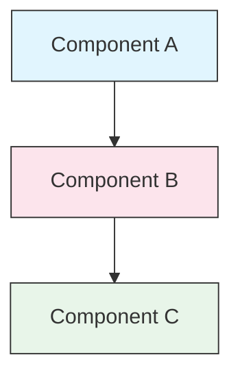

<picture>
  <source media="(prefers-color-scheme: dark)" srcset="resources/logos/claude-howto-logo-dark.svg">
  
</picture>

# 风格指南

> 这是为 Claude How To 贡献内容时应遵循的约定与格式规则。遵循本指南可以让内容保持一致、专业，并且易于维护。

---

## 目录

- [文件与文件夹命名](#文件与文件夹命名)
- [文档结构](#文档结构)
- [标题](#标题)
- [文本格式](#文本格式)
- [列表](#列表)
- [表格](#表格)
- [代码块](#代码块)
- [链接与交叉引用](#链接与交叉引用)
- [图表](#图表)
- [Emoji 使用](#emoji-使用)
- [YAML Frontmatter](#yaml-frontmatter)
- [图片与媒体](#图片与媒体)
- [语气与文风](#语气与文风)
- [Commit Messages](#commit-messages)
- [作者检查清单](#作者检查清单)

---

## 文件与文件夹命名

### 课程目录

课程目录使用 **两位数字前缀** + **kebab-case** 描述：

```
01-slash-commands/
02-memory/
03-skills/
04-subagents/
05-mcp/
```

数字表示从入门到高级的推荐学习顺序。

### 文件名

| Type | Convention | Examples |
|------|-----------|----------|
| **Lesson README** | `README.md` | `01-slash-commands/README.md` |
| **Feature file** | Kebab-case `.md` | `code-reviewer.md`、`generate-api-docs.md` |
| **Shell script** | Kebab-case `.sh` | `format-code.sh`、`validate-input.sh` |
| **Config file** | 标准命名 | `.mcp.json`、`settings.json` |
| **Memory file** | 带作用域前缀 | `project-CLAUDE.md`、`personal-CLAUDE.md` |
| **Top-level docs** | UPPER_CASE `.md` | `CATALOG.md`、`QUICK_REFERENCE.md`、`CONTRIBUTING.md` |
| **Image assets** | Kebab-case | `pr-slash-command.png`、`claude-howto-logo.svg` |

### 规则

- 所有文件与目录名都使用 **小写**（顶层文档如 `README.md`、`CATALOG.md` 除外）
- 使用 **连字符**（`-`）分隔单词，绝不要使用下划线或空格
- 名称要有描述性，但保持简洁

---

## 文档结构

### 根 README

根目录 `README.md` 应按以下顺序组织：

1. Logo（带暗黑/明亮模式变体的 `<picture>` 元素）
2. H1 标题
3. 引导性 blockquote（一句话价值主张）
4. “Why This Guide?” 章节及对比表
5. 分隔线（`---`）
6. 目录
7. 功能目录
8. 快速导航
9. 学习路径
10. 功能章节
11. 快速开始
12. 最佳实践 / 故障排查
13. Contributing / License

### Lesson README

每个课程 `README.md` 按以下顺序组织：

1. H1 标题（例如 `# Slash Commands`）
2. 简短概览段落
3. 快速参考表（可选）
4. 架构图（Mermaid）
5. 详细章节（H2）
6. 实战示例（编号，4-6 个）
7. 最佳实践（Do's / Don'ts 表）
8. 故障排查
9. 相关指南 / 官方文档
10. 文档元数据页脚

### 功能 / 示例文件

单个功能文件（例如 `optimize.md`、`pr.md`）应按以下顺序组织：

1. YAML frontmatter（如果需要）
2. H1 标题
3. 用途 / 描述
4. 使用说明
5. 代码示例
6. 自定义建议

### 章节分隔

使用分隔线（`---`）分隔主要文档区域：

```markdown
---

## 新的主要章节
```

应放在引导性 blockquote 后，以及文档中逻辑上明显独立的部分之间。

---

## 标题

### 层级

| Level | Use | Example |
|-------|-----|---------|
| `#` H1 | 页面标题（每篇文档仅一个） | `# Slash Commands` |
| `##` H2 | 主要章节 | `## Best Practices` |
| `###` H3 | 子章节 | `### Adding a Skill` |
| `####` H4 | 更细子章节（少见） | `#### Configuration Options` |

### 规则

- **每篇文档只允许一个 H1** —— 仅作为页面标题
- **不要跳级** —— 不要从 H2 直接跳到 H4
- **标题保持简洁** —— 尽量控制在 2-5 个词
- **使用 sentence case** —— 仅首词和专有名词首字母大写（特性名称除外，按原样保留）
- **只在根 README 的章节标题中加 emoji 前缀**（见 [Emoji 使用](#emoji-使用)）

---

## 文本格式

### 强调

| Style | When to Use | Example |
|-------|------------|---------|
| **Bold** (`**text**`) | 关键术语、表格标签、重要概念 | `**Installation**:` |
| *Italic* (`*text*`) | 首次出现的技术术语、书名/文档名 | `*frontmatter*` |
| `Code` (`` `text` ``) | 文件名、命令、配置值、代码引用 | `` `CLAUDE.md` `` |

### 用 Blockquote 做提示框

对重要提示使用带粗体前缀的 blockquote：

```markdown
> **Note**: Custom slash commands have been merged into skills since v2.0.

> **Important**: Never commit API keys or credentials.

> **Tip**: Combine memory with skills for maximum effectiveness.
```

支持的提示类型：**Note**、**Important**、**Tip**、**Warning**。

### 段落

- 每段保持简短（2-4 句）
- 段落之间留空行
- 先说关键点，再补背景
- 解释“为什么”，而不仅是“是什么”

---

## 列表

### 无序列表

使用短横线（`-`），嵌套时缩进 2 个空格：

```markdown
- First item
- Second item
  - Nested item
  - Another nested item
    - Deep nested (avoid going deeper than 3 levels)
- Third item
```

### 有序列表

对顺序步骤、操作说明和排名项使用编号列表：

```markdown
1. First step
2. Second step
   - Sub-point detail
   - Another sub-point
3. Third step
```

### 描述型列表

对键值式列表使用粗体标签：

```markdown
- **Performance bottlenecks** - identify O(n^2) operations, inefficient loops
- **Memory leaks** - find unreleased resources, circular references
- **Algorithm improvements** - suggest better algorithms or data structures
```

### 规则

- 保持一致缩进（每层 2 个空格）
- 列表前后留空行
- 列表项结构应保持平行（要么都以动词开头，要么都为名词短语）
- 避免嵌套超过 3 层

---

## 表格

### 标准格式

```markdown
| Column 1 | Column 2 | Column 3 |
|----------|----------|----------|
| Data     | Data     | Data     |
```

### 常见表格模式

**功能对比（3-4 列）：**

```markdown
| Feature | Invocation | Persistence | Best For |
|---------|-----------|------------|----------|
| **Slash Commands** | Manual (`/cmd`) | Session only | Quick shortcuts |
| **Memory** | Auto-loaded | Cross-session | Long-term learning |
```

**Do's and Don'ts：**

```markdown
| Do | Don't |
|----|-------|
| Use descriptive names | Use vague names |
| Keep files focused | Overload a single file |
```

**Quick reference：**

```markdown
| Aspect | Details |
|--------|---------|
| **Purpose** | Generate API documentation |
| **Scope** | Project-level |
| **Complexity** | Intermediate |
```

### 规则

- 当表头实际是行标签时，将其加粗（通常是第一列）
- 为了源码可读性，对齐竖线是可选但推荐的
- 单元格内容保持简洁；更多细节可用链接补充
- 表格内的命令与文件路径使用 `code formatting`

---

## 代码块

### 语言标签

始终为代码块指定语言标签，以启用语法高亮：

| Language | Tag | Use For |
|----------|-----|---------|
| Shell | `bash` | CLI 命令、脚本 |
| Python | `python` | Python 代码 |
| JavaScript | `javascript` | JS 代码 |
| TypeScript | `typescript` | TS 代码 |
| JSON | `json` | 配置文件 |
| YAML | `yaml` | Frontmatter、配置 |
| Markdown | `markdown` | Markdown 示例 |
| SQL | `sql` | 数据库查询 |
| Plain text | (no tag) | 预期输出、目录树 |

### 约定

```bash
# 说明该命令用途的注释
claude mcp add notion --transport http https://mcp.notion.com/mcp
```

- 对不明显的命令，在前面加一行**说明性注释**
- 所有示例都应 **可直接复制粘贴**
- 在相关场景下同时展示 **简单版和高级版**
- 如果有助于理解，可加入 **预期输出**（使用无标签代码块）

### 安装代码块

安装说明应使用如下模式：

```bash
# 将文件复制到你的项目中
cp 01-slash-commands/*.md .claude/commands/
```

### 多步骤工作流

```bash
# Step 1: 创建目录
mkdir -p .claude/commands

# Step 2: 复制模板
cp 01-slash-commands/*.md .claude/commands/

# Step 3: 验证安装结果
ls .claude/commands/
```

---

## 链接与交叉引用

### 内部链接（相对路径）

所有内部链接都使用相对路径：

```markdown
[Slash Commands](01-slash-commands/)
[Skills Guide](03-skills/)
[Memory Architecture](02-memory/README_zh.md)
```

从课程目录返回根目录或兄弟目录时：

```markdown
[Back to main guide](README_zh.md)
[Related: Skills](03-skills/)
```

### 外部链接（绝对 URL）

使用完整 URL，并使用有描述性的锚文本：

```markdown
[Anthropic's official documentation](https://code.claude.com/docs/en/overview)
```

- 不要使用 “click here” 或 “this link” 作为锚文本
- 锚文本应在脱离上下文时依然可读

### 章节锚点

链接到同一文档内的章节时，使用 GitHub 风格锚点：

```markdown
[Feature Catalog](#-feature-catalog)
[Best Practices](#best-practices)
```

### 相关指南模式

课程结尾建议加入相关指南章节：

```markdown
## Related Guides

- [Slash Commands](01-slash-commands/) - Quick shortcuts
- [Memory](02-memory/) - Persistent context
- [Skills](03-skills/) - Reusable capabilities
```

---

## 图表

### Mermaid

所有图都应优先使用 Mermaid。支持的类型包括：

- `graph TB` / `graph LR` — 架构、层级、流程
- `sequenceDiagram` — 交互流程
- `timeline` — 时间序列

### 样式约定

使用 style block 应用统一配色：



**配色方案：**

| Color | Hex | Use For |
|-------|-----|---------|
| Light blue | `#e1f5fe` | 主要组件、输入 |
| Light pink | `#fce4ec` | 处理流程、中间层 |
| Light green | `#e8f5e9` | 输出、结果 |
| Light yellow | `#fff9c4` | 配置、可选部分 |
| Light purple | `#f3e5f5` | 面向用户的部分、UI |

### 规则

- 节点标签使用 `["Label text"]` 格式（便于支持特殊字符）
- 标签内换行使用 `<br/>`
- 图表保持简单（最多 10-12 个节点）
- 图下补充简短文字说明，以提高可访问性
- 层级结构用自上而下（`TB`），工作流用从左到右（`LR`）

---

## Emoji 使用

### Emoji 出现的位置

Emoji 应 **克制且有明确意义地使用**，只出现在特定上下文中：

| Context | Emojis | Example |
|---------|--------|---------|
| 根 README 章节标题 | 类别图标 | `## 📚 Learning Path` |
| Skill level indicators | 彩色圆点 | 🟢 Beginner、🔵 Intermediate、🔴 Advanced |
| Do's and Don'ts | 勾 / 叉 | ✅ Do this、❌ Don't do this |
| Complexity ratings | Stars | ⭐⭐⭐ |

### 标准 Emoji 集

| Emoji | Meaning |
|-------|---------|
| 📚 | 学习、指南、文档 |
| ⚡ | 快速开始、速查 |
| 🎯 | 功能、快速参考 |
| 🎓 | 学习路径 |
| 📊 | 统计、比较 |
| 🚀 | 安装、快速命令 |
| 🟢 | Beginner 级别 |
| 🔵 | Intermediate 级别 |
| 🔴 | Advanced 级别 |
| ✅ | 推荐做法 |
| ❌ | 避免 / 反模式 |
| ⭐ | 复杂度单位 |

### 规则

- **不要在正文段落中使用 emoji**
- **只在根 README 的标题中使用 emoji**（课程 README 不使用）
- **不要添加装饰性 emoji** —— 每个 emoji 都应传达实际含义
- 保持 emoji 用法与上表一致

---

## YAML Frontmatter

### 功能文件（Skills、Commands、Agents）

```yaml
---
name: unique-identifier
description: What this feature does and when to use it
allowed-tools: Bash, Read, Grep
---
```

### 可选字段

```yaml
---
name: my-feature
description: Brief description
argument-hint: "[file-path] [options]"
allowed-tools: Bash, Read, Grep, Write, Edit
model: opus                        # opus, sonnet, or haiku
disable-model-invocation: true     # User-only invocation
user-invocable: false              # Hidden from user menu
context: fork                      # Run in isolated subagent
agent: Explore                     # Agent type for context: fork
---
```

### 规则

- Frontmatter 必须放在文件最顶部
- `name` 字段使用 **kebab-case**
- `description` 保持为一句话
- 只包含真正需要的字段

---

## 图片与媒体

### Logo 模式

所有以 logo 开头的文档，都应使用 `<picture>` 元素，以支持暗黑/明亮模式：

```html
<picture>
  <source media="(prefers-color-scheme: dark)" srcset="resources/logos/claude-howto-logo-dark.svg">
  
</picture>
```

### 截图

- 放在对应课程目录中（例如 `01-slash-commands/pr-slash-command.png`）
- 文件名使用 kebab-case
- 提供描述性 alt text
- 图表优先用 SVG，截图优先用 PNG

### 规则

- 所有图片都必须提供 alt text
- 图片体积保持合理（PNG 建议小于 500KB）
- 图片引用使用相对路径
- 图片可放在引用它的文档同目录，或统一放在 `assets/` 中作为共享资源

---

## 语气与文风

### 写作风格

- **专业但容易接近** —— 保持技术准确，同时避免过度术语堆砌
- **主动语态** —— 用 “Create a file”，不要用 “A file should be created”
- **直接给指令** —— 用 “Run this command”，不要用 “You might want to run this command”
- **对初学者友好** —— 假设读者是 Claude Code 新手，而不是编程新手

### 内容原则

| Principle | Example |
|-----------|---------|
| **Show, don't tell** | 给出可运行示例，而不是抽象描述 |
| **Progressive complexity** | 先讲简单版本，后面再增加深度 |
| **Explain the "why"** | 用 “Use memory for... because...” 而不只是 “Use memory for...” |
| **Copy-paste ready** | 每个代码块粘贴后都应能直接运行 |
| **Real-world context** | 使用真实场景，而不是刻意编造的例子 |

### 术语

- 使用 “Claude Code”（不要写 “Claude CLI” 或 “the tool”）
- 使用 “skill”（不要写 “custom command” —— 那是旧术语）
- 对编号章节使用 “lesson” 或 “guide”
- 对单个功能文件使用 “example”

---

## Commit Messages

遵循 [Conventional Commits](https://www.conventionalcommits.org/)：

```
type(scope): description
```

### 类型

| Type | Use For |
|------|---------|
| `feat` | 新功能、示例或指南 |
| `fix` | Bug 修复、纠正、坏链接修复 |
| `docs` | 文档改进 |
| `refactor` | 不改变行为的结构调整 |
| `style` | 仅格式调整 |
| `test` | 测试新增或变更 |
| `chore` | 构建、依赖、CI |

### Scope

scope 使用课程名或文件区域：

```
feat(slash-commands): Add API documentation generator
docs(memory): Improve personal preferences example
fix(README): Correct table of contents link
docs(skills): Add comprehensive code review skill
```

---

## 文档元数据页脚

课程 README 结尾应使用如下元数据块：

```markdown
---
**Last Updated**: March 2026
**Claude Code Version**: 2.1+
**Compatible Models**: Claude Sonnet 4.6, Claude Opus 4.6, Claude Haiku 4.5
```

- 使用 “月份 + 年份” 格式（例如 “March 2026”）
- 当功能变化时更新版本号
- 列出所有兼容模型

---

## 作者检查清单

提交内容前，请确认：

- [ ] 文件/目录名使用 kebab-case
- [ ] 文档以 H1 标题开头（每个文件仅一个）
- [ ] 标题层级正确（没有跳级）
- [ ] 所有代码块都有语言标签
- [ ] 代码示例可直接复制粘贴
- [ ] 内部链接使用相对路径
- [ ] 外部链接使用有描述性的锚文本
- [ ] 表格格式正确
- [ ] Emoji 若使用，遵循标准集合
- [ ] Mermaid 图使用标准配色
- [ ] 不包含敏感信息（API key、凭据）
- [ ] YAML frontmatter 合法（如适用）
- [ ] 图片有 alt text
- [ ] 段落简短、聚焦
- [ ] 相关指南章节已链接到相关课程
- [ ] Commit message 遵循 conventional commits
