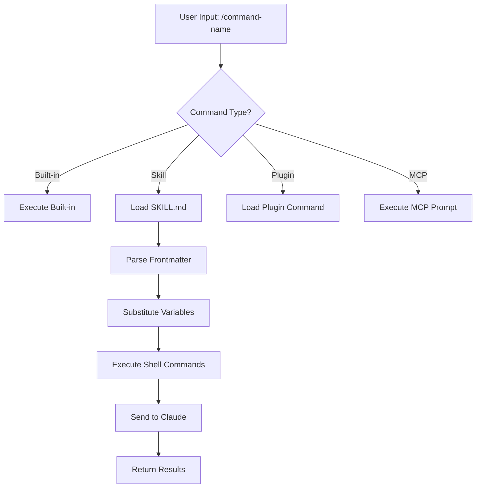
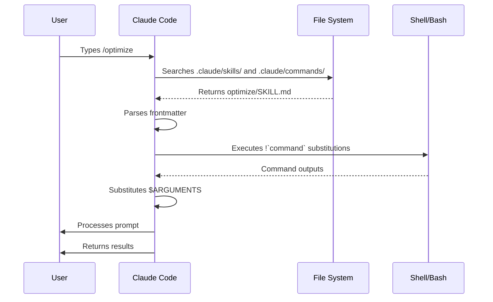

<picture>
  <source media="(prefers-color-scheme: dark)" srcset="../resources/logos/claude-howto-logo-dark.svg">
  
</picture>

# Slash Commands

## Overview

Slash commands 是在交互式会话中控制 Claude 行为的快捷命令，主要分为几类：

- **Built-in commands**：Claude Code 内置命令（`/help`、`/clear`、`/model`）
- **Skills**：通过 `SKILL.md` 文件定义的用户自定义命令（`/optimize`、`/pr`）
- **Plugin commands**：已安装插件提供的命令（`/frontend-design:frontend-design`）
- **MCP prompts**：MCP 服务器暴露出来的命令（`/mcp__github__list_prs`）

> **Note**：自定义 slash commands 已经合并进 skills。`.claude/commands/` 下的文件仍然可用，但现在更推荐使用 skills（`.claude/skills/`）。两种方式都会创建 `/command-name` 形式的快捷命令。完整说明见 [Skills Guide](../03-skills/)。

## Built-in Commands Reference

Built-in commands 是用于常见操作的快捷命令。当前可用的有 **55+ 个 built-in commands** 和 **5 个内置 bundled skills**。在 Claude Code 中输入 `/` 可以查看完整列表，也可以在 `/` 后继续输入字母来筛选。

| Command | Purpose |
|---------|---------|
| `/add-dir <path>` | 添加工作目录 |
| `/agents` | 管理 agent 配置 |
| `/branch [name]` | 将当前对话分叉到一个新会话中（别名：`/fork`）。注意：`/fork` 已在 v2.1.77 更名为 `/branch` |
| `/btw <question>` | 提问一个不写入主历史记录的旁路问题 |
| `/chrome` | 配置 Chrome 浏览器集成 |
| `/clear` | 清空当前对话（别名：`/reset`、`/new`） |
| `/color [color\|default]` | 设置提示栏颜色 |
| `/compact [instructions]` | 压缩当前对话，并可附带聚焦说明 |
| `/config` | 打开设置（别名：`/settings`） |
| `/context` | 以彩色网格可视化上下文使用情况 |
| `/copy [N]` | 将助手回复复制到剪贴板；`w` 表示写入文件 |
| `/cost` | 显示 token 使用统计 |
| `/desktop` | 继续在 Desktop app 中操作（别名：`/app`） |
| `/diff` | 交互式查看未提交变更的 diff |
| `/doctor` | 诊断安装与运行状态 |
| `/effort [low\|medium\|high\|max\|auto]` | 设置推理强度。`max` 需要 Opus 4.6 |
| `/exit` | 退出 REPL（别名：`/quit`） |
| `/export [filename]` | 将当前对话导出到文件或剪贴板 |
| `/extra-usage` | 配置额外 usage 配额 |
| `/fast [on\|off]` | 切换 fast mode |
| `/feedback` | 提交反馈（别名：`/bug`） |
| `/help` | 显示帮助 |
| `/hooks` | 查看 hook 配置 |
| `/ide` | 管理 IDE 集成 |
| `/init` | 初始化 `CLAUDE.md`。设置 `CLAUDE_CODE_NEW_INIT=true` 可启用交互式流程 |
| `/insights` | 生成会话分析报告 |
| `/install-github-app` | 安装 GitHub Actions app |
| `/install-slack-app` | 安装 Slack app |
| `/keybindings` | 打开按键绑定配置 |
| `/login` | 切换 Anthropic 账号 |
| `/logout` | 退出当前 Anthropic 账号 |
| `/mcp` | 管理 MCP 服务器与 OAuth |
| `/memory` | 编辑 `CLAUDE.md`，切换 auto-memory |
| `/mobile` | 生成移动端 app 的二维码（别名：`/ios`、`/android`） |
| `/model [model]` | 选择模型，并可通过左右方向键切换 effort |
| `/passes` | 分享 Claude Code 免费试用周 |
| `/permissions` | 查看或更新权限（别名：`/allowed-tools`） |
| `/plan [description]` | 进入 plan mode |
| `/plugin` | 管理插件 |
| `/pr-comments [PR]` | 获取 GitHub PR 评论 |
| `/privacy-settings` | 隐私设置（仅 Pro/Max） |
| `/release-notes` | 查看更新日志 |
| `/reload-plugins` | 重新加载已启用插件 |
| `/remote-control` | 从 claude.ai 进行远程控制（别名：`/rc`） |
| `/remote-env` | 配置默认远程环境 |
| `/rename [name]` | 重命名当前会话 |
| `/resume [session]` | 恢复历史会话（别名：`/continue`） |
| `/review` | **已弃用**，请改用 `code-review` 插件 |
| `/rewind` | 回退对话和/或代码（别名：`/checkpoint`） |
| `/sandbox` | 切换 sandbox mode |
| `/schedule [description]` | 创建或管理定时任务 |
| `/security-review` | 分析当前分支中的安全漏洞 |
| `/skills` | 列出可用 skills |
| `/stats` | 可视化每日使用情况、会话数和 streaks |
| `/status` | 查看版本、模型和账号信息 |
| `/statusline` | 配置状态栏 |
| `/tasks` | 列出或管理后台任务 |
| `/terminal-setup` | 配置终端快捷键 |
| `/theme` | 切换主题 |
| `/vim` | 切换 Vim/Normal 模式 |
| `/voice` | 切换按住说话语音输入 |

### Bundled Skills

这些 skills 会随 Claude Code 一起提供，调用方式和 slash commands 一样：

| Skill | Purpose |
|-------|---------|
| `/batch <instruction>` | 使用 worktree 协调大规模并行改动 |
| `/claude-api` | 加载与你项目语言对应的 Claude API 参考文档 |
| `/debug [description]` | 开启调试日志 |
| `/loop [interval] <prompt>` | 按时间间隔重复运行 prompt |
| `/simplify [focus]` | 针对已修改文件做代码质量审查 |

### Deprecated Commands

| Command | Status |
|---------|--------|
| `/review` | 已弃用，由 `code-review` 插件取代 |
| `/output-style` | 自 v2.1.73 起弃用 |
| `/fork` | 已更名为 `/branch`（别名仍可用，v2.1.77） |

### Recent Changes

- `/fork` 已更名为 `/branch`，同时保留 `/fork` 作为别名（v2.1.77）
- `/output-style` 已弃用（v2.1.73）
- `/review` 已弃用，推荐改用 `code-review` 插件
- 新增 `/effort` 命令，其中 `max` 级别需要 Opus 4.6
- 新增 `/voice` 命令，用于按住说话的语音输入
- 新增 `/schedule` 命令，用于创建和管理定时任务
- 新增 `/color` 命令，用于自定义提示栏颜色
- `/model` 选择器现在显示更易读的标签（例如 “Sonnet 4.6”），不再直接显示原始模型 ID
- `/resume` 支持 `/continue` 别名
- MCP prompts 可以作为 `/mcp__<server>__<prompt>` 形式的命令使用（见 [MCP Prompts as Commands](#mcp-prompts-as-commands)）

## Custom Commands (Now Skills)

自定义 slash commands 已经**并入 skills**。两种方式都会创建你可以通过 `/command-name` 调用的命令：

| Approach | Location | Status |
|----------|----------|--------|
| **Skills (Recommended)** | `.claude/skills/<name>/SKILL.md` | 当前标准方式 |
| **Legacy Commands** | `.claude/commands/<name>.md` | 仍然可用 |

如果 skill 和 command 同名，**skill 优先级更高**。例如同时存在 `.claude/commands/review.md` 和 `.claude/skills/review/SKILL.md` 时，会优先使用 skill 版本。

### Migration Path

你现有的 `.claude/commands/` 文件无需修改也能继续使用。如果要迁移到 skills：

**Before (Command):**
```
.claude/commands/optimize.md
```

**After (Skill):**
```
.claude/skills/optimize/SKILL.md
```

### Why Skills?

相比旧式 commands，skills 提供了更多能力：

- **Directory structure**：可以把脚本、模板和参考文件一起打包
- **Auto-invocation**：当上下文相关时，Claude 可以自动触发 skill
- **Invocation control**：可以控制只有用户、只有 Claude，或双方都能调用
- **Subagent execution**：可通过 `context: fork` 在隔离上下文中运行
- **Progressive disclosure**：只在需要时再加载额外文件

### Creating a Custom Command as a Skill

创建一个带 `SKILL.md` 的目录：

```bash
mkdir -p .claude/skills/my-command
```

**File:** `.claude/skills/my-command/SKILL.md`

```yaml
---
name: my-command
description: What this command does and when to use it
---

# My Command

Instructions for Claude to follow when this command is invoked.

1. First step
2. Second step
3. Third step
```

### Frontmatter Reference

| Field | Purpose | Default |
|-------|---------|---------|
| `name` | 命令名（会变成 `/name`） | 目录名 |
| `description` | 简短说明（帮助 Claude 判断何时使用） | 第一段正文 |
| `argument-hint` | 自动补全时显示的参数提示 | None |
| `allowed-tools` | 该命令可免授权使用的工具 | 继承当前设置 |
| `model` | 指定使用的模型 | 继承当前设置 |
| `disable-model-invocation` | 若为 `true`，则只能由用户调用，Claude 不会自动触发 | `false` |
| `user-invocable` | 若为 `false`，则不会显示在 `/` 菜单中 | `true` |
| `context` | 设为 `fork` 后会在隔离 subagent 中运行 | None |
| `agent` | 使用 `context: fork` 时所选的 agent 类型 | `general-purpose` |
| `hooks` | skill 级别的 hooks（PreToolUse、PostToolUse、Stop） | None |

### Arguments

命令可以接收参数：

**用 `$ARGUMENTS` 接收全部参数：**

```yaml
---
name: fix-issue
description: Fix a GitHub issue by number
---

Fix issue #$ARGUMENTS following our coding standards
```

用法：`/fix-issue 123` → `$ARGUMENTS` 会变成 `"123"`

**用 `$0`、`$1` 等接收单个参数：**

```yaml
---
name: review-pr
description: Review a PR with priority
---

Review PR #$0 with priority $1
```

用法：`/review-pr 456 high` → `$0`=`"456"`，`$1`=`"high"`

### Dynamic Context with Shell Commands

使用 `!`command`` 在 prompt 执行前动态执行 bash 命令：

```yaml
---
name: commit
description: Create a git commit with context
allowed-tools: Bash(git *)
---

## Context

- Current git status: !`git status`
- Current git diff: !`git diff HEAD`
- Current branch: !`git branch --show-current`
- Recent commits: !`git log --oneline -5`

## Your task

Based on the above changes, create a single git commit.
```

### File References

使用 `@` 引用文件内容：

```markdown
Review the implementation in @src/utils/helpers.js
Compare @src/old-version.js with @src/new-version.js
```

## Plugin Commands

插件也可以提供自定义命令：

```
/plugin-name:command-name
```

如果没有命名冲突，也可以直接用 `/command-name`。

**Examples:**
```bash
/frontend-design:frontend-design
/commit-commands:commit
```

## MCP Prompts as Commands

MCP 服务器也可以把 prompts 暴露成 slash commands：

```
/mcp__<server-name>__<prompt-name> [arguments]
```

**Examples:**
```bash
/mcp__github__list_prs
/mcp__github__pr_review 456
/mcp__jira__create_issue "Bug title" high
```

### MCP Permission Syntax

在权限配置中可以这样控制 MCP server 的访问范围：

- `mcp__github` - 访问整个 GitHub MCP server
- `mcp__github__*` - 通配访问全部工具
- `mcp__github__get_issue` - 只允许访问某个具体工具

## Command Architecture



## Command Lifecycle



## Available Commands in This Folder

这个目录中的示例命令既可以安装成 skills，也可以作为 legacy commands 使用。

### 1. `/optimize` - Code Optimization

分析代码中的性能问题、内存泄漏和优化机会。

**Usage:**
```
/optimize
[Paste your code]
```

### 2. `/pr` - Pull Request Preparation

引导你按 PR 准备清单完成 lint、测试和 commit 格式整理。

**Usage:**
```
/pr
```

**Screenshot:**


### 3. `/generate-api-docs` - API Documentation Generator

根据源代码生成完整的 API 文档。

**Usage:**
```
/generate-api-docs
```

### 4. `/commit` - Git Commit with Context

结合仓库中的动态上下文来生成 git commit。

**Usage:**
```
/commit [optional message]
```

### 5. `/push-all` - Stage, Commit, and Push

在安全检查通过后，暂存所有改动、创建 commit，并推送到远端。

**Usage:**
```
/push-all
```

**Safety Checks:**
- Secrets: `.env*`, `*.key`, `*.pem`, `credentials.json`
- API Keys: 区分真实 key 和占位符
- Large files: 未使用 Git LFS 且 `>10MB`
- Build artifacts: `node_modules/`, `dist/`, `__pycache__/`

### 6. `/doc-refactor` - Documentation Restructuring

重构项目文档结构，使其更清晰、更易使用。

**Usage:**
```
/doc-refactor
```

### 7. `/setup-ci-cd` - CI/CD Pipeline Setup

使用 pre-commit hooks 和 GitHub Actions 建立质量保障流程。

**Usage:**
```
/setup-ci-cd
```

### 8. `/unit-test-expand` - Test Coverage Expansion

通过补齐未覆盖分支和边界情况来提升测试覆盖率。

**Usage:**
```
/unit-test-expand
```

## Installation

### As Skills (Recommended)

复制到你的 skills 目录：

```bash
# Create skills directory
mkdir -p .claude/skills

# For each command file, create a skill directory
for cmd in optimize pr commit; do
  mkdir -p .claude/skills/$cmd
  cp 01-slash-commands/$cmd.md .claude/skills/$cmd/SKILL.md
done
```

### As Legacy Commands

复制到你的 commands 目录：

```bash
# Project-wide (team)
mkdir -p .claude/commands
cp 01-slash-commands/*.md .claude/commands/

# Personal use
mkdir -p ~/.claude/commands
cp 01-slash-commands/*.md ~/.claude/commands/
```

## Creating Your Own Commands

### Skill Template (Recommended)

创建 `.claude/skills/my-command/SKILL.md`：

```yaml
---
name: my-command
description: What this command does. Use when [trigger conditions].
argument-hint: [optional-args]
allowed-tools: Bash(npm *), Read, Grep
---

# Command Title

## Context

- Current branch: !`git branch --show-current`
- Related files: @package.json

## Instructions

1. First step
2. Second step with argument: $ARGUMENTS
3. Third step

## Output Format

- How to format the response
- What to include
```

### User-Only Command (No Auto-Invocation)

对于带副作用、不应该被 Claude 自动触发的命令，可以这样写：

```yaml
---
name: deploy
description: Deploy to production
disable-model-invocation: true
allowed-tools: Bash(npm *), Bash(git *)
---

Deploy the application to production:

1. Run tests
2. Build application
3. Push to deployment target
4. Verify deployment
```

## Best Practices

| Do | Don't |
|------|---------|
| 使用清晰、动作导向的命令名 | 不要为一次性任务专门创建命令 |
| `description` 里写清触发条件 | 不要把复杂逻辑都塞进命令里 |
| 让命令聚焦于单一任务 | 不要硬编码敏感信息 |
| 对有副作用的命令使用 `disable-model-invocation` | 不要省略 `description` 字段 |
| 用 `!` 前缀引入动态上下文 | 不要假设 Claude 已经知道当前状态 |
| 把相关文件组织进 skill 目录 | 不要把所有东西都塞在一个文件里 |

## Troubleshooting

### Command Not Found

**Solutions:**
- 检查文件是否位于 `.claude/skills/<name>/SKILL.md` 或 `.claude/commands/<name>.md`
- 确认 frontmatter 中的 `name` 字段和预期命令名一致
- 重启 Claude Code 会话
- 运行 `/help` 查看可用命令

### Command Not Executing as Expected

**Solutions:**
- 添加更具体的说明
- 在 skill 文件中加入示例
- 如果用了 bash 命令，检查 `allowed-tools`
- 先用简单输入测试

### Skill vs Command Conflict

如果两者同名存在，**skill 的优先级更高**。删除其中一个，或者重命名。

## Related Guides

- **[Skills](../03-skills/)** - Skills 的完整参考（可自动触发的能力）
- **[Memory](../02-memory/)** - 使用 `CLAUDE.md` 持久化上下文
- **[Subagents](../04-subagents/)** - 委派式 AI agents
- **[Plugins](../07-plugins/)** - 打包好的命令集合
- **[Hooks](../06-hooks/)** - 事件驱动自动化

## Additional Resources

- [Official Interactive Mode Documentation](https://code.claude.com/docs/en/interactive-mode) - 内置命令参考
- [Official Skills Documentation](https://code.claude.com/docs/en/skills) - Skills 完整参考
- [CLI Reference](https://code.claude.com/docs/en/cli-reference) - 命令行选项说明

---

*属于 [Claude Code Guide](../) 指南系列的一部分*
