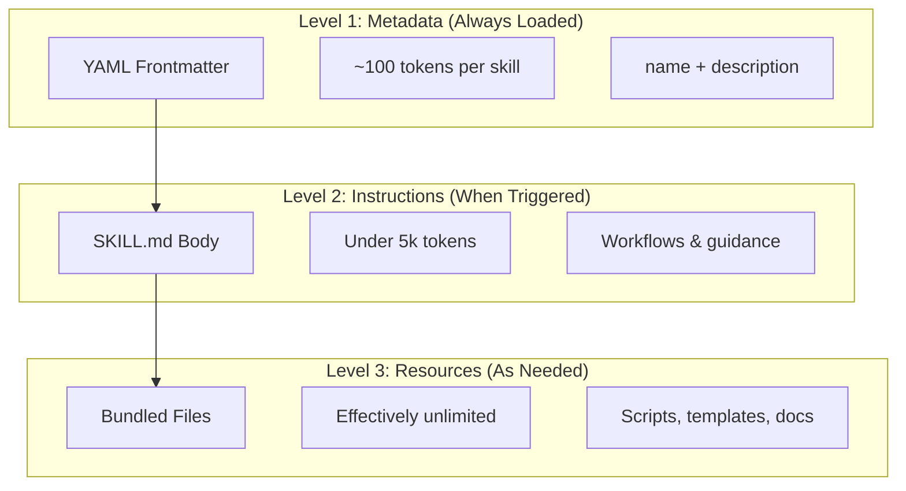
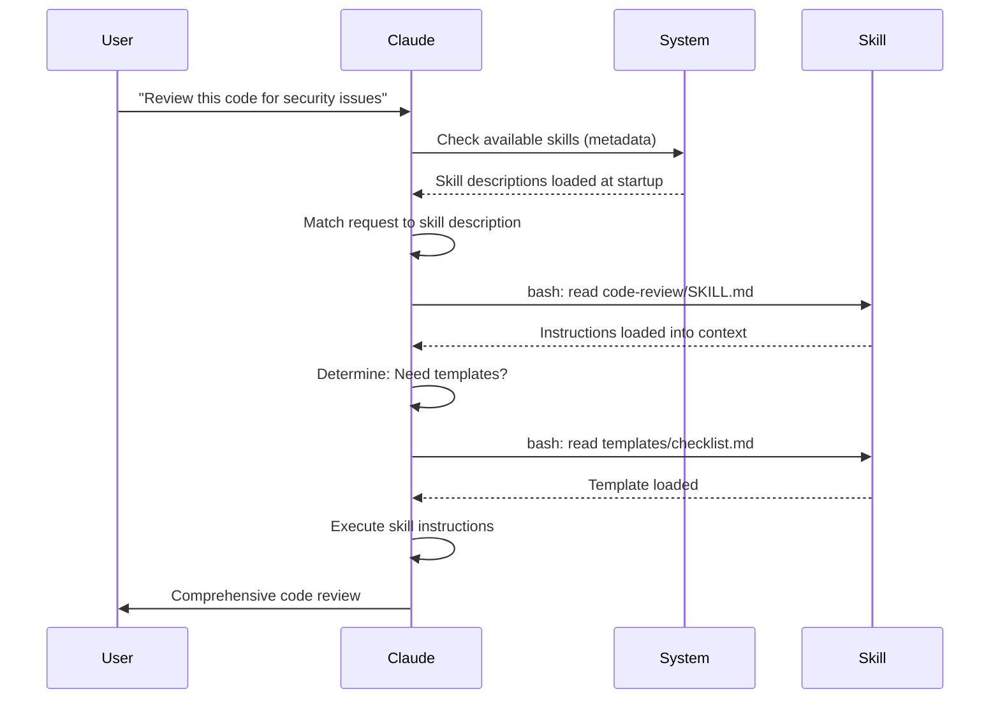

<picture>
  <source media="(prefers-color-scheme: dark)" srcset="../resources/logos/claude-code-guide-logo-dark.svg">
  
</picture>

# Agent Skills Guide

Agent Skills 是可复用、基于文件系统的能力模块，用来扩展 Claude 的功能。它们把领域知识、工作流和最佳实践打包成可发现的组件，让 Claude 在相关场景下自动使用。

## Overview

**Agent Skills** 是一种模块化能力，可以把通用 agent 变成特定领域的专家。和 prompt 不同，prompt 更像是一次性任务的对话级指令；而 Skills 会按需加载，避免你在多次对话中反复重复同样的指导。

### Key Benefits

- **让 Claude 专业化**：为特定领域任务定制能力
- **减少重复说明**：写一次，就能在多个对话中自动复用
- **组合能力**：把多个 Skill 组合成复杂工作流
- **放大工作流复用性**：跨项目、跨团队复用 skills
- **保持质量**：把最佳实践直接嵌进工作流

Skills 遵循 [Agent Skills](https://agentskills.io/home) 开放标准，可在多个 AI 工具之间复用。Claude Code 在这个标准基础上进一步扩展了调用控制、subagent 执行和动态上下文注入等能力。

> **Note**：自定义 slash commands 已经并入 skills。`.claude/commands/` 下的文件仍然可用，也支持相同的 frontmatter 字段。新开发更推荐使用 skills。当两者在同一路径下同时存在时（例如 `.claude/commands/review.md` 和 `.claude/skills/review/SKILL.md`），skill 优先。

## How Skills Work: Progressive Disclosure

Skills 采用 **progressive disclosure（渐进式披露）** 架构。Claude 会按需分阶段加载信息，而不是一开始就把所有内容塞进上下文。这种方式既能高效管理上下文，又能保持近乎无限的可扩展性。

### Three Levels of Loading



| Level | When Loaded | Token Cost | Content |
|-------|------------|------------|---------|
| **Level 1: Metadata** | 始终加载（启动时） | 每个 Skill 约 100 tokens | YAML frontmatter 中的 `name` 和 `description` |
| **Level 2: Instructions** | Skill 被触发时 | 低于 5k tokens | `SKILL.md` 正文中的说明和指导 |
| **Level 3+: Resources** | 按需加载 | 近乎无限 | 通过 bash 执行或读取的 bundled files，不需要把全部内容预先放进上下文 |

这意味着你可以安装很多 Skills，而不会显著占用上下文预算。Claude 只需要知道这些 Skill 存在，以及何时该用它们；只有真正触发时才会加载具体内容。

## Skill Loading Process



## Skill Types & Locations

| Type | Location | Scope | Shared | Best For |
|------|----------|-------|--------|----------|
| **Enterprise** | Managed settings | 所有组织用户 | Yes | 组织级标准 |
| **Personal** | `~/.claude/skills/<skill-name>/SKILL.md` | 个人 | No | 个人工作流 |
| **Project** | `.claude/skills/<skill-name>/SKILL.md` | 团队 | Yes（通过 git） | 团队规范 |
| **Plugin** | `<plugin>/skills/<skill-name>/SKILL.md` | 插件启用处 | Depends | 随插件分发 |

当不同层级存在同名 skill 时，优先级更高的位置会覆盖更低的位置：**enterprise > personal > project**。Plugin skills 使用 `plugin-name:skill-name` 命名空间，所以不会冲突。

### Automatic Discovery

**Nested directories**：当你在子目录中工作时，Claude Code 会自动发现嵌套目录下的 `.claude/skills/`。例如你正在编辑 `packages/frontend/` 下的文件，Claude Code 也会同时查找 `packages/frontend/.claude/skills/` 中的 skills。这非常适合 monorepo。

**`--add-dir` directories**：通过 `--add-dir` 添加的目录中的 skills 也会自动加载，并支持实时变更检测。也就是说，你修改这些目录下的 skill 文件后，不需要重启 Claude Code 就会生效。

**Description budget**：Skill 描述（Level 1 metadata）最多只能占上下文窗口的 **2%**（兜底上限为 **16,000 字符**）。如果安装的 skills 太多，部分 skill 可能不会被纳入。可以通过 `/context` 查看是否有相关警告，也可以用 `SLASH_COMMAND_TOOL_CHAR_BUDGET` 环境变量手动调整预算。

## Creating Custom Skills

### Basic Directory Structure

```
my-skill/
├── SKILL.md           # 主说明文件（必需）
├── template.md        # 给 Claude 填充的模板
├── examples/
│   └── sample.md      # 期望输出格式的示例
└── scripts/
    └── validate.sh    # Claude 可执行的脚本
```

### SKILL.md Format

```yaml
---
name: your-skill-name
description: Brief description of what this Skill does and when to use it
---

# Your Skill Name

## Instructions
Provide clear, step-by-step guidance for Claude.

## Examples
Show concrete examples of using this Skill.
```

### Required Fields

- **name**：只能包含小写字母、数字和连字符（最多 64 个字符），不能包含 "anthropic" 或 "claude"
- **description**：要同时说明这个 Skill 做什么，以及什么时候使用（最多 1024 个字符）。这是 Claude 判断是否自动激活该 skill 的关键

### Optional Frontmatter Fields

```yaml
---
name: my-skill
description: What this skill does and when to use it
argument-hint: "[filename] [format]"        # Hint for autocomplete
disable-model-invocation: true              # Only user can invoke
user-invocable: false                       # Hide from slash menu
allowed-tools: Read, Grep, Glob             # Restrict tool access
model: opus                                 # Specific model to use
effort: high                                # Effort level override (low, medium, high, max)
context: fork                               # Run in isolated subagent
agent: Explore                              # Which agent type (with context: fork)
shell: bash                                 # Shell for commands: bash (default) or powershell
hooks:                                      # Skill-scoped hooks
  PreToolUse:
    - matcher: "Bash"
      hooks:
        - type: command
          command: "./scripts/validate.sh"
---
```

| Field | Description |
|-------|-------------|
| `name` | 仅允许小写字母、数字、连字符（最多 64 个字符），不能包含 "anthropic" 或 "claude" |
| `description` | 说明 Skill 做什么，以及什么时候用（最多 1024 字符），用于自动触发匹配 |
| `argument-hint` | `/` 自动补全菜单里的参数提示（例如 `"[filename] [format]"`） |
| `disable-model-invocation` | `true` 表示只有用户能通过 `/name` 调用，Claude 永远不会自动触发 |
| `user-invocable` | `false` 表示在 `/` 菜单中隐藏，只允许 Claude 自动调用 |
| `allowed-tools` | 逗号分隔的工具列表，这些工具可免权限确认直接使用 |
| `model` | Skill 激活期间覆盖使用的模型（例如 `opus`、`sonnet`） |
| `effort` | Skill 激活期间覆盖 effort：`low`、`medium`、`high` 或 `max` |
| `context` | 设为 `fork` 后，会在独立 subagent 上下文中运行 |
| `agent` | 当 `context: fork` 时指定 subagent 类型（例如 `Explore`、`Plan`、`general-purpose`） |
| `shell` | `!`command`` 替换和脚本使用的 shell：`bash`（默认）或 `powershell` |
| `hooks` | 作用于该 skill 生命周期的 hooks（格式与全局 hooks 相同） |

## Skill Content Types

Skills 中通常会有两类内容，各自适合不同用途：

### Reference Content

这类内容为 Claude 当前工作提供知识支持，例如约定、模式、风格指南、领域知识。它会以内联方式参与当前对话上下文。

```yaml
---
name: api-conventions
description: API design patterns for this codebase
---

When writing API endpoints:
- Use RESTful naming conventions
- Return consistent error formats
- Include request validation
```

### Task Content

这类内容是针对特定动作的分步说明，通常会通过 `/skill-name` 直接调用。

```yaml
---
name: deploy
description: Deploy the application to production
context: fork
disable-model-invocation: true
---

Deploy the application:
1. Run the test suite
2. Build the application
3. Push to the deployment target
```

## Controlling Skill Invocation

默认情况下，你和 Claude 都可以调用任意 skill。通过两个 frontmatter 字段可以控制三种调用模式：

| Frontmatter | You can invoke | Claude can invoke |
|---|---|---|
| (default) | Yes | Yes |
| `disable-model-invocation: true` | Yes | No |
| `user-invocable: false` | No | Yes |

**对于带副作用的工作流，请使用 `disable-model-invocation: true`**，例如 `/commit`、`/deploy`、`/send-slack-message`。你不会希望 Claude 因为“代码看起来差不多好了”就自己决定去部署。

**对于背景知识类 skill，请使用 `user-invocable: false`**。比如 `legacy-system-context` 这类 skill 只是解释旧系统如何工作，对 Claude 很有帮助，但对用户来说并不是一个有意义的命令动作。

## String Substitutions

Skills 支持一些动态变量，在 skill 内容真正送到 Claude 之前会先完成替换：

| Variable | Description |
|----------|-------------|
| `$ARGUMENTS` | 调用 skill 时传入的全部参数 |
| `$ARGUMENTS[N]` 或 `$N` | 按索引访问某个具体参数（从 0 开始） |
| `${CLAUDE_SESSION_ID}` | 当前 session ID |
| `${CLAUDE_SKILL_DIR}` | 当前 skill 的 `SKILL.md` 所在目录 |
| `` !`command` `` | 动态上下文注入，先执行 shell 命令，再把输出内联进 skill |

**Example:**

```yaml
---
name: fix-issue
description: Fix a GitHub issue
---

Fix GitHub issue $ARGUMENTS following our coding standards.
1. Read the issue description
2. Implement the fix
3. Write tests
4. Create a commit
```

运行 `/fix-issue 123` 时，`$ARGUMENTS` 会被替换成 `123`。

## Injecting Dynamic Context

`!`command`` 语法会在 skill 内容发送给 Claude 之前先执行 shell 命令：

```yaml
---
name: pr-summary
description: Summarize changes in a pull request
context: fork
agent: Explore
---

## Pull request context
- PR diff: !`gh pr diff`
- PR comments: !`gh pr view --comments`
- Changed files: !`gh pr diff --name-only`

## Your task
Summarize this pull request...
```

命令会立即执行；Claude 看到的只是最终输出结果。默认使用 `bash` 执行；如果想改用 PowerShell，可以在 frontmatter 中设置 `shell: powershell`。

## Running Skills in Subagents

加上 `context: fork` 后，skill 会在隔离的 subagent 上下文中运行。skill 内容会变成专属 subagent 的任务，这样主对话就不会被大量中间上下文塞满。

`agent` 字段用于指定使用哪种 agent：

| Agent Type | Best For |
|---|---|
| `Explore` | 只读研究、代码库分析 |
| `Plan` | 制定实现计划 |
| `general-purpose` | 需要用到各种工具的综合任务 |
| Custom agents | 你在配置中定义的专用 agent |

**Example frontmatter:**

```yaml
---
context: fork
agent: Explore
---
```

**Full skill example:**

```yaml
---
name: deep-research
description: Research a topic thoroughly
context: fork
agent: Explore
---

Research $ARGUMENTS thoroughly:
1. Find relevant files using Glob and Grep
2. Read and analyze the code
3. Summarize findings with specific file references
```

## Practical Examples

### Example 1: Code Review Skill

**Directory Structure:**

```
~/.claude/skills/code-review/
├── SKILL.md
├── templates/
│   ├── review-checklist.md
│   └── finding-template.md
└── scripts/
    ├── analyze-metrics.py
    └── compare-complexity.py
```

**File:** `~/.claude/skills/code-review/SKILL.md`

```yaml
---
name: code-review-specialist
description: Comprehensive code review with security, performance, and quality analysis. Use when users ask to review code, analyze code quality, evaluate pull requests, or mention code review, security analysis, or performance optimization.
---

# Code Review Skill

This skill provides comprehensive code review capabilities focusing on:

1. **Security Analysis**
   - Authentication/authorization issues
   - Data exposure risks
   - Injection vulnerabilities
   - Cryptographic weaknesses

2. **Performance Review**
   - Algorithm efficiency (Big O analysis)
   - Memory optimization
   - Database query optimization
   - Caching opportunities

3. **Code Quality**
   - SOLID principles
   - Design patterns
   - Naming conventions
   - Test coverage

4. **Maintainability**
   - Code readability
   - Function size (should be < 50 lines)
   - Cyclomatic complexity
   - Type safety

## Review Template

对每一段被审查的代码，请提供：

### Summary
- 整体质量评估（1-5）
- 关键发现数量
- 推荐优先关注的区域

### Critical Issues (if any)
- **Issue**: 清晰描述问题
- **Location**: 文件和行号
- **Impact**: 说明为什么这很重要
- **Severity**: Critical/High/Medium
- **Fix**: 代码示例

如需详细清单，请参见 [code-review/templates/review-checklist.md](code-review/templates/review-checklist.md)。
```

### 示例 2：Codebase Visualizer Skill

一个用于生成交互式 HTML 可视化结果的 skill：

**目录结构：**

```
~/.claude/skills/codebase-visualizer/
├── SKILL.md
└── scripts/
    └── visualize.py
```

**File:** `~/.claude/skills/codebase-visualizer/SKILL.md`

````yaml
---
name: codebase-visualizer
description: Generate an interactive collapsible tree visualization of your codebase. Use when exploring a new repo, understanding project structure, or identifying large files.
allowed-tools: Bash(python *)
---

# Codebase Visualizer

生成一个交互式 HTML 树状视图，用来展示项目文件结构。

## Usage

在项目根目录运行可视化脚本：

```bash
python ~/.claude/skills/codebase-visualizer/scripts/visualize.py .
```

这会生成 `codebase-map.html`，并在默认浏览器中打开。

## What the visualization shows

- **可折叠目录**：点击文件夹展开 / 收起
- **文件大小**：显示在每个文件旁边
- **颜色区分**：不同文件类型使用不同颜色
- **目录总计**：显示每个文件夹的聚合大小
````

真正的重活由 bundled Python 脚本完成，而 Claude 负责组织流程和调用。

### 示例 3：Deploy Skill（仅允许用户手动调用）

```yaml
---
name: deploy
description: Deploy the application to production
disable-model-invocation: true
allowed-tools: Bash(npm *), Bash(git *)
---

将 $ARGUMENTS 部署到生产环境：

1. 运行测试套件：`npm test`
2. 构建应用：`npm run build`
3. 推送到部署目标
4. 验证部署成功
5. 汇报部署状态
```

### 示例 4：Brand Voice Skill（背景知识型）

```yaml
---
name: brand-voice
description: Ensure all communication matches brand voice and tone guidelines. Use when creating marketing copy, customer communications, or public-facing content.
user-invocable: false
---

## Tone of Voice
- **Friendly but professional** - 友好但专业，亲切而不随意
- **Clear and concise** - 清晰简洁，避免术语堆砌
- **Confident** - 自信，让人感到我们知道自己在做什么
- **Empathetic** - 有共情，理解用户需求

## Writing Guidelines
- 面向读者时使用 "you"
- 使用主动语态
- 句子尽量控制在 20 个词以内
- 开头先给出价值主张

如需模板，请参见 [brand-voice/templates/](brand-voice/templates/)。
```

### Example 5: CLAUDE.md Generator Skill

```yaml
---
name: claude-md
description: Create or update CLAUDE.md files following best practices for optimal AI agent onboarding. Use when users mention CLAUDE.md, project documentation, or AI onboarding.
---

## Core Principles

**LLMs are stateless**: CLAUDE.md is the only file automatically included in every conversation.

### The Golden Rules

1. **Less is More**: Keep under 300 lines (ideally under 100)
2. **Universal Applicability**: Only include information relevant to EVERY session
3. **Don't Use Claude as a Linter**: Use deterministic tools instead
4. **Never Auto-Generate**: Craft it manually with careful consideration

## Essential Sections

- **Project Name**: Brief one-line description
- **Tech Stack**: Primary language, frameworks, database
- **Development Commands**: Install, test, build commands
- **Critical Conventions**: Only non-obvious, high-impact conventions
- **Known Issues / Gotchas**: Things that trip up developers
```

### Example 6: Refactoring Skill with Scripts

**Directory Structure:**

```
refactor/
├── SKILL.md
├── references/
│   ├── code-smells.md
│   └── refactoring-catalog.md
├── templates/
│   └── refactoring-plan.md
└── scripts/
    ├── analyze-complexity.py
    └── detect-smells.py
```

## Best Practices

### Skill Description Tips

`description` 是 Claude 判断 “什么时候该用这个 skill” 的唯一元数据，所以一定要写清楚：

- **做什么**：skill 能处理什么问题
- **什么时候用**：触发场景或关键词
- **避免模糊描述**：不要只写 “Useful for coding tasks”

**Good:**
```yaml
description: Generate OpenAPI documentation from Express routes. Use when users ask to document APIs, generate API specs, or mention OpenAPI/Swagger.
```

**Bad:**
```yaml
description: Helps with API stuff.
```

### Keep SKILL.md Focused

- 主体说明尽量控制在 **5k tokens 以下**
- 把长篇参考资料放到 bundled files 中
- 使用渐进式披露，而不是把所有知识一次性塞进正文
- 避免重复 README、package.json 等现有内容

### Use Resources Effectively

适合放进 bundled files 的内容：
- **Templates**：输出格式模板
- **Examples**：示例输入/输出
- **Scripts**：自动化检查或执行脚本
- **References**：较长的领域知识文档

## Related Guides

- **[Slash Commands](../01-slash-commands/)** - 技能也可以像 slash commands 一样调用
- **[Memory](../02-memory/)** - 使用 `CLAUDE.md` 保存持久上下文
- **[Subagents](../04-subagents/)** - 让 skill 在独立 agent 中运行
- **[Hooks](../06-hooks/)** - 在 skill 生命周期中接入 hooks

## Additional Resources

- [Official Skills Documentation](https://code.claude.com/docs/en/skills) - Claude Code skills 官方文档
- [Agent Skills Standard](https://agentskills.io/home) - 跨工具通用的 skills 开放标准

---

*属于 [Claude Code Guide](../) 指南系列的一部分*
