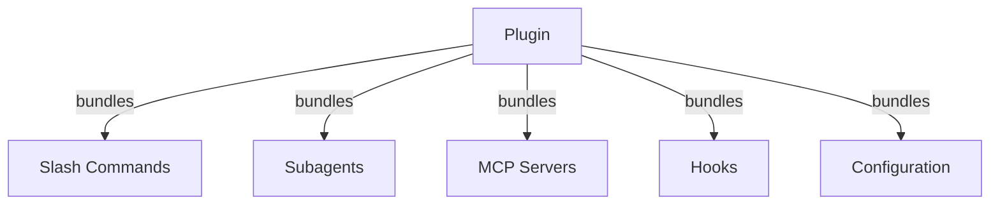
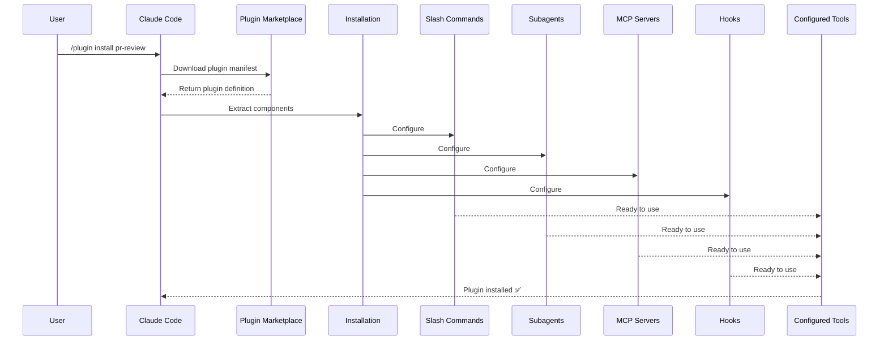
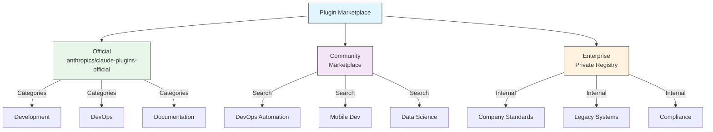
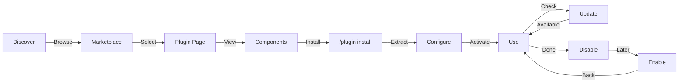
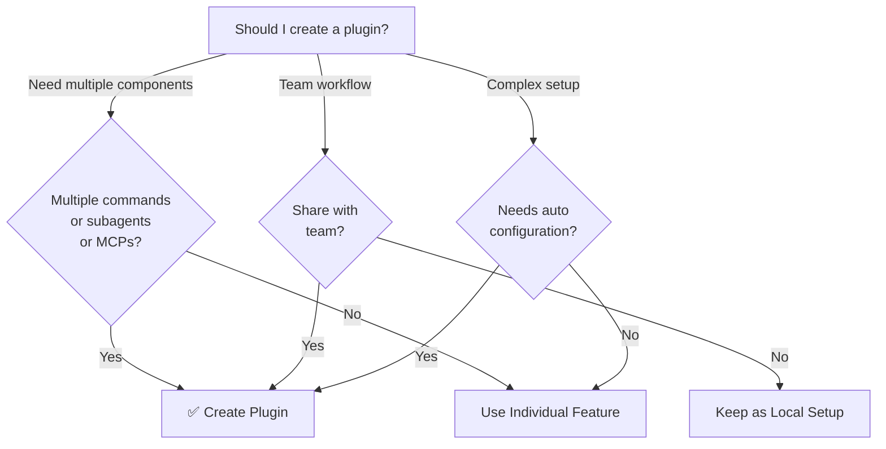

<picture>
  <source media="(prefers-color-scheme: dark)" srcset="../resources/logos/claude-howto-logo-dark.svg">
  
</picture>

# Claude Code Plugins

这个目录包含完整的 plugin 示例，用来把多个 Claude Code 能力打包成一个统一、可安装的扩展包。

## Overview

Claude Code Plugins 是一组打包好的自定义能力集合（slash commands、subagents、MCP servers 和 hooks），可以通过一条命令完成安装。它们代表最高层级的扩展机制，可以把多个功能组合成一个统一、可共享的插件包。

## Plugin Architecture



## Plugin Loading Process



## Plugin Types & Distribution

| Type | Scope | Shared | Authority | Examples |
|------|-------|--------|-----------|----------|
| Official | 全局 | 所有用户 | Anthropic | PR Review、Security Guidance |
| Community | 公开 | 所有用户 | 社区 | DevOps、Data Science |
| Organization | 内部 | 团队成员 | 公司 | 内部规范、内部工具 |
| Personal | 个人 | 单用户 | 开发者本人 | 自定义工作流 |

## Plugin Definition Structure

Plugin manifest 使用 `.claude-plugin/plugin.json` 中的 JSON 格式：

```json
{
  "name": "my-first-plugin",
  "description": "A greeting plugin",
  "version": "1.0.0",
  "author": {
    "name": "Your Name"
  },
  "homepage": "https://example.com",
  "repository": "https://github.com/user/repo",
  "license": "MIT"
}
```

## Plugin Structure Example

```
my-plugin/
├── .claude-plugin/
│   └── plugin.json       # Manifest（name、description、version、author）
├── commands/             # 以 Markdown 文件形式定义的 commands
│   ├── task-1.md
│   ├── task-2.md
│   └── workflows/
├── agents/               # 自定义 agent 定义
│   ├── specialist-1.md
│   ├── specialist-2.md
│   └── configs/
├── skills/               # 带 SKILL.md 的 Agent Skills
│   ├── skill-1.md
│   └── skill-2.md
├── hooks/                # 写在 hooks.json 里的事件处理器
│   └── hooks.json
├── .mcp.json             # MCP server 配置
├── .lsp.json             # LSP server 配置
├── settings.json         # 默认设置
├── templates/
│   └── issue-template.md
├── scripts/
│   ├── helper-1.sh
│   └── helper-2.py
├── docs/
│   ├── README.md
│   └── USAGE.md
└── tests/
    └── plugin.test.js
```

### LSP server configuration

Plugins 可以自带 Language Server Protocol（LSP）支持，为你提供实时代码智能能力。LSP server 可以在工作时提供诊断、代码导航和符号信息。

**Configuration locations**：
- 插件根目录下的 `.lsp.json`
- `plugin.json` 中的内联 `lsp` 字段

#### Field reference

| Field | Required | Description |
|-------|----------|-------------|
| `command` | Yes | LSP server 可执行文件（必须在 PATH 中） |
| `extensionToLanguage` | Yes | 将文件扩展名映射到语言 ID |
| `args` | No | 传给 server 的命令行参数 |
| `transport` | No | 通信方式：`stdio`（默认）或 `socket` |
| `env` | No | server 进程所需环境变量 |
| `initializationOptions` | No | LSP 初始化时发送的选项 |
| `settings` | No | 传给 server 的工作区配置 |
| `workspaceFolder` | No | 覆盖默认 workspace folder 路径 |
| `startupTimeout` | No | 等待 server 启动的最大时间（毫秒） |
| `shutdownTimeout` | No | 优雅关闭的最大等待时间 |
| `restartOnCrash` | No | server 崩溃时是否自动重启 |
| `maxRestarts` | No | 放弃前最多重启次数 |

#### Example configurations

**Go (gopls)**:

```json
{
  "go": {
    "command": "gopls",
    "args": ["serve"],
    "extensionToLanguage": {
      ".go": "go"
    }
  }
}
```

**Python (pyright)**:

```json
{
  "python": {
    "command": "pyright-langserver",
    "args": ["--stdio"],
    "extensionToLanguage": {
      ".py": "python",
      ".pyi": "python"
    }
  }
}
```

**TypeScript**:

```json
{
  "typescript": {
    "command": "typescript-language-server",
    "args": ["--stdio"],
    "extensionToLanguage": {
      ".ts": "typescript",
      ".tsx": "typescriptreact",
      ".js": "javascript",
      ".jsx": "javascriptreact"
    }
  }
}
```

#### Available LSP plugins

官方 marketplace 中包含预配置的 LSP plugins：

| Plugin | Language | Server Binary | Install Command |
|--------|----------|---------------|----------------|
| `pyright-lsp` | Python | `pyright-langserver` | `pip install pyright` |
| `typescript-lsp` | TypeScript/JavaScript | `typescript-language-server` | `npm install -g typescript-language-server typescript` |
| `rust-lsp` | Rust | `rust-analyzer` | 通过 `rustup component add rust-analyzer` 安装 |

#### LSP capabilities

配置完成后，LSP server 可以提供：

- **Instant diagnostics** — 修改后立即显示错误和警告
- **Code navigation** — 跳转定义、查找引用、查看实现
- **Hover information** — 悬停显示类型签名和文档
- **Symbol listing** — 浏览当前文件或整个工作区的符号

## Plugin Options (v2.1.83+)

Plugins 可以通过 manifest 中的 `userConfig` 声明用户可配置选项。标记为 `sensitive: true` 的值会存储到系统 keychain，而不是明文 settings 文件中：

```json
{
  "name": "my-plugin",
  "version": "1.0.0",
  "userConfig": {
    "apiKey": {
      "description": "API key for the service",
      "sensitive": true
    },
    "region": {
      "description": "Deployment region",
      "default": "us-east-1"
    }
  }
}
```

## Persistent Plugin Data (`${CLAUDE_PLUGIN_DATA}`) (v2.1.78+)

插件可以通过 `${CLAUDE_PLUGIN_DATA}` 环境变量访问一个持久状态目录。该目录按插件独立，并可跨 session 保留，非常适合用于缓存、数据库或其他持久状态：

```json
{
  "hooks": {
    "PostToolUse": [
      {
        "command": "node ${CLAUDE_PLUGIN_DATA}/track-usage.js"
      }
    ]
  }
}
```

插件安装时会自动创建这个目录。存放在其中的文件会一直保留，直到插件被卸载。

## Inline Plugin via Settings (`source: 'settings'`) (v2.1.80+)

插件也可以直接在 settings 文件中以内联 marketplace entry 的方式定义，通过 `source: 'settings'` 字段实现。这意味着你不需要单独的仓库或 marketplace，也可以直接嵌入一个插件定义：

```json
{
  "pluginMarketplaces": [
    {
      "name": "inline-tools",
      "source": "settings",
      "plugins": [
        {
          "name": "quick-lint",
          "source": "./local-plugins/quick-lint"
        }
      ]
    }
  ]
}
```

## Plugin Settings

插件可以自带一个 `settings.json` 来提供默认配置。目前支持 `agent` 字段，用于指定插件的主线程 agent：

```json
{
  "agent": "agents/specialist-1.md"
}
```

当插件包含 `settings.json` 时，这些默认值会在安装时被应用。用户仍然可以在自己的 project 或 user 配置中覆盖它们。

## Standalone vs Plugin Approach

| Approach | Command Names | Configuration | Best For |
|----------|---------------|---|---|
| **Standalone** | `/hello` | 在 CLAUDE.md 中手动配置 | 个人、项目专属 |
| **Plugins** | `/plugin-name:hello` | 通过 plugin.json 自动配置 | 团队共享、分发发布 |

如果只是快速搭建个人工作流，优先使用 **standalone slash commands**。当你希望打包多个能力、共享给团队，或发布出去时，请使用 **plugins**。

## Practical Examples

### Example 1: PR Review Plugin

**File:** `.claude-plugin/plugin.json`

```json
{
  "name": "pr-review",
  "version": "1.0.0",
  "description": "Complete PR review workflow with security, testing, and docs",
  "author": {
    "name": "Anthropic"
  },
  "repository": "https://github.com/your-org/pr-review",
  "license": "MIT"
}
```

**File:** `commands/review-pr.md`

```markdown
---
name: Review PR
description: Start comprehensive PR review with security and testing checks
---

# PR Review

This command initiates a complete pull request review including:

1. Security analysis
2. Test coverage verification
3. Documentation updates
4. Code quality checks
5. Performance impact assessment
```

**File:** `agents/security-reviewer.md`

```yaml
---
name: security-reviewer
description: Security-focused code review
tools: read, grep, diff
---

# Security Reviewer

Specializes in finding security vulnerabilities:
- Authentication/authorization issues
- Data exposure
- Injection attacks
- Secure configuration
```

**Installation:**

```bash
/plugin install pr-review

# 结果：
# ✅ 已安装 3 个 slash commands
# ✅ 已配置 3 个 subagents
# ✅ 已连接 2 个 MCP servers
# ✅ 已注册 4 个 hooks
# ✅ 现在可以直接使用！
```

### Example 2: DevOps Plugin

**Components:**

```
devops-automation/
├── commands/
│   ├── deploy.md
│   ├── rollback.md
│   ├── status.md
│   └── incident.md
├── agents/
│   ├── deployment-specialist.md
│   ├── incident-commander.md
│   └── alert-analyzer.md
├── mcp/
│   ├── github-config.json
│   ├── kubernetes-config.json
│   └── prometheus-config.json
├── hooks/
│   ├── pre-deploy.js
│   ├── post-deploy.js
│   └── on-error.js
└── scripts/
    ├── deploy.sh
    ├── rollback.sh
    └── health-check.sh
```

### Example 3: Documentation Plugin

**Bundled Components:**

```
documentation/
├── commands/
│   ├── generate-api-docs.md
│   ├── generate-readme.md
│   ├── sync-docs.md
│   └── validate-docs.md
├── agents/
│   ├── api-documenter.md
│   ├── code-commentator.md
│   └── example-generator.md
├── mcp/
│   ├── github-docs-config.json
│   └── slack-announce-config.json
└── templates/
    ├── api-endpoint.md
    ├── function-docs.md
    └── adr-template.md
```

## Plugin Marketplace

官方由 Anthropic 维护的 plugin 目录是 `anthropics/claude-plugins-official`。企业管理员也可以建立私有 plugin marketplace，用于内部发布。



### Marketplace Configuration

企业用户和高级用户可以通过 settings 控制 marketplace 行为：

| Setting | Description |
|---------|-------------|
| `extraKnownMarketplaces` | 在默认 marketplace 之外再添加额外来源 |
| `strictKnownMarketplaces` | 限制用户可以添加哪些 marketplaces |
| `deniedPlugins` | 管理员维护的 blocklist，阻止某些 plugin 被安装 |

### Additional Marketplace Features

- **Default git timeout**：大型 plugin 仓库的默认 git timeout 已从 30 秒提高到 120 秒
- **Custom npm registries**：插件可指定自定义 npm registry 以解析依赖
- **Version pinning**：可将插件锁定到特定版本，便于复现环境

### Marketplace definition schema

Plugin marketplace 定义写在 `.claude-plugin/marketplace.json` 中：

```json
{
  "name": "my-team-plugins",
  "owner": "my-org",
  "plugins": [
    {
      "name": "code-standards",
      "source": "./plugins/code-standards",
      "description": "Enforce team coding standards",
      "version": "1.2.0",
      "author": "platform-team"
    },
    {
      "name": "deploy-helper",
      "source": {
        "source": "github",
        "repo": "my-org/deploy-helper",
        "ref": "v2.0.0"
      },
      "description": "Deployment automation workflows"
    }
  ]
}
```

| Field | Required | Description |
|-------|----------|-------------|
| `name` | Yes | kebab-case 形式的 marketplace 名称 |
| `owner` | Yes | 维护该 marketplace 的组织或用户 |
| `plugins` | Yes | plugin 条目数组 |
| `plugins[].name` | Yes | plugin 名（kebab-case） |
| `plugins[].source` | Yes | plugin 来源（路径字符串或 source 对象） |
| `plugins[].description` | No | 简短描述 |
| `plugins[].version` | No | semver 版本字符串 |
| `plugins[].author` | No | plugin 作者名 |

### Plugin source types

Plugins 可以从多种来源获取：

| Source | Syntax | Example |
|--------|--------|---------|
| **Relative path** | 字符串路径 | `"./plugins/my-plugin"` |
| **GitHub** | `{ "source": "github", "repo": "owner/repo" }` | `{ "source": "github", "repo": "acme/lint-plugin", "ref": "v1.0" }` |
| **Git URL** | `{ "source": "url", "url": "..." }` | `{ "source": "url", "url": "https://git.internal/plugin.git" }` |
| **Git subdirectory** | `{ "source": "git-subdir", "url": "...", "path": "..." }` | `{ "source": "git-subdir", "url": "https://github.com/org/monorepo.git", "path": "packages/plugin" }` |
| **npm** | `{ "source": "npm", "package": "..." }` | `{ "source": "npm", "package": "@acme/claude-plugin", "version": "^2.0" }` |
| **pip** | `{ "source": "pip", "package": "..." }` | `{ "source": "pip", "package": "claude-data-plugin", "version": ">=1.0" }` |

GitHub 和 git 类型支持可选 `ref`（branch/tag）和 `sha`（commit hash），用于版本锁定。

### Distribution methods

**GitHub（推荐）**：
```bash
# 用户添加你的 marketplace
/plugin marketplace add owner/repo-name
```

**Other git services**（需要完整 URL）：
```bash
/plugin marketplace add https://gitlab.com/org/marketplace-repo.git
```

**Private repositories**：支持通过 git credential helper 或环境变量 token 访问。用户必须拥有仓库读取权限。

**Official marketplace submission**：可以向 Anthropic curated marketplace 提交 plugin，以获得更广泛分发。

### Strict mode

控制 marketplace 定义与本地 `plugin.json` 文件如何协作：

| Setting | Behavior |
|---------|----------|
| `strict: true` (default) | 本地 `plugin.json` 是权威来源，marketplace entry 只做补充 |
| `strict: false` | marketplace entry 就是完整 plugin 定义 |

**Organization restrictions** with `strictKnownMarketplaces`：

| Value | Effect |
|-------|--------|
| 未设置 | 不限制，用户可添加任意 marketplace |
| 空数组 `[]` | 完全锁死，不允许任何 marketplace |
| 模式数组 | allowlist，只有匹配的 marketplace 才允许添加 |

```json
{
  "strictKnownMarketplaces": [
    "my-org/*",
    "github.com/trusted-vendor/*"
  ]
}
```

> **Warning**：在 strict mode 配合 `strictKnownMarketplaces` 时，用户只能安装 allowlist 中 marketplace 的 plugins。这对需要受控插件分发的企业环境特别有用。

## Plugin Installation & Lifecycle



## Plugin Features Comparison

| Feature | Slash Command | Skill | Subagent | Plugin |
|---------|---------------|-------|----------|--------|
| **Installation** | 手动复制 | 手动复制 | 手动配置 | 一条命令 |
| **Setup Time** | 5 分钟 | 10 分钟 | 15 分钟 | 2 分钟 |
| **Bundling** | 单文件 | 单文件 | 单文件 | 多组件打包 |
| **Versioning** | 手动 | 手动 | 手动 | 自动 |
| **Team Sharing** | 复制文件 | 复制文件 | 复制文件 | 安装 ID / marketplace |
| **Updates** | 手动 | 手动 | 手动 | 可自动发现 |
| **Dependencies** | 无 | 无 | 无 | 可能包含 |
| **Marketplace** | 否 | 否 | 否 | 是 |
| **Distribution** | 仓库内分发 | 仓库内分发 | 仓库内分发 | Marketplace 分发 |

## Plugin CLI Commands

所有 plugin 操作都有对应 CLI 命令：

```bash
claude plugin install <name>@<marketplace>   # 从 marketplace 安装
claude plugin uninstall <name>               # 删除 plugin
claude plugin list                           # 列出已安装 plugins
claude plugin enable <name>                  # 启用已禁用 plugin
claude plugin disable <name>                 # 禁用 plugin
claude plugin validate                       # 校验 plugin 结构
```

## Installation Methods

### From Marketplace
```bash
/plugin install plugin-name
# 或使用 CLI：
claude plugin install plugin-name@marketplace-name
```

### Enable / Disable (with auto-detected scope)
```bash
/plugin enable plugin-name
/plugin disable plugin-name
```

### Local Plugin (for development)
```bash
# 用于本地测试的 CLI flag（可重复多次加载多个 plugin）
claude --plugin-dir ./path/to/plugin
claude --plugin-dir ./plugin-a --plugin-dir ./plugin-b
```

### From Git Repository
```bash
/plugin install github:username/repo
```

## When to Create a Plugin



### Plugin Use Cases

| Use Case | Recommendation | Why |
|----------|-----------------|-----|
| **Team Onboarding** | ✅ Use Plugin | 一次安装，完整配置就位 |
| **Framework Setup** | ✅ Use Plugin | 可打包框架专用 commands |
| **Enterprise Standards** | ✅ Use Plugin | 便于集中分发和版本控制 |
| **Quick Task Automation** | ❌ Use Command | 用 plugin 反而太重 |
| **Single Domain Expertise** | ❌ Use Skill | 这种场景 skill 更合适 |
| **Specialized Analysis** | ❌ Use Subagent | 手动建 subagent 或用 skill 即可 |
| **Live Data Access** | ❌ Use MCP | MCP 自身就足够，不必强行打包 |

## Testing a Plugin

在发布前，使用 `--plugin-dir` CLI flag 本地测试你的 plugin（可重复多次加载多个 plugin）：

```bash
claude --plugin-dir ./my-plugin
claude --plugin-dir ./my-plugin --plugin-dir ./another-plugin
```

这样会启动一个已加载你本地 plugin 的 Claude Code session，方便你：
- 检查所有 slash commands 是否可用
- 测试 subagents / agents 是否正常工作
- 确认 MCP servers 连接正常
- 验证 hook 是否被正确执行
- 检查 LSP server 配置
- 排查配置错误

## Hot-Reload

Plugins 支持开发时热重载。你修改 plugin 文件后，Claude Code 可以自动检测变化；你也可以手动强制重载：

```bash
/reload-plugins
```

它会重新读取所有 plugin manifests、commands、agents、skills、hooks 以及 MCP/LSP 配置，而无需重启 session。

## Managed Settings for Plugins

管理员可以通过 managed settings 在组织范围内控制 plugin 行为：

| Setting | Description |
|---------|-------------|
| `enabledPlugins` | 默认启用的 plugin allowlist |
| `deniedPlugins` | 禁止安装的 plugin blocklist |
| `extraKnownMarketplaces` | 在默认 marketplace 之外增加额外来源 |
| `strictKnownMarketplaces` | 限制用户允许添加哪些 marketplaces |
| `allowedChannelPlugins` | 按发布渠道控制允许使用哪些 plugins |

这些设置可以通过组织级 managed configuration 文件下发，并且优先级高于用户级设置。

## Plugin Security

Plugin subagents 运行在受限 sandbox 中。以下 frontmatter 字段**不允许**出现在 plugin subagent 定义中：

- `hooks` -- subagent 不能注册事件处理器
- `mcpServers` -- subagent 不能自行配置 MCP servers
- `permissionMode` -- subagent 不能覆盖权限模型

这样可以确保 plugins 无法提权，也不能越过声明范围修改宿主环境。

## Publishing a Plugin

**Steps to publish:**

1. 创建完整 plugin 结构并放好组件
2. 编写 `.claude-plugin/plugin.json` manifest
3. 编写带说明文档的 `README.md`
4. 使用 `claude --plugin-dir ./my-plugin` 本地测试
5. 提交到 plugin marketplace
6. 完成审核
7. 在 marketplace 上发布
8. 用户可通过一条命令安装

**Example submission:**

````markdown
# PR Review Plugin

## Description
包含安全、测试和文档检查的完整 PR review 工作流。

## What's Included
- 3 个面向不同 review 场景的 slash commands
- 3 个专用 subagents
- GitHub 和 CodeQL MCP 集成
- 自动化安全扫描 hooks

## Installation
```bash
/plugin install pr-review
```

## Features
✅ 安全分析
✅ 测试覆盖率检查
✅ 文档校验
✅ 代码质量评估
✅ 性能影响分析

## Usage
```bash
/review-pr
/check-security
/check-tests
```

## Requirements
- Claude Code 1.0+
- GitHub access
- CodeQL（可选）
````

## Plugin vs Manual Configuration

**Manual Setup（2+ 小时）：**
- 逐个安装 slash commands
- 单独创建 subagents
- 分别配置 MCPs
- 手动配置 hooks
- 自己补全说明文档
- 分享给团队（然后祈祷大家都配置正确）

**With Plugin（2 分钟）：**
```bash
/plugin install pr-review
# ✅ 一切都已安装并配置完成
# ✅ 可立即使用
# ✅ 团队能复现完全一致的环境
```

## Best Practices

### Do's ✅
- 使用清晰、可描述的 plugin 名称
- 提供完整 README
- 正确使用版本号（semver）
- 联合测试所有组件
- 清楚写明 requirements
- 提供使用示例
- 做好错误处理
- 使用合适标签便于发现
- 保持向后兼容
- 保持插件聚焦且内聚
- 包含完整测试
- 记录所有依赖

### Don'ts ❌
- 不要把无关功能打包在一起
- 不要硬编码凭据
- 不要跳过测试
- 不要缺少文档
- 不要创建功能重复的 plugin
- 不要忽视版本管理
- 不要让组件依赖关系过度复杂
- 不要忘记优雅处理错误

## Installation Instructions

### Installing from Marketplace

1. **浏览可用 plugins：**
   ```bash
   /plugin list
   ```

2. **查看 plugin 详情：**
   ```bash
   /plugin info plugin-name
   ```

3. **安装 plugin：**
   ```bash
   /plugin install plugin-name
   ```

### Installing from Local Path

```bash
/plugin install ./path/to/plugin-directory
```

### Installing from GitHub

```bash
/plugin install github:username/repo
```

### Listing Installed Plugins

```bash
/plugin list --installed
```

### Updating a Plugin

```bash
/plugin update plugin-name
```

### Disabling/Enabling a Plugin

```bash
# 临时禁用
/plugin disable plugin-name

# 重新启用
/plugin enable plugin-name
```

### Uninstalling a Plugin

```bash
/plugin uninstall plugin-name
```

## Related Concepts

以下 Claude Code 功能经常与 plugins 一起使用：

- **[Slash Commands](../01-slash-commands/)** - 插件中打包的独立命令
- **[Memory](../02-memory/)** - 插件使用的持久上下文
- **[Skills](../03-skills/)** - 可进一步封装进 plugin 的领域能力
- **[Subagents](../04-subagents/)** - 作为 plugin 组件打包进去的专用 agents
- **[MCP Servers](../05-mcp/)** - 随 plugin 一起分发的 MCP 集成
- **[Hooks](../06-hooks/)** - 用于触发 plugin 工作流的事件处理器

## Complete Example Workflow

### PR Review Plugin Full Workflow

```
1. User: /review-pr

2. Plugin executes:
   ├── pre-review.js hook 校验 git repo
   ├── GitHub MCP 拉取 PR 数据
   ├── security-reviewer subagent 做安全分析
   ├── test-checker subagent 校验覆盖率
   └── performance-analyzer subagent 做性能评估

3. Results synthesized and presented:
   ✅ Security: No critical issues
   ⚠️  Testing: Coverage 65% (recommend 80%+)
   ✅ Performance: No significant impact
   📝 12 recommendations provided
```

## Troubleshooting

### Plugin Won't Install
- 检查 Claude Code 版本兼容性：`/version`
- 用 JSON 校验器验证 `plugin.json` 语法
- 检查网络连接（针对远程插件）
- 检查权限：`ls -la plugin/`

### Components Not Loading
- 确认 `plugin.json` 中路径和实际目录结构一致
- 检查文件权限：`chmod +x scripts/`
- 检查组件文件语法
- 查看日志：`/plugin debug plugin-name`

### MCP Connection Failed
- 确认环境变量已正确设置
- 检查 MCP server 是否安装正常、运行健康
- 用 `/mcp test` 独立测试 MCP 连接
- 检查 `mcp/` 目录中的 MCP 配置

### Commands Not Available After Install
- 确认插件已成功安装：`/plugin list --installed`
- 检查插件是否启用：`/plugin status plugin-name`
- 重启 Claude Code：`exit` 后重新打开
- 检查是否和现有命令命名冲突

### Hook Execution Issues
- 确认 hook 文件权限正确
- 检查 hook 语法和事件名
- 查看 hook 日志定位错误
- 条件允许时手动独立测试 hook

## Additional Resources

- [Official Plugins Documentation](https://code.claude.com/docs/en/plugins)
- [Discover Plugins](https://code.claude.com/docs/en/discover-plugins)
- [Plugin Marketplaces](https://code.claude.com/docs/en/plugin-marketplaces)
- [Plugins Reference](https://code.claude.com/docs/en/plugins-reference)
- [MCP Server Reference](https://modelcontextprotocol.io/docs/getting-started/intro)
- [Subagent Configuration Guide](../04-subagents/README.md)
- [Hook System Reference](../06-hooks/README.md)
