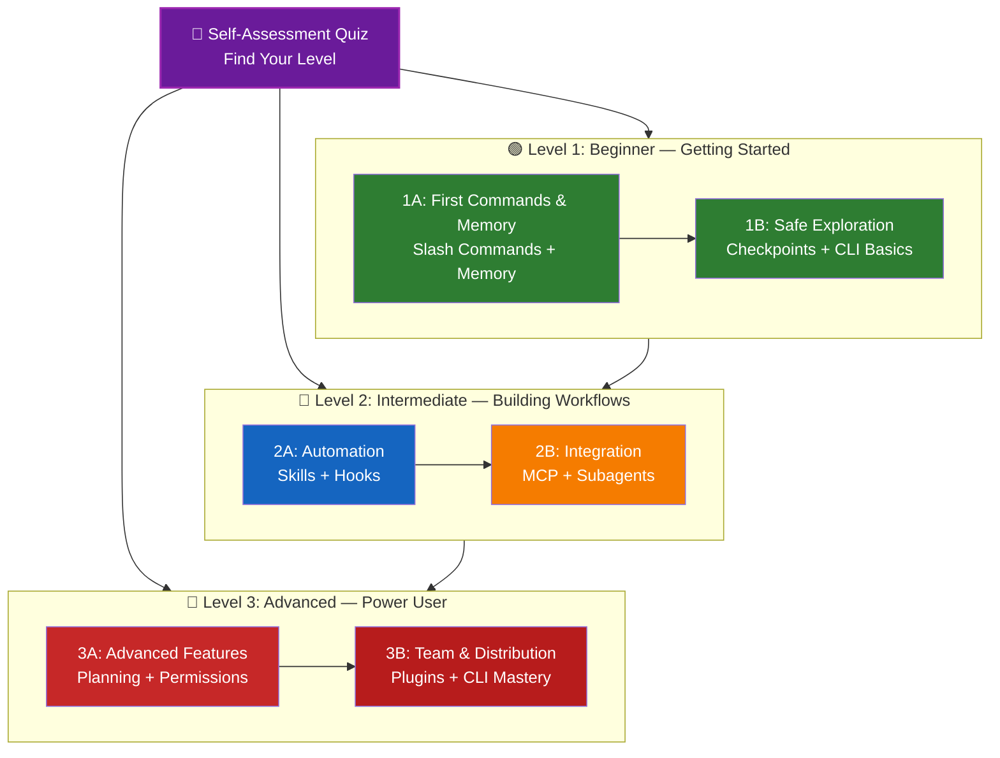

<picture>
  <source media="(prefers-color-scheme: dark)" srcset="resources/logos/claude-howto-logo-dark.svg">
  
</picture>

# 📚 Claude Code 学习路线图

**刚开始接触 Claude Code？** 这份指南会帮助你按自己的节奏掌握 Claude Code 的各项能力。无论你是完全的新手，还是已经有经验的开发者，都建议先从下面的自评测验开始，找到适合你的起点。

---

## 🧭 找到你的级别

每个人的起点都不同。先做一个快速自评，找到最合适的入口。

**请诚实回答下面这些问题：**

- [ ] 我能启动 Claude Code 并进行对话（`claude`）
- [ ] 我创建过或编辑过 CLAUDE.md 文件
- [ ] 我至少使用过 3 个内置 slash commands（例如 `/help`、`/compact`、`/model`）
- [ ] 我创建过自定义 slash command 或 skill（`SKILL.md`）
- [ ] 我配置过 MCP server（例如 GitHub、数据库）
- [ ] 我在 `~/.claude/settings.json` 中配置过 hooks
- [ ] 我创建过或使用过自定义 subagents（`.claude/agents/`）
- [ ] 我使用过 print mode（`claude -p`）做脚本化或 CI/CD

**你的级别：**

| Checks | Level | Start At | Time to Complete |
|--------|-------|----------|------------------|
| 0-2 | **Level 1: Beginner** — 入门起步 | [Milestone 1A](#milestone-1a-first-commands--memory) | ~3 小时 |
| 3-5 | **Level 2: Intermediate** — 搭建工作流 | [Milestone 2A](#milestone-2a-automation-skills--hooks) | ~5 小时 |
| 6-8 | **Level 3: Advanced** — 高阶用户与团队负责人 | [Milestone 3A](#milestone-3a-advanced-features) | ~5 小时 |

> **Tip**: 如果你不确定，就从更低一级开始。快速复习熟悉的内容，总比错过基础概念更划算。

> **交互版本**：在 Claude Code 中运行 `/self-assessment`，即可获得一个引导式、交互式测验。它会覆盖全部 10 个功能领域，为你的熟练度打分，并生成个性化学习路径。

---

## 🎯 学习理念

这个仓库中的文件夹按 **推荐学习顺序** 编号，其背后基于三条核心原则：

1. **依赖关系** - 先学基础概念
2. **复杂度** - 先学简单功能，再学高级能力
3. **使用频率** - 最常用的功能优先教授

这种安排可以让你在打牢基础的同时，尽快获得实际生产力提升。

---

## 🗺️ 你的学习路径



**颜色说明：**
- 💜 紫色：Self-Assessment Quiz
- 🟢 绿色：Level 1 — Beginner 路径
- 🔵 蓝色 / 🟡 金色：Level 2 — Intermediate 路径
- 🔴 红色：Level 3 — Advanced 路径

---

## 📊 完整路线图总表

| Step | Feature | Complexity | Time | Level | Dependencies | Why Learn This | Key Benefits |
|------|---------|-----------|------|-------|--------------|----------------|--------------|
| **1** | [Slash Commands](01-slash-commands/) | ⭐ Beginner | 30 min | Level 1 | None | 快速获得生产力收益（55+ 内置命令 + 5 个打包技能） | 即时自动化、团队规范 |
| **2** | [Memory](02-memory/) | ⭐⭐ Beginner+ | 45 min | Level 1 | None | 所有功能的核心基础 | 持久上下文、偏好记忆 |
| **3** | [Checkpoints](08-checkpoints/) | ⭐⭐ Intermediate | 45 min | Level 1 | Session management | 安全探索 | 试验、恢复 |
| **4** | [CLI Basics](10-cli/) | ⭐⭐ Beginner+ | 30 min | Level 1 | None | 核心 CLI 用法 | 交互模式与 print mode |
| **5** | [Skills](03-skills/) | ⭐⭐ Intermediate | 1 hour | Level 2 | Slash Commands | 自动获得专长能力 | 可复用能力、一致性 |
| **6** | [Hooks](06-hooks/) | ⭐⭐ Intermediate | 1 hour | Level 2 | Tools、Commands | 工作流自动化（25 个事件，4 种类型） | 校验、质量门禁 |
| **7** | [MCP](05-mcp/) | ⭐⭐⭐ Intermediate+ | 1 hour | Level 2 | Configuration | 获取实时数据 | 实时集成、API 接入 |
| **8** | [Subagents](04-subagents/) | ⭐⭐⭐ Intermediate+ | 1.5 hours | Level 2 | Memory、Commands | 处理复杂任务（含 6 个内置类型，其中包括 Bash） | 委派、专长协作 |
| **9** | [Advanced Features](09-advanced-features/) | ⭐⭐⭐⭐⭐ Advanced | 2-3 hours | Level 3 | All previous | Power user 工具 | Planning、Auto Mode、Channels、Voice Dictation、权限控制 |
| **10** | [Plugins](07-plugins/) | ⭐⭐⭐⭐ Advanced | 2 hours | Level 3 | All previous | 完整解决方案 | 团队上手、分发能力 |
| **11** | [CLI Mastery](10-cli/) | ⭐⭐⭐ Advanced | 1 hour | Level 3 | Recommended: All | 掌握命令行能力 | 脚本化、CI/CD、自动化 |

**总学习时间**：约 11-13 小时（也可以直接跳到你的级别，节省时间）

---

## 🟢 Level 1: Beginner — Getting Started

**适合**：自评中勾选 0-2 项的用户
**时间**：约 3 小时
**重点**：立刻提升生产力，理解核心基础
**结果**：成为熟练的日常使用者，并准备进入 Level 2

### Milestone 1A: First Commands & Memory

**主题**：Slash Commands + Memory
**时间**：1-2 小时
**复杂度**：⭐ Beginner
**目标**：通过自定义命令和持久上下文快速提升生产力

#### 你将达成的成果
✅ 为重复任务创建自定义 slash commands
✅ 配置项目 memory，记录团队规范
✅ 设置个人偏好
✅ 理解 Claude 如何自动加载上下文

#### 动手练习

```bash
# Exercise 1: 安装你的第一个 slash command
mkdir -p .claude/commands
cp 01-slash-commands/optimize.md .claude/commands/

# Exercise 2: 创建项目 memory
cp 02-memory/project-CLAUDE.md ./CLAUDE.md

# Exercise 3: 试一下
# 在 Claude Code 中输入：/optimize
```

#### 成功标准
- [ ] 成功调用 `/optimize` 命令
- [ ] Claude 能从 CLAUDE.md 记住你的项目规范
- [ ] 你理解何时该用 slash commands，何时该用 memory

#### 下一步
熟悉之后，继续阅读：
- [01-slash-commands/README.md](01-slash-commands/README.md)
- [02-memory/README.md](02-memory/README.md)

> **Check your understanding**: 在 Claude Code 中运行 `/lesson-quiz slash-commands` 或 `/lesson-quiz memory`，测试你是否真正掌握了这些内容。

---

### Milestone 1B: Safe Exploration

**主题**：Checkpoints + CLI Basics
**时间**：1 小时
**复杂度**：⭐⭐ Beginner+
**目标**：学会安全试验，并掌握基础 CLI 命令

#### 你将达成的成果
✅ 创建并恢复 checkpoints，实现安全试验
✅ 理解交互模式与 print mode 的区别
✅ 使用基础 CLI 参数与选项
✅ 通过 piping 处理文件

#### 动手练习

```bash
# Exercise 1: 练习 checkpoint 工作流
# 在 Claude Code 中：
# 做一些试验性修改，然后按 Esc+Esc 或使用 /rewind
# 选择试验前的检查点
# 选择 "Restore code and conversation" 回到之前状态

# Exercise 2: 交互模式 vs Print mode
claude "explain this project"           # 交互模式
claude -p "explain this function"       # Print mode（非交互）

# Exercise 3: 通过管道处理文件内容
cat error.log | claude -p "explain this error"
```

#### 成功标准
- [ ] 创建并回退到某个 checkpoint
- [ ] 同时使用过交互模式和 print mode
- [ ] 通过管道把文件交给 Claude 分析
- [ ] 理解 checkpoints 在安全试验中的作用

#### 下一步
- 阅读：[08-checkpoints/README.md](08-checkpoints/README.md)
- 阅读：[10-cli/README.md](10-cli/README.md)
- **准备进入 Level 2！** 前往 [Milestone 2A](#milestone-2a-automation-skills--hooks)

> **Check your understanding**: 运行 `/lesson-quiz checkpoints` 或 `/lesson-quiz cli`，确认你已经准备好进入 Level 2。

---

## 🔵 Level 2: Intermediate — Building Workflows

**适合**：自评中勾选 3-5 项的用户
**时间**：约 5 小时
**重点**：自动化、集成、任务委派
**结果**：拥有自动化工作流和外部集成能力，准备进入 Level 3

### 前置检查

在开始 Level 2 前，请确认你已经熟悉这些 Level 1 概念：

- [ ] 会创建和使用 slash commands（[01-slash-commands/](01-slash-commands/)）
- [ ] 已通过 CLAUDE.md 配置项目 memory（[02-memory/](02-memory/)）
- [ ] 知道如何创建和恢复 checkpoints（[08-checkpoints/](08-checkpoints/)）
- [ ] 会在命令行里使用 `claude` 和 `claude -p`（[10-cli/](10-cli/)）

> **还有缺口？** 继续前请先回头补上这些教程。

---

### Milestone 2A: Automation (Skills + Hooks)

**主题**：Skills + Hooks
**时间**：2-3 小时
**复杂度**：⭐⭐ Intermediate
**目标**：自动化常见工作流与质量检查

#### 你将达成的成果
✅ 借助 YAML frontmatter 自动调用专用能力（包括 `effort` 和 `shell` 字段）
✅ 在 25 个 hook 事件上配置事件驱动自动化
✅ 使用全部 4 种 hook 类型（command、http、prompt、agent）
✅ 强制执行代码质量标准
✅ 为自己的工作流创建自定义 hooks

#### 动手练习

```bash
# Exercise 1: 安装一个 skill
cp -r 03-skills/code-review ~/.claude/skills/

# Exercise 2: 配置 hooks
mkdir -p ~/.claude/hooks
cp 06-hooks/pre-tool-check.sh ~/.claude/hooks/
chmod +x ~/.claude/hooks/pre-tool-check.sh

# Exercise 3: 在 settings 中配置 hooks
# 添加到 ~/.claude/settings.json:
{
  "hooks": {
    "PreToolUse": [
      {
        "matcher": "Bash",
        "hooks": [
          {
            "type": "command",
            "command": "~/.claude/hooks/pre-tool-check.sh"
          }
        ]
      }
    ]
  }
}
```

#### 成功标准
- [ ] 当场景匹配时，代码评审 skill 能自动调用
- [ ] PreToolUse hook 会在工具执行前运行
- [ ] 你理解 skill 自动调用与 hook 事件触发的区别

#### 下一步
- 创建你自己的 custom skill
- 按你的工作流继续补充 hooks
- 阅读：[03-skills/README.md](03-skills/README.md)
- 阅读：[06-hooks/README.md](06-hooks/README.md)

> **Check your understanding**: 在继续前，运行 `/lesson-quiz skills` 或 `/lesson-quiz hooks` 测试掌握程度。

---

### Milestone 2B: Integration (MCP + Subagents)

**主题**：MCP + Subagents
**时间**：2-3 小时
**复杂度**：⭐⭐⭐ Intermediate+
**目标**：集成外部服务，并把复杂任务委派出去

#### 你将达成的成果
✅ 从 GitHub、数据库等来源获取实时数据
✅ 把任务委派给专用 AI agents
✅ 理解何时该用 MCP，何时该用 subagents
✅ 搭建集成式工作流

#### 动手练习

```bash
# Exercise 1: 配置 GitHub MCP
export GITHUB_TOKEN="your_github_token"
claude mcp add github -- npx -y @modelcontextprotocol/server-github

# Exercise 2: 测试 MCP 集成
# 在 Claude Code 中：/mcp__github__list_prs

# Exercise 3: 安装 subagents
mkdir -p .claude/agents
cp 04-subagents/*.md .claude/agents/
```

#### 集成练习
尝试这个完整工作流：
1. 使用 MCP 拉取一个 GitHub PR
2. 让 Claude 把评审任务委派给 code-reviewer subagent
3. 使用 hooks 自动运行测试

#### 成功标准
- [ ] 成功通过 MCP 查询 GitHub 数据
- [ ] Claude 会把复杂任务委派给 subagents
- [ ] 你理解 MCP 与 subagents 的差别
- [ ] 在一个工作流里组合使用 MCP + subagents + hooks

#### 下一步
- 配置更多 MCP servers（数据库、Slack 等）
- 为你的领域创建 custom subagents
- 阅读：[05-mcp/README.md](05-mcp/README.md)
- 阅读：[04-subagents/README.md](04-subagents/README.md)
- **准备进入 Level 3！** 前往 [Milestone 3A](#milestone-3a-advanced-features)

> **Check your understanding**: 运行 `/lesson-quiz mcp` 或 `/lesson-quiz subagents`，确认你已经准备好进入 Level 3。

---

## 🔴 Level 3: Advanced — Power User & Team Lead

**适合**：自评中勾选 6-8 项的用户
**时间**：约 5 小时
**重点**：团队工具、CI/CD、企业能力、plugin 开发
**结果**：成为 power user，能够搭建团队工作流与 CI/CD

### 前置检查

在开始 Level 3 前，请确认你已经熟悉这些 Level 2 概念：

- [ ] 会创建并使用自动调用的 skills（[03-skills/](03-skills/)）
- [ ] 已配置事件驱动的 hooks（[06-hooks/](06-hooks/)）
- [ ] 会为外部数据配置 MCP servers（[05-mcp/](05-mcp/)）
- [ ] 知道如何用 subagents 做任务委派（[04-subagents/](04-subagents/)）

> **还有缺口？** 继续前请先回头补上这些教程。

---

### Milestone 3A: Advanced Features

**主题**：Advanced Features（Planning、Permissions、Extended Thinking、Auto Mode、Channels、Voice Dictation、Remote/Desktop/Web）
**时间**：2-3 小时
**复杂度**：⭐⭐⭐⭐⭐ Advanced
**目标**：掌握高级工作流和 power user 工具

#### 你将达成的成果
✅ 用 planning mode 处理复杂功能
✅ 使用 6 种权限模式进行精细控制（default、acceptEdits、plan、auto、dontAsk、bypassPermissions）
✅ 通过 Alt+T / Option+T 切换 extended thinking
✅ 管理后台任务
✅ 使用 Auto Memory 保存偏好
✅ 使用带后台安全分类器的 Auto Mode
✅ 借助 Channels 组织结构化多会话工作流
✅ 使用 Voice Dictation 实现免手输入
✅ 使用 Remote control、desktop app 和 web sessions
✅ 使用 Agent Teams 进行多代理协作

#### 动手练习

```bash
# Exercise 1: 使用 planning mode
/plan Implement user authentication system

# Exercise 2: 试用权限模式（共 6 种：default、acceptEdits、plan、auto、dontAsk、bypassPermissions）
claude --permission-mode plan "analyze this codebase"
claude --permission-mode acceptEdits "refactor the auth module"
claude --permission-mode auto "implement the feature"

# Exercise 3: 启用 extended thinking
# 在会话中按 Alt+T（macOS 上为 Option+T）切换

# Exercise 4: 高级 checkpoint 工作流
# 1. 创建检查点 "Clean state"
# 2. 用 planning mode 设计一个功能
# 3. 通过 subagent 委派来实现
# 4. 在后台运行测试
# 5. 如果测试失败，回退到检查点
# 6. 尝试另一种方案

# Exercise 5: 试试 auto mode（后台安全分类器）
claude --permission-mode auto "implement user settings page"

# Exercise 6: 启用 agent teams
export CLAUDE_AGENT_TEAMS=1
# 对 Claude 说："Implement feature X using a team approach"

# Exercise 7: 定时任务
/loop 5m /check-status
# 或使用 CronCreate 创建持久定时任务

# Exercise 8: 使用 Channels 构建多会话工作流
# 用 channels 在不同会话间组织工作

# Exercise 9: Voice Dictation
# 使用语音输入，与 Claude Code 免手交互
```

#### 成功标准
- [ ] 用 planning mode 完成过一次复杂功能规划
- [ ] 配置过权限模式（plan、acceptEdits、auto、dontAsk）
- [ ] 用 Alt+T / Option+T 切换过 extended thinking
- [ ] 使用过带后台安全分类器的 auto mode
- [ ] 对长任务使用过后台任务
- [ ] 探索过 Channels 的多会话工作流
- [ ] 尝试过 Voice Dictation
- [ ] 理解 Remote Control、Desktop App 与 Web sessions
- [ ] 启用并使用过 Agent Teams 协作
- [ ] 用 `/loop` 做过周期任务或监控

#### 下一步
- 阅读：[09-advanced-features/README.md](09-advanced-features/README.md)

> **Check your understanding**: 运行 `/lesson-quiz advanced`，测试你是否掌握了这些 power user 特性。

---

### Milestone 3B: Team & Distribution (Plugins + CLI Mastery)

**主题**：Plugins + CLI Mastery + CI/CD
**时间**：2-3 小时
**复杂度**：⭐⭐⭐⭐ Advanced
**目标**：搭建团队工具、创建 plugins，并掌握 CI/CD 集成

#### 你将达成的成果
✅ 安装并创建完整的打包式 plugins
✅ 熟练使用 CLI 做脚本化与自动化
✅ 使用 `claude -p` 配置 CI/CD 集成
✅ 为自动化流水线生成 JSON 输出
✅ 进行会话管理与批处理

#### 动手练习

```bash
# Exercise 1: 安装一个完整 plugin
# 在 Claude Code 中：/plugin install pr-review

# Exercise 2: 在 CI/CD 中使用 print mode
claude -p "Run all tests and generate report"

# Exercise 3: 为脚本生成 JSON 输出
claude -p --output-format json "list all functions"

# Exercise 4: 会话管理与恢复
claude -r "feature-auth" "continue implementation"

# Exercise 5: 带限制的 CI/CD 集成
claude -p --max-turns 3 --output-format json "review code"

# Exercise 6: 批处理
for file in *.md; do
  claude -p --output-format json "summarize this: $(cat $file)" > ${file%.md}.summary.json
done
```

#### CI/CD 集成练习
创建一个简单的 CI/CD 脚本：
1. 使用 `claude -p` 审查变更文件
2. 将结果输出为 JSON
3. 用 `jq` 处理指定问题
4. 集成进 GitHub Actions 工作流

#### 成功标准
- [ ] 安装并使用过一个 plugin
- [ ] 为团队构建或修改过一个 plugin
- [ ] 在 CI/CD 中使用过 print mode（`claude -p`）
- [ ] 为脚本生成过 JSON 输出
- [ ] 成功恢复过一个历史会话
- [ ] 创建过批处理脚本
- [ ] 把 Claude 集成进 CI/CD 工作流

#### CLI 的真实场景
- **Code Review Automation**：在 CI/CD 流水线中运行代码评审
- **Log Analysis**：分析错误日志和系统输出
- **Documentation Generation**：批量生成文档
- **Testing Insights**：分析测试失败原因
- **Performance Analysis**：审查性能指标
- **Data Processing**：转换与分析数据文件

#### 下一步
- 阅读：[07-plugins/README.md](07-plugins/README.md)
- 阅读：[10-cli/README.md](10-cli/README.md)
- 为团队创建统一的 CLI 快捷方式和 plugins
- 搭建批处理脚本

> **Check your understanding**: 运行 `/lesson-quiz plugins` 或 `/lesson-quiz cli`，确认你已经掌握这些内容。

---

## 🧪 测试你的理解

这个仓库提供了两个可在 Claude Code 中随时使用的交互式 skills，帮助你评估自己的掌握程度：

| Skill | Command | Purpose |
|-------|---------|---------|
| **Self-Assessment** | `/self-assessment` | 评估你在全部 10 个功能领域的总体熟练度。可选择 Quick（2 分钟）或 Deep（5 分钟）模式，获得个性化能力画像和学习路径。 |
| **Lesson Quiz** | `/lesson-quiz [lesson]` | 用 10 个问题测试你对某节课程的理解。可在课前（预检）、课中（进度检查）或课后（掌握确认）使用。 |

**示例：**
```
/self-assessment                  # 查看你的整体级别
/lesson-quiz hooks                # 测验第 06 课：Hooks
/lesson-quiz 03                   # 测验第 03 课：Skills
/lesson-quiz advanced-features    # 测验第 09 课
```

---

## ⚡ 快速开始路径

### 如果你只有 15 分钟
**目标**：获得你的第一个成果

1. 复制一个 slash command：`cp 01-slash-commands/optimize.md .claude/commands/`
2. 在 Claude Code 中试一下：`/optimize`
3. 阅读：[01-slash-commands/README.md](01-slash-commands/README.md)

**结果**：你会拥有一个可工作的 slash command，并理解基础用法

---

### 如果你有 1 小时
**目标**：配置核心生产力工具

1. **Slash commands**（15 分钟）：复制并测试 `/optimize` 和 `/pr`
2. **Project memory**（15 分钟）：创建 CLAUDE.md，写入你的项目规范
3. **Install a skill**（15 分钟）：配置 code-review skill
4. **Try them together**（15 分钟）：看看它们如何协同工作

**结果**：通过 commands、memory 和 auto-skills 获得基础生产力提升

---

### 如果你有一个周末
**目标**：熟练掌握大多数功能

**周六上午**（3 小时）：
- 完成 Milestone 1A：Slash Commands + Memory
- 完成 Milestone 1B：Checkpoints + CLI Basics

**周六下午**（3 小时）：
- 完成 Milestone 2A：Skills + Hooks
- 完成 Milestone 2B：MCP + Subagents

**周日**（4 小时）：
- 完成 Milestone 3A：Advanced Features
- 完成 Milestone 3B：Plugins + CLI Mastery + CI/CD
- 为你的团队做一个 custom plugin

**结果**：你会成为 Claude Code 的 power user，能够培训他人并自动化复杂工作流

---

## 💡 学习建议

### ✅ 建议这样做

- **先做测验**，找到你的起点
- **完成每个里程碑的动手练习**
- **从简单开始**，逐步增加复杂度
- **每学会一个功能就先测试**
- **记录笔记**，总结哪些方法适合你的工作流
- **在学习高级内容时回头关联基础概念**
- **使用 checkpoints 做安全试验**
- **与团队分享知识**

### ❌ 不建议这样做

- **不要跳过前置检查**，尤其是跨级学习时
- **不要试图一次学完所有东西** —— 会非常容易超载
- **不要在没理解的情况下直接照搬配置** —— 出问题时你就不会调试
- **不要忘记测试** —— 永远先验证功能是否生效
- **不要急着赶进度** —— 给自己足够时间理解
- **不要忽视文档** —— 每个 README 都有很多关键信息
- **不要闭门自己学** —— 多和队友交流

---

## 🎓 学习方式

### 视觉型学习者
- 多看每个 README 中的 Mermaid 图
- 观察命令执行流程
- 自己画工作流图
- 参考上面的可视化学习路径

### 动手型学习者
- 完成每一个动手练习
- 主动尝试变体
- 故意弄坏再修回来（用 checkpoints！）
- 自己创建示例

### 阅读型学习者
- 仔细阅读全文
- 深入看代码示例
- 回顾对比表
- 阅读 resources 中链接的博文

### 社交型学习者
- 开展结对编程
- 把概念讲给队友听
- 参与 Claude Code 社区讨论
- 分享你的自定义配置

---

## 📈 进度跟踪

使用下面这些清单按级别跟踪进度。你可以随时运行 `/self-assessment` 获取新的能力画像，也可以在每节课后运行 `/lesson-quiz [lesson]` 来验证理解程度。

### 🟢 Level 1: Beginner
- [ ] 完成 [01-slash-commands](01-slash-commands/)
- [ ] 完成 [02-memory](02-memory/)
- [ ] 创建了第一个 custom slash command
- [ ] 配好了项目 memory
- [ ] **Milestone 1A achieved**
- [ ] 完成 [08-checkpoints](08-checkpoints/)
- [ ] 完成 [10-cli](10-cli/) 基础部分
- [ ] 创建并回退过 checkpoint
- [ ] 使用过交互模式和 print mode
- [ ] **Milestone 1B achieved**

### 🔵 Level 2: Intermediate
- [ ] 完成 [03-skills](03-skills/)
- [ ] 完成 [06-hooks](06-hooks/)
- [ ] 安装了第一个 skill
- [ ] 配置了 PreToolUse hook
- [ ] **Milestone 2A achieved**
- [ ] 完成 [05-mcp](05-mcp/)
- [ ] 完成 [04-subagents](04-subagents/)
- [ ] 接上了 GitHub MCP
- [ ] 创建了 custom subagent
- [ ] 在一个工作流中整合了这些能力
- [ ] **Milestone 2B achieved**

### 🔴 Level 3: Advanced
- [ ] 完成 [09-advanced-features](09-advanced-features/)
- [ ] 成功使用 planning mode
- [ ] 配置过权限模式（包括 auto 在内的 6 种）
- [ ] 使用过带安全分类器的 auto mode
- [ ] 使用过 extended thinking toggle
- [ ] 探索过 Channels 和 Voice Dictation
- [ ] **Milestone 3A achieved**
- [ ] 完成 [07-plugins](07-plugins/)
- [ ] 完成 [10-cli](10-cli/) 高级用法
- [ ] 配好了 print mode（`claude -p`）CI/CD
- [ ] 为自动化生成过 JSON 输出
- [ ] 把 Claude 集成进了 CI/CD 流水线
- [ ] 创建了团队 plugin
- [ ] **Milestone 3B achieved**

---

## 🆘 常见学习难点

### 难点 1：“概念太多，一下子记不住”
**解决方案**：一次只聚焦一个里程碑。把练习做完后再进入下一阶段。

### 难点 2：“不知道什么时候该用哪个功能”
**解决方案**：回到主 README 中的 [“你可以用这些能力构建什么？”](README.md) 查看对照表。

### 难点 3：“配置不生效”
**解决方案**：查看 [FAQ](README.md) 章节，并检查文件位置是否正确。

### 难点 4：“这些概念看起来有点重叠”
**解决方案**：查看 [“你可以用这些能力构建什么？”](README.md) 一节中的对照内容，理解它们之间的差异。

### 难点 5：“很难把所有内容都记住”
**解决方案**：自己做一份 cheat sheet，并借助 checkpoints 做安全试验。

### 难点 6：“我有经验，但不知道该从哪开始”
**解决方案**：先做上面的 [Self-Assessment Quiz](#-找到你的级别)。直接跳到对应级别，再通过前置检查找出遗漏项。

---

## 🎯 全部完成后还能做什么？

当你完成全部里程碑后：

1. **为团队编写文档** - 记录团队的 Claude Code 配置方式
2. **构建 custom plugins** - 将团队工作流打包
3. **探索 Remote Control** - 从外部工具中以编程方式控制 Claude Code 会话
4. **尝试 Web Sessions** - 在浏览器界面中做远程开发
5. **使用 Desktop App** - 通过原生桌面应用使用 Claude Code 功能
6. **使用 Auto Mode** - 让 Claude 在后台安全分类器护栏下自主工作
7. **利用 Auto Memory** - 让 Claude 随时间自动学习你的偏好
8. **配置 Agent Teams** - 在复杂多维任务中协调多个 agents
9. **使用 Channels** - 在结构化多会话工作流中组织工作
10. **尝试 Voice Dictation** - 用免手语音输入与 Claude Code 交互
11. **使用 Scheduled Tasks** - 通过 `/loop` 和 cron 工具自动化周期检查
12. **贡献示例** - 与社区分享成果
13. **指导他人** - 帮助队友上手
14. **优化工作流** - 根据实际使用持续改进
15. **保持更新** - 跟进 Claude Code 发布和新功能

---

## 📚 更多资源

### 官方文档
- [Claude Code Documentation](https://code.claude.com/docs/en/overview)
- [Anthropic Documentation](https://docs.anthropic.com/en/docs/claude-code/overview)
- [MCP Protocol Specification](https://modelcontextprotocol.io/specification)

### 博文
- [Discovering Claude Code Slash Commands](https://medium.com/@luongnv89/discovering-claude-code-slash-commands-cdc17f0dfb29)

### 社区
- [Anthropic Cookbook](https://github.com/anthropics/anthropic-cookbook)
- [MCP Servers Repository](https://github.com/modelcontextprotocol/servers)

---

## 💬 反馈与支持

- **发现问题？** 在仓库中创建 issue
- **有建议？** 提交 pull request
- **需要帮助？** 查看文档或向社区提问

---

**Last Updated**：2026 年 3 月
**Maintained by**：Claude How-To Contributors
**License**：可自由使用与改造，供学习用途

---

[← 返回主 README](README.md)
