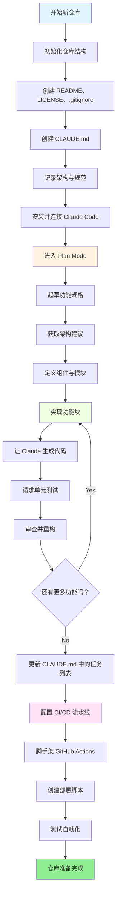
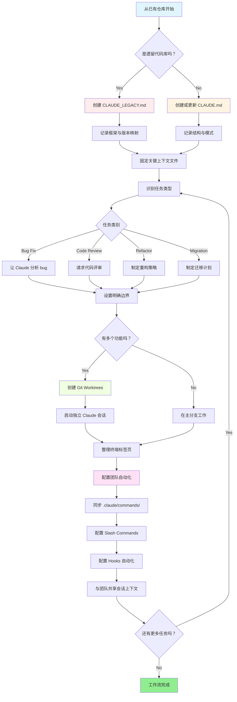

<picture>
  <source media="(prefers-color-scheme: dark)" srcset="resources/logos/claude-code-guide-logo-dark.svg">
  
</picture>

# 优质资源清单

## 官方文档

| Resource | Description | Link |
|----------|-------------|------|
| Claude Code Docs | Claude Code 官方文档 | [code.claude.com/docs/en/overview](https://code.claude.com/docs/en/overview) |
| Anthropic Docs | Anthropic 完整文档 | [docs.anthropic.com](https://docs.anthropic.com/en/docs/claude-code/overview) |
| MCP Protocol | Model Context Protocol 规范 | [modelcontextprotocol.io](https://modelcontextprotocol.io/specification) |
| MCP Servers | 官方 MCP server 实现 | [github.com/modelcontextprotocol/servers](https://github.com/modelcontextprotocol/servers) |
| Anthropic Cookbook | 代码示例与教程 | [github.com/anthropics/anthropic-cookbook](https://github.com/anthropics/anthropic-cookbook) |
| Claude Code Skills | 社区技能仓库 | [github.com/anthropics/skills](https://github.com/anthropics/skills) |
| Agent Teams | 多代理协同与协作 | [code.claude.com/docs/en/agent-teams](https://code.claude.com/docs/en/agent-teams) |
| Scheduled Tasks | 使用 `/loop` 和 cron 的周期性任务 | [code.claude.com/docs/en/scheduled-tasks](https://code.claude.com/docs/en/scheduled-tasks) |
| Chrome Integration | 浏览器自动化 | [code.claude.com/docs/en/chrome](https://code.claude.com/docs/en/chrome) |
| Keybindings | 键盘快捷键自定义 | [code.claude.com/docs/en/keybindings](https://code.claude.com/docs/en/keybindings) |
| Desktop App | 原生桌面应用 | [code.claude.com/docs/en/desktop](https://code.claude.com/docs/en/desktop) |
| Remote Control | 远程控制会话 | [code.claude.com/docs/en/remote-control](https://code.claude.com/docs/en/remote-control) |
| Auto Mode | 自动权限管理 | [code.claude.com/docs/en/permissions](https://code.claude.com/docs/en/permissions) |
| Channels | 多通道通信 | [code.claude.com/docs/en/channels](https://code.claude.com/docs/en/channels) |
| Voice Dictation | Claude Code 的语音输入 | [code.claude.com/docs/en/voice-dictation](https://code.claude.com/docs/en/voice-dictation) |

## Anthropic Engineering Blog

| Article | Description | Link |
|---------|-------------|------|
| Code Execution with MCP | 如何通过代码执行解决 MCP 上下文膨胀问题——实现 98.7% 的 token 降幅 | [anthropic.com/engineering/code-execution-with-mcp](https://www.anthropic.com/engineering/code-execution-with-mcp) |

---

## 30 分钟掌握 Claude Code

_视频_：https://www.youtube.com/watch?v=6eBSHbLKuN0

_**全部技巧**_
- **探索高级特性与快捷方式**
  - 定期查看 Claude 的发布说明，跟进新的代码编辑能力与上下文特性。
  - 学会快捷键，在聊天、文件和编辑器视图之间快速切换。

- **高效初始化**
  - 用清晰的名称/描述创建项目级会话，便于后续检索。
  - 固定最常用的文件或目录，让 Claude 随时可访问。
  - 配置 Claude 的集成能力（如 GitHub、主流 IDE），让编码流程更顺畅。

- **高效的代码库问答**
  - 向 Claude 提出关于架构、设计模式和具体模块的细致问题。
  - 在问题中使用文件和行号引用（例如：“`app/models/user.py` 里的逻辑是在做什么？”）。
  - 对大型代码库，先提供摘要或清单，帮助 Claude 聚焦。
  - **示例提示词**：_"Can you explain the authentication flow implemented in src/auth/AuthService.ts:45-120? How does it integrate with the middleware in src/middleware/auth.ts?"_

- **代码编辑与重构**
  - 在代码块中用行内注释或明确请求来获得更聚焦的修改（例如 “Refactor this function for clarity”）。
  - 让 Claude 给出前后对照版本。
  - 在大改之后让 Claude 生成测试或文档，帮助做质量保障。
  - **示例提示词**：_"Refactor the getUserData function in api/users.js to use async/await instead of promises. Show me a before/after comparison and generate unit tests for the refactored version."_

- **上下文管理**
  - 只粘贴与当前任务相关的代码和上下文。
  - 使用结构化提示词（“这是文件 A，这是函数 B，我的问题是 X”）来获得更好效果。
  - 从提示窗口移除或折叠大文件，避免超出上下文限制。
  - **示例提示词**：_"Here's the User model from models/User.js and the validateUser function from utils/validation.js. My question is: how can I add email validation while maintaining backward compatibility?"_

- **集成团队工具**
  - 将 Claude 会话接入团队仓库和文档系统。
  - 对重复性工程任务使用内置模板或创建自己的模板。
  - 通过共享会话转录和提示词与团队成员协作。

- **提升效果**
  - 给 Claude 清晰、结果导向的指令（例如 “Summarize this class in five bullet points”）。
  - 从上下文窗口中删掉无关注释和样板代码。
  - 如果 Claude 输出偏题，就重置上下文或换一种提问方式。
  - **示例提示词**：_"Summarize the DatabaseManager class in src/db/Manager.ts in five bullet points, focusing on its main responsibilities and key methods."_

- **实用场景示例**
  - Debugging：贴出错误和堆栈，让 Claude 帮你分析原因与修复方案。
  - Test Generation：为复杂逻辑生成属性测试、单元测试或集成测试。
  - Code Reviews：让 Claude 帮你识别风险改动、边界情况或代码坏味道。
  - **示例提示词**：
    - _"I'm getting this error: 'TypeError: Cannot read property 'map' of undefined at line 42 in components/UserList.jsx'. Here's the stack trace and the relevant code. What's causing this and how can I fix it?"_
    - _"Generate comprehensive unit tests for the PaymentProcessor class, including edge cases for failed transactions, timeouts, and invalid inputs."_
    - _"Review this pull request diff and identify potential security issues, performance bottlenecks, and code smells."_

- **工作流自动化**
  - 通过 Claude 提示词把格式化、清理、重复重命名等任务脚本化。
  - 让 Claude 根据代码 diff 起草 PR 描述、发布说明或文档。
  - **示例提示词**：_"Based on the git diff, create a detailed PR description with a summary of changes, list of modified files, testing steps, and potential impacts. Also generate release notes for version 2.3.0."_

**提示**：想获得最好效果，建议把多种实践组合起来使用：先固定关键文件并概述目标，再用聚焦式提示词和 Claude 的重构工具逐步改进你的代码库和自动化流程。

**Claude Code 推荐工作流**

### 使用 Claude Code 的推荐工作流

#### 面向新仓库

1. **初始化仓库与 Claude 集成**
   - 先搭好新仓库的基本结构：README、LICENSE、.gitignore、根目录配置。
   - 创建一个 `CLAUDE.md` 文件，用来描述架构、高层目标和编码规范。
   - 安装 Claude Code，并将其连接到仓库，用于代码建议、测试脚手架和工作流自动化。

2. **使用 Plan Mode 和 Specs**
   - 在实现功能前，用 plan mode（`shift-tab` 或 `/plan`）先起草详细规格。
   - 让 Claude 给出架构建议和初始项目布局。
   - 保持清晰、结果导向的提示顺序：先问组件轮廓，再问主要模块和职责。

3. **迭代开发与审查**
   - 以小块方式实现核心功能，逐步让 Claude 生成代码、做重构并补文档。
   - 每个增量后都请求单元测试和示例。
   - 在 CLAUDE.md 中维护任务列表。

4. **自动化 CI/CD 与部署**
   - 让 Claude 帮你脚手架 GitHub Actions、npm/yarn scripts 或部署工作流。
   - 通过更新 CLAUDE.md，并让 Claude 生成相应命令/脚本，快速适配流水线。

#### 面向已有仓库

1. **仓库与上下文准备**
   - 添加或更新 `CLAUDE.md`，记录仓库结构、编码模式和关键文件。对于遗留仓库，可使用 `CLAUDE_LEGACY.md` 记录框架、版本映射、说明、已知 bug 和升级备注。
   - 固定或标出 Claude 应重点参考的关键文件。

2. **上下文化代码问答**
   - 让 Claude 针对特定文件/函数做 code review、bug 分析、重构建议或迁移规划。
   - 给 Claude 明确边界（例如 “只改这些文件” 或 “不要引入新依赖”）。

3. **分支、Worktree 与多会话管理**
   - 对隔离功能或 bug 修复使用多个 git worktree，并为每个 worktree 启动单独的 Claude 会话。
   - 按分支或功能整理终端标签页/窗口，以支持并行工作流。

4. **团队工具与自动化**
   - 通过 `.claude/commands/` 同步自定义命令，确保团队内一致性。
   - 通过 Claude 的 slash commands 或 hooks 自动化重复任务、PR 创建和代码格式化。
   - 与团队成员共享会话与上下文，以便协作式排查和评审。

**提示**：
- 每个新功能或修复，最好都从 spec 和 plan mode prompt 开始。
- 对遗留和复杂仓库，建议把详细指导写进 CLAUDE.md/CLAUDE_LEGACY.md。
- 给出清晰、聚焦的指令，并把复杂工作拆成多阶段计划。
- 定期清理会话、修剪上下文、移除已完成的 worktree，避免工作区杂乱。

这些步骤概括了在新仓库和已有仓库中顺畅使用 Claude Code 的核心建议。
